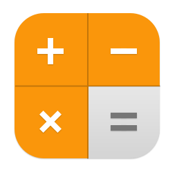

====================================================
Calculator
====================================================

This builds a simple calculator using code to add the buttons.
It is based on the the iphone grid of 5 rows and 4 columns.

References
------------------------------

#. Youtube guide for using code to create the components: https://www.youtube.com/watch?v=NiQdsK3H57Y
#. Try-except: https://www.w3schools.com/python/python_try_except.asp
#. eval: https://www.w3schools.com/python/ref_func_eval.asp
#. enumerate: https://www.w3schools.com/python/ref_func_enumerate.asp
#. Colour hex values: https://www.w3schools.com/colors/colors_picker.asp?colorhex=85b185
#. Calculator icon: https://icons.iconarchive.com/icons/tristan-edwards/sevenesque/256/Calculator-icon.png

----

Get started
------------------------------

#. Go to: https://anvil.works/new-build
#. Click: Blank App.
#. Choose: Custom HTML
#. Choose: Blank Panel

----

Settings
------------------------------

#. Click on the cog icon to show the settings tab.
#. Enter an App name. iPhone_Calculator
#. Enter an App title. iPhone_Calculator
#. Enter an App description. iPhone_Calculator using code to build the buttons
#. Get a calculator icon to upload such as: https://icons.iconarchive.com/icons/tristan-edwards/sevenesque/256/Calculator-icon.png
#. Click Change Image to upload an App logo.
#. Close the settings tab.

----

Build first part of interface
------------------------------

#. Drag and drop the *image* component from the right toolbox onto Form1.
#. In the properties panel: height section, set the height to ``75``.
#. Drag and drop the *textbox* component from the right toolbox onto Form1 below the image.
#. In the properties panel: text section, set the align to ``left``, the font to ``Consolas`` and the font_size to ``32``.
#. Click below on the form itself.
#. In the properties panel: appearance section, set the background to ``#eee``.

----

Get started
------------------------------

----

Get started
------------------------------

