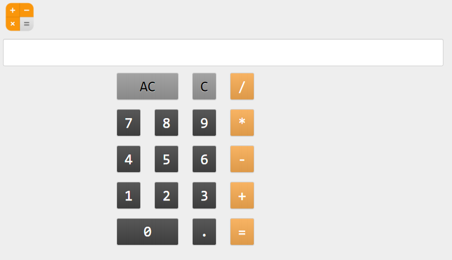

====================================================
Calculator
====================================================

This builds a simple calculator using code to add the buttons.
It is based on the the iphone grid of 5 rows and 4 columns.

References
------------------------------

#. Youtube guide for using code to create the components: https://www.youtube.com/watch?v=NiQdsK3H57Y
#. Python try-except: https://www.w3schools.com/python/python_try_except.asp
#. Python eval: https://www.w3schools.com/python/ref_func_eval.asp
#. Python enumerate: https://www.w3schools.com/python/ref_func_enumerate.asp
#. Colour hex values: https://www.w3schools.com/colors/colors_picker.asp?colorhex=85b185
#. Calculator icon: https://icons.iconarchive.com/icons/tristan-edwards/sevenesque/256/Calculator-icon.png
#. Grid panel syntax: https://anvil.works/docs/api/anvil#GridPanel
#. Button syntax: https://anvil.works/docs/api/anvil#Button
 
.. image:: images/Calculator-icon.png
    :scale: 60%

----

Get started
------------------------------

#. Go to: https://anvil.works/new-build
#. Click: Blank App.
#. Choose: Custom HTML
#. Choose: Blank Panel

----

Settings
------------------------------

#. Click on the cog icon to show the settings tab.
#. Enter an App name. iPhone_Calculator
#. Enter an App title. iPhone_Calculator
#. Enter an App description. iPhone_Calculator using code to build the buttons
#. Get a calculator icon to upload such as: https://icons.iconarchive.com/icons/tristan-edwards/sevenesque/256/Calculator-icon.png
#. Click Change Image to upload an App logo.
#. Close the settings tab.

----

Build first part of interface
------------------------------

#. Drag and drop the *image* component from the right toolbox onto Form1.
#. In the properties panel: height section, set the height to ``75``.
#. Drag and drop the *textbox* component from the right toolbox onto Form1 below the image.
#. In the properties panel: text section, set the align to ``left``, the font to ``Consolas`` and the font_size to ``32``.
#. Click below on the form itself.
#. In the properties panel: appearance section, set the background to ``#eee``.

----

Add code for buttons
------------------------------

| Add a ``chars`` list that has the button text to be shown.
| Use whitespace to layout the list as it will appear so it will be easier to work out the rows needed later in the code.

.. code-block:: python

    class Form1(Form1Template):
    def __init__(self, **properties):
        # Set Form properties and Data Bindings.
        self.init_components(**properties)

        # Any code you write here will run when the form opens.
        # add btn text list
        chars = ["AC", "C", "/",
                "7", "8", "9", "*",
                "4", "5", "6", "-",
                "1", "2", "3", "+",
                "0",".", "="]

----

Add code for buttons
------------------------------

| Add code to the end of the init method to create buttons.
| See Grid panel syntax: https://anvil.works/docs/api/anvil#GridPanel
| The grid panel has rows specified by letters: A, B, C...
| The grid panel has 12 columns specified by numbers: 0, 1, 2, ....11
| See Button syntax: https://anvil.works/docs/api/anvil#Button
| Set some default values for the button variables to be adjusted later: row, background colour bgcol, foreground colour fgcol, and button width bthwidth

.. code-block:: python

        self.btn = {}
        gp = GridPanel()

        row = 'A'
        bgcol = "#999999"
        fgcol = "#000000"
        btnwidth = 1

        #create btns
        self.btn[i] = Button(align="full", text=i, font="Consolas", font_size=32, bold=False, foreground=fgcol,background=bgcol)
        gp.add_component(self.btn[i], row=row, col_xs=3, width_xs=btnwidth)

        # display grid panel
        self.add_component(gp)
        # add a spacer after grid panle to fill the bottom of the screen
        self.space = Spacer(height=500)
        self.add_component(self.space)

----

----

Final code
------------------------------

.. code-block:: python

    class Form1(Form1Template):
    def __init__(self, **properties):
        # Set Form properties and Data Bindings.
        self.init_components(**properties)

        # Any code you write here will run when the form opens.
        # add btn text list
        chars = ["AC", "C", "/",
                "7", "8", "9", "*",
                "4", "5", "6", "-",
                "1", "2", "3", "+",
                "0",".", "="]

        self.btn = {}
        gp = GridPanel()

        # enumerate buttons
        for idx,i in enumerate(chars):
        #btn row
        if idx < 3:
            row = 'A'
        elif 3 <= idx < 7:
            row = 'B'
        elif 7 <= idx < 11:
            row = 'C'
        elif 11 <= idx < 15:
            row = 'D'
        else:
            row = 'E'
            
        #btn colour
        if i in ["AC", "C"]:
            bgcol = "#999999"
            fgcol = "#000000"
        elif i in ["=", "+", "-", "*", "/"]:
            bgcol = "#f6aa51"
            fgcol = "#FFFFFF"
        else:
            bgcol = "#444444"
            fgcol = "#FFFFFF"
            
        #btn width
        if i in ["AC", "0"]:
            btnwidth = 2
        else:
            btnwidth = 1  
            
        #create btns
        self.btn[i] = Button(align="full", text=i, font="Consolas", font_size=32, bold=False, foreground=fgcol,background=bgcol)
        # to collect the tag name when clicked
        self.btn[i].tag.name = i
        # handle the click event and attach the click method to the event
        self.btn[i].set_event_handler('click', self.click)
        gp.add_component(self.btn[i], row=row, col_xs=3, width_xs=btnwidth)

        # display grid panel
        self.add_component(gp)
        # add a spacer after grid panle to fill the bottom of the screen
        self.space = Spacer(height=500)
        self.add_component(self.space)
        
    # click method for btns
    def click(self, **event_args):
        val = event_args['sender'].tag.name
        if val == "=":
        try:
            self.text_box_1.text = eval(self.text_box_1.text)
        except:
            self.text_box_1.text  += " error"
        elif val == "AC":
        self.text_box_1.text = ""
        elif val == "C":
        self.text_box_1.text = self.text_box_1.text[:-1]
        else:
        self.text_box_1.text += val

