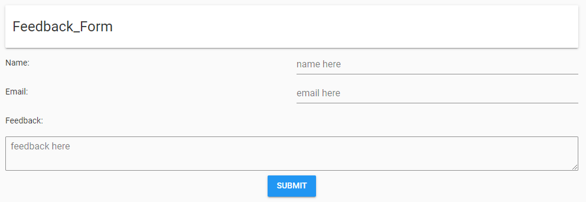
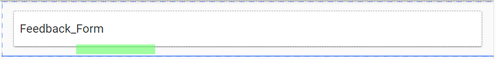
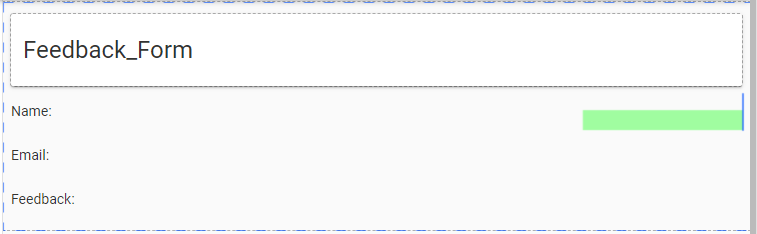

====================================================
Feedback Form
====================================================

This builds a feedback form that uses full stack: client side and server side code in python.

References
------------------------------

#. Youtube guide to create the app: https://www.youtube.com/watch?v=liZThmkIwys

----

Get started
------------------------------

#. Go to: https://anvil.works/new-build
#. Click: Blank App.
#. Choose: Material Design

----

Settings
------------------------------

#. Click on the cog icon to show thie settings tab.
#. Enter an App name. Feedback_Form
#. Enter an App title. Feedback_Form
#. Enter an App description. Feedback_Form using server side code and a PGSQL database.
#. Get a feedback icon to upload such as: https://pics.freeicons.io/uploads/icons/png/121888721582994865-512.png
#. Click Change Image to upload an App logo.
#. Close the settings tab.

----

Build first part of interface
------------------------------

| Build the following interface by dragging and dropping components and setting their properties.

| Drag and drop the *card* component from the right toolbox onto Form1.

| Drag and drop the *label* component onto card_1.
| In the properties panel: text section, set the text to ``Feedback Form``.
| In the properties panel: appearance section, set the role to ``Headline``.

| Drag and drop three *label* components onto card_1 below the Feedback Form label, one below the other. 

| A horizontal blue line will indicate that you are in the right place to drop it.
| In the properties panel: set their text to ``Name:``, ``Email:`` and ``Feedback:``.

| Drag and drop a *text box* component onto card_1 to the right of the Name label. 

    
| In the properties panel: set their placeholder to ``Name here``.

| Drag and drop a *text box* component onto card_1 to the right of the Email label. 
| In the properties panel: set their placeholder to ``Email here``.

| Drag and drop a *text area* component onto card_1 below the Feedback label. 
| In the properties panel: set their placeholder to ``Feedback here``.

| Drag and drop a *button* component onto card_1 below the Feedback text area. 
| In the properties panel: set their text to ``Submit``.
| In the properties panel: set their name to ``submit_button``.
| In the properties panel: set their role to ``primary-colour``.

----
