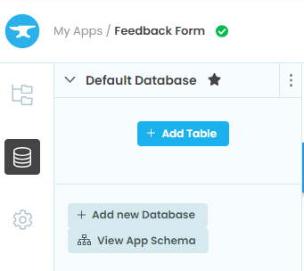
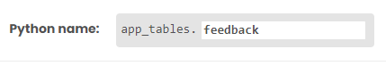
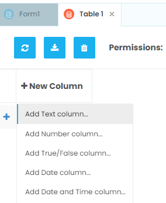
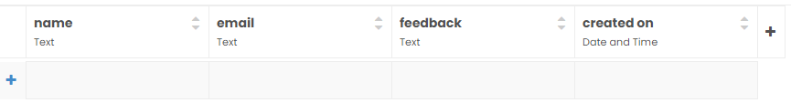
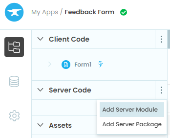

====================================================
Feedback Form
====================================================

This builds a feedback form that uses full stack: client side and server side code in python.

.. image:: images/Feedback_Form.png
    :scale: 50%

References
------------------------------

#. Youtube guide to create the app: https://www.youtube.com/watch?v=liZThmkIwys

----

Get started
------------------------------

#. Go to: https://anvil.works/new-build
#. Click: Blank App.
#. Choose: Material Design

----

Settings
------------------------------

#. Click on the cog icon to show thie settings tab.
#. Enter an App name. Feedback_Form
#. Enter an App title. Feedback_Form
#. Enter an App description. Feedback_Form using server side code and a PGSQL database.
#. Get a feedback icon to upload such as: https://pics.freeicons.io/uploads/icons/png/121888721582994865-512.png
#. Click Change Image to upload an App logo.
#. Close the settings tab.

----

Build first part of interface
------------------------------

| Build the following interface by dragging and dropping components and setting their properties.

| Drag and drop the *card* component from the right toolbox onto Form1.

| Drag and drop the *label* component onto card_1.
| In the properties panel: text section, set the text to ``Feedback Form``.
| In the properties panel: appearance section, set the role to ``Headline``.

| Drag and drop three *label* components onto card_1 below the Feedback Form label, one below the other. 

.. image:: images/Feedback_Form_Add_label_below.png
    :scale: 60%

| A horizontal blue line will indicate that you are in the right place to drop it.
| In the properties panel: set their text to ``Name:``, ``Email:`` and ``Feedback:``.

| Drag and drop a *text box* component onto card_1 to the right of the Name label. 

.. image:: images/Feedback_Form_add_text_box.png
    :scale: 80%

| In the properties panel: set the placeholder to ``Name here``.

| Drag and drop a *text box* component onto card_1 to the right of the Email label. 
| In the properties panel: set the placeholder to ``Email here``.

| Drag and drop a *text area* component onto card_1 below the Feedback label. 
| In the properties panel: set the placeholder to ``Feedback here``.

| Drag and drop a *button* component onto card_1 below the Feedback text area. 
| In the properties panel: set the text to ``Submit``.
| In the properties panel: set the name to ``submit_button``.
| In the properties panel: set the role to ``primary-colour``.

.. image:: images/Feedback_Form.png
    :scale: 80%

----

Build Data Table
------------------------------

| In the left sidebar, click on the data icon.
| Under default database, click ``Add Table``.

| On the top right, name the table ``feeedback``.

| Click on the ``+ New Column`` button.

| Choose ``Add Text Column``.
| Change the column name from Column0 to ``name``.

| Click on the ``+`` button.
| Choose ``Add Text Column``.
| Change the column name from Column1 to ``email``.

| Click on the ``+`` button.
| Choose ``Add Text Column``.
| Change the column name from Column2 to ``feedback``.

| Click on the ``+`` button.
| Choose ``Add date and Time Column``.
| Change the column name from Column3 to ``created on``.

----

Build the Server Code
------------------------------

| In the left sidebar, click on the top app icon.
| Under Server Code, click ``Add Server Module``.

