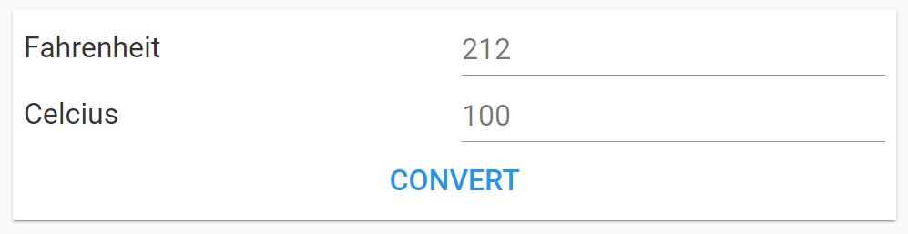
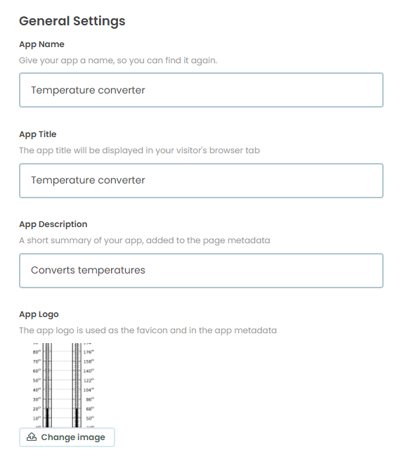
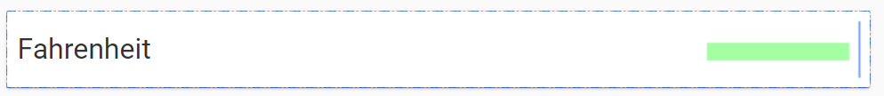

====================================================
Temperature converter
====================================================

This builds a simple temperature converter.

----

Get started
------------------------------

#. Go to: https://anvil.works/new-build
#. Click: Blank App.
#. Choose: Material Design

----

Settings
------------------------------

| Enter the settings for app.

#. Click on the cog icon to show the settings tab.
#. Enter an App name. Temperature converter
#. Enter an App title. Temperature converter
#. Enter an App description. Converts temperatures
#. Get a thermometer icon to upload such as: https://upload.wikimedia.org/wikipedia/commons/thumb/1/1e/Fahrenheit_Celsius_scales.svg/240px-Fahrenheit_Celsius_scales.svg.png

    
#. Click Change Image to upload an App logo.
#. Close the settings tab.

----

Build first part of interface
------------------------------

| Build the following interface by dragging and dropping componenets and setting their properties.

#. Drag and drop the *card* component from the right toolbox onto Form1.

#. Drag and drop the *label* component onto card_1.
#. In the properties panel: text section, set the text to ``Fahrenheit`` and the font_size to ``32``.

#. Drag and drop the *textbox* component onto card_1 to the right of the Fahrenheit label. 
A vertical blue line will indicate that you are in the right place to drop it.
#. In the properties panel: set the placeholder to ``212`` and the font_size to ``32``.

#. Drag and drop the *label* component onto card_1 below the Fahrenheit label.
#. A horizontal blue line will indicate that you are in the right place to drop it.
#. In the properties panel: text section, set the text to ``Celcius`` and the font_size to ``32``.

#. Drag and drop the *textbox* component onto card_1 to the right of the Celcius label.
#. In the properties panel: set the placeholder to ``100`` and the font_size to ``32``.
#. 
#. Drag and drop the *button* component onto card_1 below the Celcius label.
#. In the properties panel: set the text to ``Convert`` and the font_size to ``32``.

----

Code
------------------------------

.. code-block:: python

    class Form1(Form1Template):
        def __init__(self, **properties):
            # Set Form properties and Data Bindings.
            self.init_components(**properties)

            # Any code you write here will run when the form opens.

----

.. admonition:: Tasks

    #. Add some colour to the buttons and text and form.
    #. Add Kelvin as a temperature.
    #. Try making a distance converter such as miles to km or inches to cm.
    #. Try making a mass converter such as lbs to kg.
    #. Try making a volume converter such as gallons to litres.
