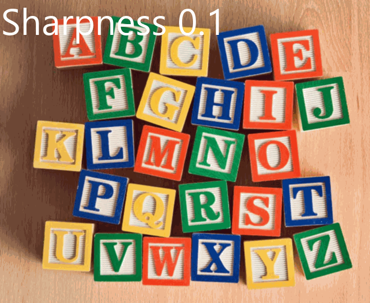
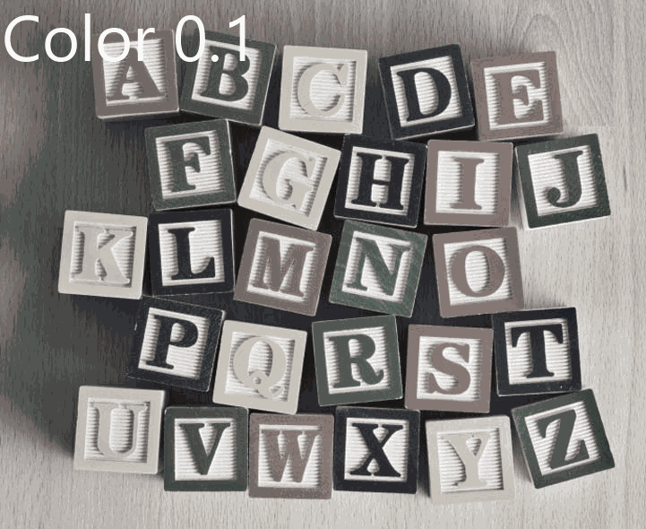
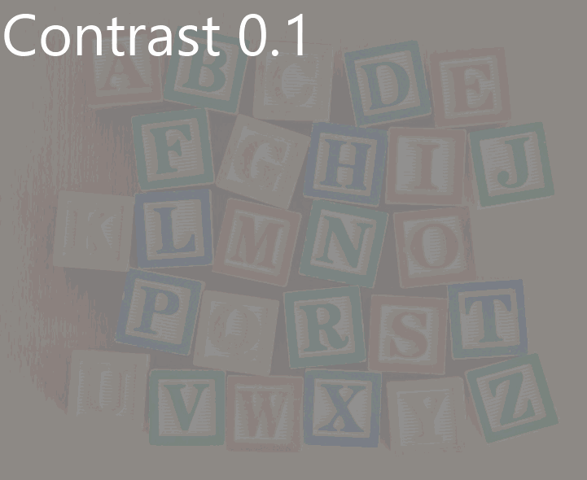
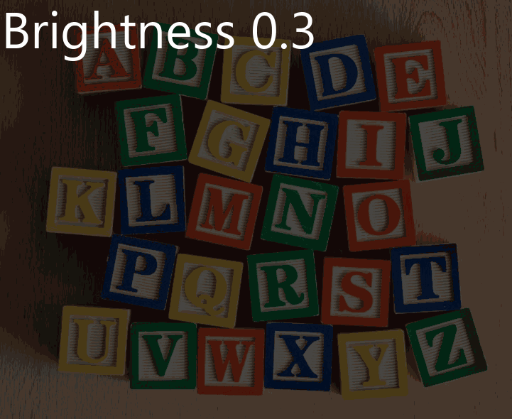

==========================
Image enhance
==========================

| See: https://pillow.readthedocs.io/en/stable/reference/ImageEnhance.html

----

Sharpness
----------------------

| Use the method to adjust the sharpness of an image.

.. py:function:: ImageEnhance.Sharpness(image).enhance(factor)

    | return an enhanced image.
    | factor is a floating point value controlling the enhancement. There are no restrictions on this value.
    | Factor 1.0 always returns a copy of the original image.
    | lower factors mean less sharpness, and higher values more.

| The code below creates several images of various sharpness enhancement factors.

.. code-block:: python

    from PIL import Image, ImageEnhance

    with Image.open("test_images/AtoZ.png") as im:
        new_im = ImageEnhance.Sharpness(im).enhance(0.5)
        new_im.save("new_images/AtoZ_sharpness05.png")
        new_im = ImageEnhance.Sharpness(im).enhance(10)
        new_im.save("new_images/AtoZ_sharpness10.png")
        new_im = ImageEnhance.Sharpness(im).enhance(100)
        new_im.save("new_images/AtoZ_sharpness100.png")

        
----

Color
----------------------

| Use the method to adjust the color of an image.

.. py:function:: ImageEnhance.Color(image).enhance(factor)

    | return an enhanced image.
    | factor is a floating point value controlling the enhancement. There are no restrictions on this value.
    | Factor 1.0 always returns a copy of the original image.
    | lower factors mean less color, and higher values more.

| The code below creates several images of various color enhancement factors.

.. code-block:: python

    from PIL import Image, ImageEnhance

    with Image.open("test_images/AtoZ.png") as im:
        new_im = ImageEnhance.Color(im).enhance(0)
        new_im.save("new_images/AtoZ_color0.png")
        new_im = ImageEnhance.Color(im).enhance(0.5)
        new_im.save("new_images/AtoZ_color05.png")
        new_im = ImageEnhance.Color(im).enhance(2)
        new_im.save("new_images/AtoZ_color2.png")
        new_im = ImageEnhance.Color(im).enhance(10)
        new_im.save("new_images/AtoZ_color10.png")

        
----

Contrast
----------------------

| Use the method to adjust the contrast of an image.

.. py:function:: ImageEnhance.Contrast(image).enhance(factor)

    | return an enhanced image.
    | factor is a floating point value controlling the enhancement. There are no restrictions on this value.
    | Factor 1.0 always returns a copy of the original image.
    | lower factors mean less contrast, and higher values more.

.. code-block:: python

    from PIL import Image, ImageEnhance

    with Image.open("test_images/AtoZ.png") as im:
        new_im = ImageEnhance.Contrast(im).enhance(0.5)
        new_im.save("new_images/AtoZ_contrast05.png")
        new_im = ImageEnhance.Contrast(im).enhance(2)
        new_im.save("new_images/AtoZ_contrast2.png")

        
----

Brightness
----------------------

| Use the method to adjust the brightness of an image

.. py:function:: ImageEnhance.Brightness(image).enhance(factor)

    | return an enhanced image.
    | factor is a floating point value controlling the enhancement. There are no restrictions on this value.
    | Factor 1.0 always returns a copy of the original image.
    | lower factors mean less brightness, and higher values more.

.. code-block:: python

    from PIL import Image, ImageEnhance

with Image.open("test_images/AtoZ.png") as im:
    new_im = ImageEnhance.Brightness(im).enhance(0.5)
    new_im.save("new_images/AtoZ_brightness05.png")
    new_im = ImageEnhance.Brightness(im).enhance(2)
    new_im.save("new_images/AtoZ_brightness2.png")

        
