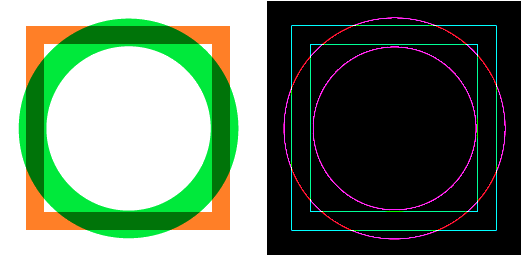

==========================
Image filters
==========================

| See: https://pillow.readthedocs.io/en/stable/reference/ImageFilter.html

----

Blur
----------------------

| Use the **.filter(ImageFilter.BLUR)** method to blur an image.

.. code-block:: python

    from PIL import Image, ImageFilter

    with Image.open("test_images/alph_blocks.png") as im:
        new_im = im.filter(ImageFilter.BLUR)
        new_im.save("filters/blur.png")

.. image:: images/blocks_blur.png
    :scale: 50%
    :align: center
        
----

Sharpen
----------------------

| Use the **.filter(ImageFilter.SHARPEN)** method to sharpen an image.

.. code-block:: python

    from PIL import Image, ImageFilter

    with Image.open("test_images/alph_blocks.png") as im:
        new_im = im.filter(ImageFilter.SHARPEN)
        new_im.save("filters/sharpen.png")

.. image:: images/blocks_sharp.png
    :scale: 50%
    :align: center
    
----

Edges
------

| Use the **.filter(ImageFilter.FIND_EDGES)** method to find the edges of parts of the image.

.. code-block:: python

    from PIL import Image, ImageFilter

    im = Image.open("new_images/merged.png") 
    im_rgb = im.convert(mode='RGB')
    new_im = im_rgb.filter(ImageFilter.FIND_EDGES)
    new_im.save("filters/merged_edges.png")

    