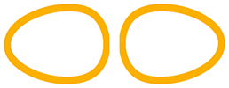
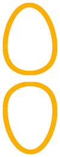
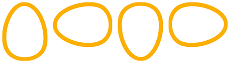
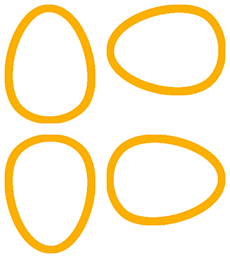

==========================
Merge images
==========================

| See: https://pillow.readthedocs.io/en/stable/handbook/tutorial.html#merging-images

----

2 images side by side
---------------------------

| The code below places 2 images side by side with a white background for areas not covered by the images.
| A gap can be specified between the 2 images.
| Instead of white, a background colour can be specified to fill in the gap and unused space.

.. code-block:: python

    from PIL import Image

    def merge2hor(im1, im2, gap=0, bgcol=(255, 255, 255)):
        w = im1.size[0] + im2.size[0] + gap
        h = max(im1.size[1], im2.size[1])
        im = Image.new("RGBA", (w, h), bgcol)
        im.paste(im1)
        im.paste(im2, (im1.size[0]+ gap , 0))
        return im

    im1 = Image.open("rotations/egg_90.png")
    im2 = Image.open("rotations/egg_270.png")
    im3= merge2hor(im1, im2, 2)
    im3.save("rotations/eggs2h.png")

----

2 images vertically
------------------------

| The code below places 2 images in a column with a white background for areas not covered by the images.
| A gap can be specified between the 2 images.
| Instead of white, a background colour can be specified to fill in the gap and unused space.

.. code-block:: python

    from PIL import Image

    def merge2vert(im1, im2, gap=0, bgcol=(255, 255, 255)):
        w = max(im1.size[0], im2.size[0])
        h = im1.size[1] + im2.size[1] + gap
        im = Image.new("RGBA", (w, h), bgcol)
        im.paste(im1)
        im.paste(im2, (0 , im1.size[1]+ gap ))
        return im

    im1 = Image.open("rotations/egg_0.png")
    im2 = Image.open("rotations/egg_180.png")
    im3= merge2vert(im1, im2, 2)
    im3.save("rotations/eggs2v.png")

----

4 images in a row
---------------------------

| The code below first places 2 images together, then another 2, then combines them in row.
| The code below places 4 images in a row with a white background for areas not covered by the images.
| A gap can be specified between the images.
| Instead of white, a background colour can be specified to fill in the gap and unused space.

.. code-block:: python

    from PIL import Image

    def merge4hor(im1, im2, im3, im4, gap=0, bgcol=(255, 255, 255)):
        imh1= merge2hor(im1, im2, gap, bgcol)
        imh2= merge2hor(im3, im4, gap, bgcol)
        im= merge2hor(imh1, imh2, gap, bgcol)
        return im

    im1 = Image.open("rotations/egg_0.png")
    im2 = Image.open("rotations/egg_90.png")
    im3 = Image.open("rotations/egg_180.png")
    im4 = Image.open("rotations/egg_270.png")
    im5= merge4hor(im1, im2, im3, im4, 2)
    im5.save("rotations/eggs4hor.png")
    im6= merge4square(im1, im2, im3, im4, 2)
    im6.save("rotations/eggs4.png")

----

4 images in a row
---------------------------

| The code below first places 2 images together, then another 2, then combines them in column.
| The code below places 4 images in a square with a white background for areas not covered by the images.
| A gap can be specified between the images.
| Instead of white, a background colour can be specified to fill in the gap and unused space.

.. code-block:: python

    from PIL import Image

    def merge4square(im1, im2, im3, im4, gap=0, bgcol=(255, 255, 255)):
        # layout 1 and 2 in top row, 3 and 4 on bottom row
        imh1= merge2hor(im1, im2, gap, bgcol)
        imh2= merge2hor(im3, im4, gap, bgcol)
        im= merge2vert(imh1, imh2, gap, bgcol)
        return im

    im1 = Image.open("rotations/egg_0.png")
    im2 = Image.open("rotations/egg_90.png")
    im3 = Image.open("rotations/egg_180.png")
    im4 = Image.open("rotations/egg_270.png")
    im5= merge4square(im1, im2, im3, im4, 2)
    im5.save("rotations/eggs4.png")

