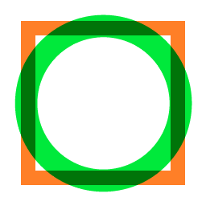

==========================
Multiply an image
==========================

| See: https://pillow.readthedocs.io/en/stable/reference/ImageChops.html#PIL.ImageChops.multiply

----

Multiply
---------------------------

| Use the **ImageChops.multiply** method to overlay 2 images of the same size.
| If an image is multiplied with an image with a solid black image, the result is black. 
| If an image is multiplied with a solid white image, the image is unaffected.

.. py:function:: ImageChops.multiply(image1, image2)

    | image1 and image2 are the images to multiply.

| The code below overlays a box with a circle.
| The pngs are first converted to RGB mode for best results.

.. code-block:: python

    from PIL import Image, ImageChops

    b = Image.open("shapes/box.png") 
    o = Image.open("shapes/o.png") 

    imb= b.convert(mode='RGB')
    imo= o.convert(mode='RGB')

    merged = ImageChops.multiply(imb, imo)

    merged.save("new_images/multiplied_b_o.png")

