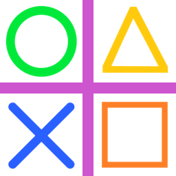
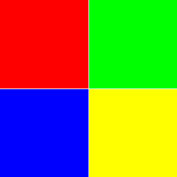
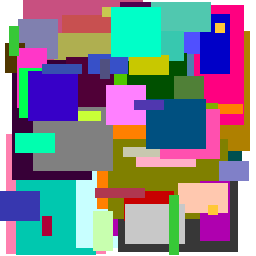
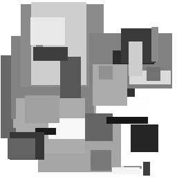
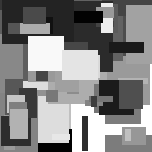

==========================
Paste an image
==========================

| See: https://pillow.readthedocs.io/en/stable/reference/Image.html#PIL.Image.Image.paste

----

Paste method with images
---------------------------

| Use the paste method to place an image over part of another image
| The code below resizes 4 images to 120 by 120 then pastes them in the 4 corners of an image 256 by 256.

| The simplified paste syntax is: 

.. py:function:: Image.paste(im, box=None)

    | im is the image to paste
    | box can be an optional 4-tuple giving the region to paste into. The size of the pasted image must match the size of the box region.
    | box can be 2-tuple as the upper left corner. 
    | If box is omitted or None, im is pasted into the upper left corner at 0, 0.
    | eg. im1.paste(im2, (0, 0)) pastes image im2 over image im1 in the top left corner.

.. code-block:: python

    from PIL import Image

    s1 = "shapes/o.png"
    s2 = "shapes/x.png"
    s3 = "shapes/tri.png"
    s4 = "shapes/box.png"
    s5 = "shapes/plus.png"
    newsize = (120, 120)

    im1 = Image.open(s1)
    im1s = im1.resize(newsize)
    im2 = Image.open(s2)
    im2s = im2.resize(newsize)
    im3 = Image.open(s3)
    im3s = im3.resize(newsize)
    im4 = Image.open(s4)
    im4s = im4.resize(newsize)

    im5 = Image.open(s5)

    im5.paste(im1s, (0, 0))
    im5.paste(im2s, (0, 256 - 120))
    im5.paste(im3s, (256 - 120 , 0))
    im5.paste(im4s, (256 - 120 , 256 - 120))

    im5.save("new_images/shapes_grid.png")

----

Paste method with RGB
---------------------------

| Use the paste method to place 4 RGB colours over part of another image.
| The code below places 4 colour squares in the 4 corners of an image 256 by 256.

| Instead of an image, the source can be a integer or RGB tuple containing pixel colour values. The method then fills the region with the given color.

.. code-block:: python

    from PIL import Image

    c1 = (255, 0, 0)
    c2 = (0, 255, 0)
    c3 = (0, 0, 255)
    c4 = (255, 255, 0)

    im = Image.new("RGBA", (256, 256))

    im.paste(c1, (0, 0, 128, 128))
    im.paste(c2, (129, 0, 256, 128))
    im.paste(c3, (0, 129, 128, 256))
    im.paste(c4, (129, 129, 256, 256))

    im.save("new_images/colour_squares.png")

----

Paste random coloured rectangles
----------------------------------

| Use the paste method to place random rectangles in an image 256 by 256.
| Create a function, **random_rgb(cvals)**, that takes in a list of numbers in range 0 to 255, and returns random rgb tuples by randomly choosing from the list. Make sure that it doesn't return black (0, 0, 0) or white (255, 255, 255). THe lsit used below is the standard websafe list: [0, 51, 102, 153, 204, 255].
| Create a function, **paste_rect(rvals)** that takes a list of lengths in the range 1 to 255, gets a random rgb tuple, calculates a random rectangle and pastes the colour to the base image.
| The random rectangle needs to fit, so once the width and height are chosen, the closet position to the bottom right is calculated so that the random top left positions can be chosen from the top left corner  to the calculated point.
| The code below places between 4 and 30 large rectangels first, then between 4 and 50 small rectangles.

.. code-block:: python

    from PIL import Image
    import random

    def random_rgb(cvals):
        c = (0, 0, 0)
        while c == (0, 0, 0) or c == (255, 255, 255):
            rv = random.choice(cvals)
            gv = random.choice(cvals)
            bv = random.choice(cvals)
            c = (rv, gv, bv)
        return c

    def paste_rect(rvals):
        c = random_rgb(cvals)
        # print(c, end="; ")
        w = random.choice(rvals)
        h = random.choice(rvals)
        x1max = 256 - w
        y1max = 256 - h
        x1 = random.randint(0, x1max)
        y1 = random.randint(0, y1max)
        x2 = x1 + w
        y2 = y1 + h
        im.paste(c, (x1, y1, x2, y2))

    im = Image.new("RGBA", (256, 256), (255, 255, 255))
    cvals = [0, 51, 102, 153, 204, 255]  # standard websafe values

    rvals = [80, 100, 120]
    large_num = random.randint(4, 30)
    for i in range(large_num):
        paste_rect(rvals)

    rvals = [10, 20, 30, 40, 50, 60]
    small_num = random.randint(4, 50)
    for i in range(small_num):
        paste_rect(rvals)

    im.save("new_images/random_colour_rects.png")

----

Paste random greyscale rectangles
----------------------------------

| Use the paste method to place random rectangles in an image 256 by 256.
| Use **Image.new("L", (256, 256), 255)** to make a greyscale image. "L" is the mode for greyscale. The last 255 fills it with white.
| Create a function, **random_rgb(gvals)**, that takes in a list of numbers in range 0 to 255, and returns a random greyscale level value by randomly choosing from the list. THe rangle fucntion can be used for a full spectrum of possible values from 0 to 255.
| Create a function, **paste_rect(rvals)** that takes a list of lengths in the range 1 to 255, gets a random greyscale integer, calculates a random rectangle and pastes the greyscal rect angle to the base image.
| The code below places between 4 and 30 large rectangels first, then between 4 and 50 small rectangles.

.. code-block:: python

    from PIL import Image
    import random

    def random_rgb(gvals):
        gv = random.choice(gvals)
        return gv

    def paste_rect(rvals):
        c = random_rgb(gvals)
        # print(c, end="; ")
        w = random.choice(rvals)
        h = random.choice(rvals)
        x1max = 256 - w
        y1max = 256 - h
        x1 = random.randint(0, x1max)
        y1 = random.randint(0, y1max)
        x2 = x1 + w
        y2 = y1 + h
        im.paste(c, (x1, y1, x2, y2))

    im = Image.new("L", (256, 256), 255)
    gvals = range(0,256)
    rvals = [80, 100, 120]
    large_num = random.randint(4, 30)
    for i in range(large_num):
        paste_rect(rvals)

    rvals = [10, 20, 30, 40, 50, 60]
    small_num = random.randint(4, 50)
    for i in range(small_num):
        paste_rect(rvals)

    im.save("new_images/random_grey_rects.png")

----

Paste random greyscale rectangles using offscreen area
--------------------------------------------------------

| Modify **paste_rect(rvals)** to create a new definition, **paste_rect_offscreen(rvals)**, that allows rectangles to be draws partially offscreen, so as to better use the edge areas.
| In, paste_rect_offscreen, the top left position can be offscreen at -100, -100.

.. code-block:: python

    from PIL import Image
    import random

    def random_rgb(gvals):
        gv = random.choice(gvals)
        return gv

    def paste_rect(rvals):
        c = random_rgb(gvals)
        # print(c, end="; ")
        w = random.choice(rvals)
        h = random.choice(rvals)
        x1max = 256 - w
        y1max = 256 - h
        x1 = random.randint(0, x1max)
        y1 = random.randint(0, y1max)
        x2 = x1 + w
        y2 = y1 + h
        im.paste(c, (x1, y1, x2, y2))

    def paste_rect_offscreen(rvals):
        c = random_rgb(gvals)
        # print(c, end="; ")
        w = random.choice(rvals)
        h = random.choice(rvals)
        x1 = random.randint(-100, 245)
        y1 = random.randint(-100, 245)
        x2 = x1 + w
        y2 = y1 + h
        im.paste(c, (x1, y1, x2, y2))

    im = Image.new("L", (256, 256), 255)
    gvals = range(0,256)
    rvals = [80, 100, 120]
    large_num = random.randint(4, 30)
    for i in range(large_num):
        paste_rect_offscreen(rvals)

    rvals = [10, 20, 30, 40, 50, 60]
    small_num = random.randint(4, 50)
    for i in range(small_num):
        paste_rect(rvals)

    im.save("new_images/random_grey_rects_offscreen.png")

