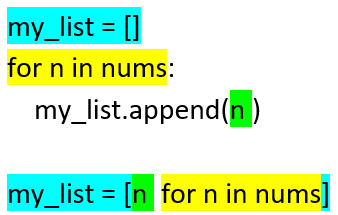
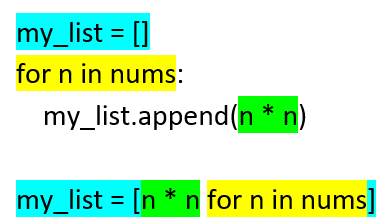
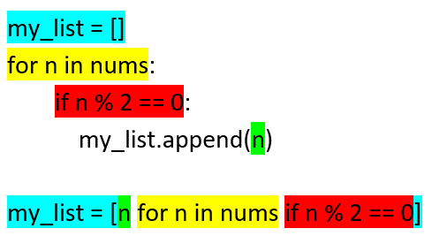
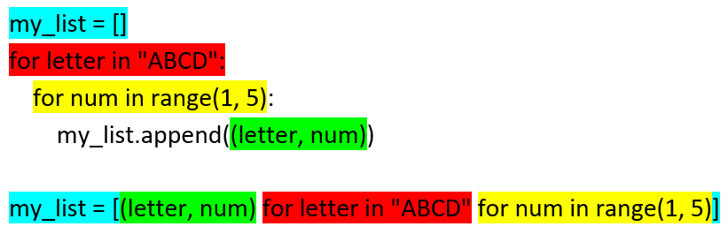

==========================
Comprehensions
==========================

See docs at: https://docs.python.org/3/tutorial/datastructures.html#list-comprehensions
See ref video at: https://www.youtube.com/watch?v=3dt4OGnU5sM

| Anything that can be done with a for loop can be done as a comprehension.
| List comprehensions provide a concise way to create lists.
| They are used to make new lists where each element is the result of some operations applied to each member of another sequence or iterable.
| They can create a subsequence of those elements that satisfy a certain condition.

----

=====================================
Lists comprehension
=====================================

Syntax:

.. py:function:: newlist = [expression for item in iterable]

    :param expression: the item variable only (e.g. x) or any expression such as one that uses the item variable (e.g. x*x, x.upper()).
    :param item:  a variable.
    :param iterable: iterable objects like strings, lists, dictionaries, range function and others.

| A list comprehension consists of brackets containing an expression followed by a for clause.
| The result will be a new list resulting from evaluating the expression in the context of the for and if clauses which follow it.
| e.g newlist = [2 * n for n in range(5)]

----

The first 2 examples illustrate simple list comprehensions without doing anything with the values.

Lists Example: list
-------------------------

| In the code below, a for-loop is used to get each value from an original list then append it to a new list, my_list.

.. code-block:: python

    nums = [1, 3, 6, 10, 15, 21, 28]

    # I want 'n' for each 'n' in nucd docsms
    my_list = []
    for n in nums:
        my_list.append(n)
    print(my_list)

| The list comprehension, ``my_list_comprehension = [n for n in nums]``, does this in one line.

.. code-block:: python

    # I want 'n' for each 'n' in nums
    my_list_comprehension = [n for n in nums]
    print(my_list_comprehension)

----

Lists Example: range
-------------------------   

| In the code below, a for-loop is used to get each value from the range function then append it to a new list, my_list.

.. code-block:: python

    # I want 'n' for each 'n' from 1 to 10
    my_list = []
    for n in range(1, 11):
        my_list.append(n)
    print(my_list)

| The list comprehension, ``my_list_comprehension = [n for n in range(1, 11)]``, does this in one line.

.. code-block:: python

    # I want 'n' for each 'n' in range(1, 11)
    my_list_comprehension = [n for n in range(1, 11)]
    print(my_list_comprehension)

----

List Example: n * n
-----------------------

| In the code below, a for-loop is used to get each value from an original list then append a calculated value to a new list, my_list.

.. code-block:: python

    nums = [1, 3, 6, 10, 15, 21, 28]

    # I want 'n*n' for each 'n' in nums
    my_list = []
    for n in nums:
        my_list.append(n * n)
    print(my_list)

| The list comprehension, ``my_list_comprehension = [n * n for n in nums]``, does this in one line.

.. code-block:: python

    # I want 'n*n' for each 'n' in nums
    my_list_comprehension = [n * n for n in nums]
    print(my_list_comprehension)

Practice Questions
--------------------

.. admonition:: Tasks

    1. Use a list comprehension to create a list of 2 * n for each n in [0, 1, 1, 2, 3, 5, 8].
    2. Use a list comprehension to create a list of 2 * n - 1  for each n in [2, 3, 5, 6, 7, 8, 10].

----

=====================================
Lists comprehension: conditions
=====================================

Syntax:

.. py:function:: newlist = [expression for item in iterable if condition == True]

    :param expression: the item variable only (e.g. x) or any expression such as one that uses the item variable (e.g. x*x, x.upper()).
    :param item:  variable.
    :param iterable: iterable objects like strings, lists, dictionaries, range function and others.
    :param condition: any condition.

| A list comprehension consists of brackets containing an expression followed by a for clause, then zero or more for or if clauses.
| The result will be a new list resulting from evaluating the expression in the context of the for and if clauses which follow it.
| e.g newlist = [2 * n for n in range(5) if n % 2 = 0]

List Example: Modulo
------------------------

| In the code below, a for-loop is used to get a list of event numbers from a list.
| The modulo, ``n % 2``, returns 0 for even numbers.

.. code-block:: python

    nums = [1, 3, 6, 10, 15, 21, 28]

    # I want n for each n in nums if n is even
    my_list = []
    for n in nums:
        if n % 2 == 0:
            my_list.append(n)
    print(my_list)

| The list comprehension, ``my_list_comprehension = [n for n in nums if n % 2 == 0]``, does this in one line.

.. code-block:: python

    nums = [1, 3, 6, 10, 15, 21, 28]

    # I want n for each n in nums if n is even
    my_list_comprehension = [n for n in nums if n % 2 == 0]
    print(my_list_comprehension)

----

=====================================
Lists comprehension: nested
=====================================

Syntax:

.. py:function:: newlist = [expression for item1 in iterable1 for item2 in iterable2]

    :param expression: an expression using item1 and item2.
    :param item2:  variable for iterable1.
    :param iterable1: iterable objects like strings, lists, dictionaries, range function and others.
    :param item2:  variable for iterable2.
    :param iterable2: a second iterable objects like strings, lists, dictionaries, range function and others.

List Example: grid coordinates
-----------------------------------

| In the code below, a nested for-loop is used to get a list of grid coordinates.

.. code-block:: python

    # I want a (letter, num) pair for each letter in 'ABCD' and each number in '1234'
    my_list = []
    for letter in "ABCD":
        for num in range(1, 5):
            my_list.append((letter, num))
    print(my_list)

| The list comprehension does the nested for loop in one line.

.. code-block:: python

    # I want n for each n in nums if n is even
    my_list_comprehension = [(letter, num) for letter in "ABCD" for num in range(1, 5)]
    print(my_list_comprehension)

