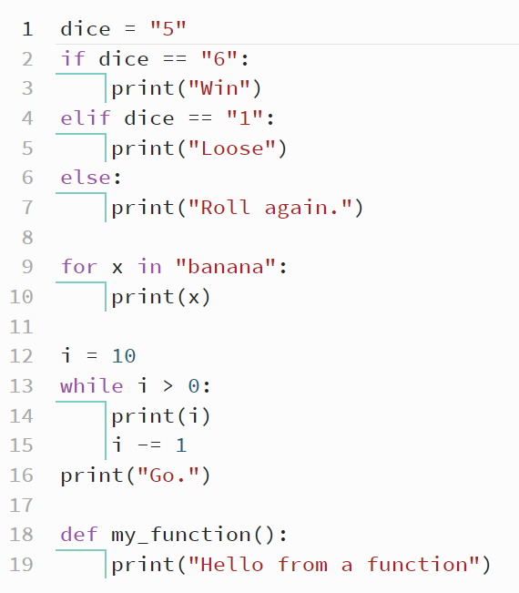
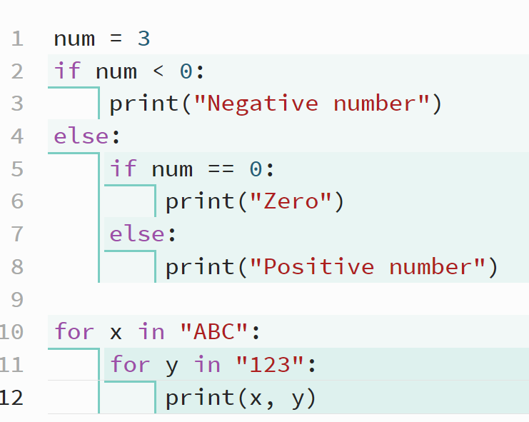

==========================
Indentation
==========================

Python Indentation
----------------------

| Python uses **indentation** to indicate a **block of code** for selection and iteration and definition.
| Indentation refers to the spaces at the beginning of a code line.
| The number of spaces is flexible, but is usually 4 spaces for each indentation.
| A tab press can be used instead of 4 spaces, with editors converting the tab to 4 spaces.
| Errors result from not using the same number of spaces in the same block of code or for not applying indentation in blocks after a colon (:).

| Indentation is required in any block of code where the header line starts with a keyword: (**if**, **elif**, **else**, **for**, **while**, **def**, class, try, except, finally, with) and ends with a colon (:).

Code examples showing indentation:

.. code-block:: python

    dice = "5"
    if dice == "6":
        print("Win")
    elif dice == "1":
        print("Loose")
    else:
        print("Roll again.")

    for x in "banana":
        print(x)

    i = 10
    while i > 0:
        print(i)
        i -= 1
    print("Go.")

    def my_function():
        print("Hello from a function")

Blocks of code nested within other blocks of code need to be indented to the same level of nesting.

.. code-block:: python

    num = 3
    if num < 0:
        print("Negative number")
    else:
        if num == 0:
            print("Zero")
        else:
            print("Positive number")

    for x in "ABC":
        for y in "123":
            print(x, y)

----

Indenting with Conditionals
----------------------------------

**Question:**
The following sequence of code is supposed to check if a number is positive, negative, or zero, but it has indentation errors. Fix the indentation.

.. code-block:: python

    n= 10
    if n > 0:
    print("Positive")
    elif n < 0:
    print("Negative")
    else:
    print("Zero")

**Solution:**

.. code-block:: python

    n= 10
    if n > 0:
        print("Positive")
    elif n < 0:
        print("Negative")
    else:
        print("Zero")

----

Practice Questions
~~~~~~~~~~~~~~~~~~~~~~~~

.. admonition:: Tasks

    #. The following code is supposed to check if a number is positive, but it has indentation errors. Fix the indentation.

        ::

            n = 5
            if n > 0:
            print("Positive")

    #. The following code is supposed to check if a number is even or odd, but it has indentation errors. Fix the indentation.

        ::

            n = 4
            if n % 2 == 0:
            print("Even")
            else:
            print("Odd")

    #. The following code is supposed to check if a number is positive, negative, or zero, but it has indentation errors. Fix the indentation.

        ::

            n = 0
            if n > 0:
            print("Positive")
            elif n < 0:
            print("Negative")
            else:
            print("Zero")

    #. The following code is supposed to check if a number is positive and even, but it has indentation errors. Fix the indentation.

        ::

            n = 6
            if n > 0:
            if n % 2 == 0:
            print("Positive and even")

    #. The following code is supposed to check if a number is positive, negative, or zero, and if it is even or odd, but it has indentation errors. Fix the indentation.

        ::

            n = -3
            if n > 0:
            if n % 2 == 0:
            print("Positive and even")
            else:
            print("Positive and odd")
            elif n < 0:
            if n % 2 == 0:
            print("Negative and even")
            else:
            print("Negative and odd")
            else:
            print("Zero")

    .. dropdown::
        :icon: codescan
        :color: primary
        :class-container: sd-dropdown-container

        .. tab-set::

            .. tab-item:: Q1

                The following code is supposed to check if a number is positive, but it has indentation errors. Fix the indentation.

                .. code-block:: python

                    n = 5
                    if n > 0:
                        print("Positive")

            .. tab-item:: Q2

                The following code is supposed to check if a number is even or odd, but it has indentation errors. Fix the indentation.

                .. code-block:: python

                    n = 4
                    if n % 2 == 0:
                        print("Even")
                    else:
                        print("Odd")

            .. tab-item:: Q3

                The following code is supposed to check if a number is positive, negative, or zero, but it has indentation errors. Fix the indentation.

                .. code-block:: python

                    n = 0
                    if n > 0:
                        print("Positive")
                    elif n < 0:
                        print("Negative")
                    else:
                        print("Zero")

            .. tab-item:: Q4

                The following code is supposed to check if a number is positive and even, but it has indentation errors. Fix the indentation.

                .. code-block:: python

                        n = 6
                        if n > 0:
                            if n % 2 == 0:
                                print("Positive and even")

            .. tab-item:: Q5

                The following code is supposed to check if a number is positive, negative, or zero, and if it is even or odd, but it has indentation errors. Fix the indentation.

                .. code-block:: python

                    n = -3
                    if n > 0:
                        if n % 2 == 0:
                            print("Positive and even")
                        else:
                            print("Positive and odd")
                    elif n < 0:
                        if n % 2 == 0:
                            print("Negative and even")
                        else:
                            print("Negative and odd")
                    else:
                        print("Zero")

----

Indenting with Loops
-----------------------

**Question:**
The following code is supposed to print each character in the string "hello", but it has indentation errors. Fix the indentation.

.. code-block:: python

    for char in "hello":
    print(char)

**Solution:**

.. code-block:: python

    for char in "hello":
        print(char)

----

Practice Questions
~~~~~~~~~~~~~~~~~~~~~~~~

.. admonition:: Tasks

    #. The following code is supposed to print each character in the string "goodbye", but it has indentation errors. Fix the indentation.

        ::

            for char in "goodbye":
            print(char)

    #. The following code is supposed to print each item in the list ``[1, 2, 3, 4, 5]``, but it has indentation errors. Fix the indentation.

        ::

            numbers = [1, 2, 3, 4, 5]
            for num in numbers:
            print(num)

    #. The following code is supposed to print numbers from 1 to 5 using the range function, but it has indentation errors. Fix the indentation.

        ::

            for i in range(1, 6):
            print(i)

    #.  The following code is supposed to print even numbers from 1 to 10, but it has indentation errors. Fix the indentation.

        ::

            for i in range(1, 11):
            if i % 2 == 0:
            print(i)

    #. The following code is supposed to print a 3x3 grid of numbers, but it has indentation errors. Fix the indentation.

        ::

            for i in range(1, 4):
            for j in range(1, 4):
            print(i * j, end=" ")
            print()

    .. dropdown::
        :icon: codescan
        :color: primary
        :class-container: sd-dropdown-container

        .. tab-set::

            .. tab-item:: Q1

                The following code is supposed to print each character in the string "goodbye", but it has indentation errors. Fix the indentation.

                .. code-block:: python

                    for char in "goodbye":
                        print(char)

            .. tab-item:: Q2

                The following code is supposed to print each item in the list ``[1, 2, 3, 4, 5]``, but it has indentation errors. Fix the indentation.

                .. code-block:: python

                    numbers = [1, 2, 3, 4, 5]
                    for num in numbers:
                        print(num)

            .. tab-item:: Q3

                The following code is supposed to print numbers from 1 to 5 using the range function, but it has indentation errors. Fix the indentation.

                .. code-block:: python

                    for i in range(1, 6):
                        print(i)

            .. tab-item:: Q4

                The following code is supposed to print even numbers from 1 to 10, but it has indentation errors. Fix the indentation

                .. code-block:: python

                    for i in range(1, 11):
                        if i % 2 == 0:
                            print(i)

            .. tab-item:: Q5

                The following code is supposed to print a 3x3 grid of numbers, but it has indentation errors. Fix the indentation.

                .. code-block:: python

                    for i in range(1, 4):
                        for j in range(1, 4):
                            print(i * j, end=" ")
                        print()

----

Indenting with Functions
----------------------------

**Question:**
The following function is supposed to print a greeting message, but it has indentation errors. Fix the indentation.

.. code-block:: python

    def greet(name):
    print(f"Hello, {name}!")

**Solution:**

.. code-block:: python

    def greet(name):
        print(f"Hello, {name}!")

----

Practice Questions
~~~~~~~~~~~~~~~~~~~~~~~~

.. admonition:: Tasks

    #. The following function, which adds two numbers, has indentation errors. Fix the indentation.

        ::

            def add_numbers(a, b):
            result = a + b
            return result

    #. The following function, which checks whether a number is even or not, has indentation errors. Fix the indentation.

        ::

            def check_even(number):
            if number % 2 == 0:
            return True
            else:
            return False

    #. The following function, which sums a list of numbers, contains indentation errors. Fix the indentation.

        ::

            def sum_list(numbers):
            total = 0
            for num in numbers:
            total += num
            return total

    #. The following function, which categorizes an age into one of three categories, has indentation errors. Fix the indentation.

        ::

            def categorize_age(age):
            if age < 13:
            category = 'Child'
            elif age < 20:
            category = 'Teenager'
            else:
            category = 'Adult'
            return category

    #. The following function, which returns the maximum number in a list, has indentation errors. Fix the indentation.

        ::

            def find_max(numbers):
            max_num = numbers[0]
            for num in numbers:
            if num > max_num:
            max_num = num
            return max_num

    .. dropdown::
        :icon: codescan
        :color: primary
        :class-container: sd-dropdown-container

        .. tab-set::

            .. tab-item:: Q1

                The following function, which adds two numbers, has indentation errors. Fix the indentation.

                .. code-block:: python

                    def add_numbers(a, b):
                        result = a + b
                        return result

            .. tab-item:: Q2

                The following function, which checks whether a number is even or not, has indentation errors. Fix the indentation.

                .. code-block:: python

                    def check_even(number):
                        if number % 2 == 0:
                            return True
                        else:
                            return False

            .. tab-item:: Q3

                The following function, which sums a list of numbers, contains indentation errors. Fix the indentation.

                .. code-block:: python

                    def sum_list(numbers):
                        total = 0
                        for num in numbers:
                            total += num
                        return total

            .. tab-item:: Q4

                The following function, which categorizes an age into one of three categories, has indentation errors. Fix the indentation.

                .. code-block:: python

                    def categorize_age(age):
                        if age < 13:
                            category = 'Child'
                        elif age < 20:
                            category = 'Teenager'
                        else:
                            category = 'Adult'
                        return category

            .. tab-item:: Q5

                The following function, which returns the maximum number in a list, has indentation errors. Fix the indentation.

                .. code-block:: python

                    def find_max(numbers):
                        max_num = numbers[0]
                        for num in numbers:
                            if num > max_num:
                                max_num = num
                        return max_num

