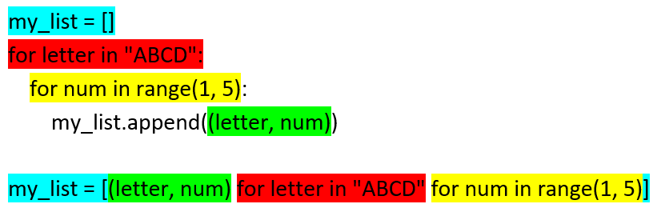

==========================
List Comprehensions
==========================

See docs at: https://docs.python.org/3/tutorial/datastructures.html#list-comprehensions
See ref video at: https://www.youtube.com/watch?v=3dt4OGnU5sM

| Anything that can be done with a for-loop can be done as a comprehension.

----

List comprehension
=====================================

| List comprehensions provide a concise way to create lists. They are more readable than other approaches.
| They are used to make new lists where each element is the result of some operations applied to each member of another sequence or iterable.
| They can create a subsequence of those elements that satisfy a certain condition.

Syntax:

.. py:function:: new_list = [expression for item in iterable]

    :param expression: the item variable only (e.g. x) or any expression such as one that uses the item variable (e.g. x * x).
    :param item:  a variable.
    :param iterable: iterable objects like strings, lists, dictionaries, range function and others.

| A list comprehension consists of brackets containing an expression followed by a for clause.
| The result will be a new list created by evaluating the expression in the context of the for clause.

----

The first 2 examples illustrate simple list comprehensions without doing anything with the values.

List Example: list
-------------------------

| In the code below, a for-loop is used to get each value from an original list then append it to a new list, my_list.

.. code-block:: python

    nums = [1, 3, 6, 10, 15, 21, 28]

    # I want 'n' for each 'n' in nums
    my_list = []
    for n in nums:
        my_list.append(n)
    print(my_list)

| The printed list is: [1, 3, 6, 10, 15, 21, 28]
| The list comprehension, ``my_list_comprehension = [n for n in nums]``, does this in one line.

.. code-block:: python

    nums = [1, 3, 6, 10, 15, 21, 28]
    
    my_list_comprehension = [n for n in nums]
    print(my_list_comprehension)

| The diagram below has colouring to compare the use of for-loops with comprehensions.

----

List Example: range
-------------------------   

| In the code below, a for-loop is used to get each value from the range function then append it to a new list, my_list.

.. code-block:: python

    # I want 'n' for each 'n' from 1 to 10
    my_list = []
    for n in range(1, 11):
        my_list.append(n)
    print(my_list)

| The printed list is: [1, 2, 3, 4, 5, 6, 7, 8, 9, 10]
| The list comprehension, ``my_list_comprehension = [n for n in range(1, 11)]``, does this in one line.

.. code-block:: python

    my_list_comprehension = [n for n in range(1, 11)]
    print(my_list_comprehension)

----

List Example: n * n
-----------------------

| In the code below, a for-loop is used to get each value from an original list then append a calculated valu, n * n, to a new list, my_list.

.. code-block:: python

    nums = [1, 3, 6, 10, 15, 21, 28]

    # I want 'n*n' for each 'n' in nums
    my_list = []
    for n in nums:
        my_list.append(n * n)
    print(my_list)

| The printed list is: [1, 9, 36, 100, 225, 441, 784]
| The list comprehension, ``my_list_comprehension = [n * n for n in nums]``, does this in one line.

.. code-block:: python

    nums = [1, 3, 6, 10, 15, 21, 28]

    my_list_comprehension = [n * n for n in nums]
    print(my_list_comprehension)

| The diagram below has colouring to compare the use of for-loops with comprehensions.

----

Practice Questions
--------------------

.. admonition:: Tasks

    1. Use a list comprehension to create a list of 2 * n for each n in [0, 1, 1, 2, 3, 5, 8].
    2. Use a list comprehension to create a list of 2 * n - 1  for each n in [2, 4, 6, 8, 10].
    3. Use a list comprehension to create a list of n ** 3  for each n in [1, 2, 3, 4].

----

List comprehension: conditions
=====================================

Syntax:

.. py:function:: new_list = [expression for item in iterable if condition == True]

    :param expression: the item variable only (e.g. x) or any expression such as one that uses the item variable (e.g. x*x, x.upper()).
    :param item:  variable.
    :param iterable: iterable objects like strings, lists, dictionaries, range function and others.
    :param condition: any condition.

| A list comprehension consists of brackets containing an expression followed by a for clause, then zero or more for or if clauses.
| The result will be a new list resulting from evaluating the expression in the context of the for and if clauses which follow it.
| e.g newlist = [2 * n for n in range(5) if n % 2 = 0]

----

List Example: Modulo
------------------------

| In the code below, a for-loop is used to get a list of event numbers from a list.
| The modulo, ``n % 2``, returns 0 for even numbers.

.. code-block:: python

    nums = [1, 3, 6, 10, 15, 21, 28]

    # I want n for each n in nums if n is even
    my_list = []
    for n in nums:
        if n % 2 == 0:
            my_list.append(n)
    print(my_list)

| The printed list is: [6, 10, 28]
| The list comprehension, ``my_list_comprehension = [n for n in nums if n % 2 == 0]``, does this in one line.

.. code-block:: python

    nums = [1, 3, 6, 10, 15, 21, 28]

    # I want n for each n in nums if n is even
    my_list_comprehension = [n for n in nums if n % 2 == 0]
    print(my_list_comprehension)

| The diagram below has colouring to compare the use of for-loops with comprehensions.

----

Practice Questions
--------------------

.. admonition:: Tasks

    1. Use a list comprehension to create a list of even n for each n in [1, 2, 3, 5, 8].
    2. Use a list comprehension to create a list of odd n for each n in [1, 2, 3, 5, 8].

----

List comprehension: nested
=====================================

Syntax:

.. py:function:: new_list = [expression for item1 in iterable1 for item2 in iterable2]

    :param expression: an expression using item1 and item2.
    :param item2:  variable for iterable1.
    :param iterable1: iterable objects like strings, lists, dictionaries, range function and others.
    :param item2:  variable for iterable2.
    :param iterable2: a second iterable objects like strings, lists, dictionaries, range function and others.

List Example: grid coordinates
-----------------------------------

| In the code below, a nested for-loop is used to get a list of grid coordinates.
| Each grid coordinate is a tuple. e.g. ('A', 1)

| The output will be: [('A', 1), ('A', 2), ('A', 3), ('A', 4), ('B', 1), ('B', 2), ('B', 3), ('B', 4), ('C', 1), ('C', 2), ('C', 3), ('C', 4), ('D', 1), ('D', 2), ('D', 3), ('D', 4)]

.. code-block:: python

    # I want a (letter, num) pair for each letter in 'ABCD' and each number in '1234'
    my_list = []
    for letter in "ABCD":
        for num in range(1, 5):
            my_list.append((letter, num))
    print(my_list)

| The list comprehension does the nested for-loop in one line.

.. code-block:: python

    my_list_comprehension = [(letter, num) for letter in "ABCD" for num in range(1, 5)]
    print(my_list_comprehension)

| The diagram has colouring to compare the use of for-loops with comprehensions.

----

Practice Questions
--------------------

.. admonition:: Tasks

    1. Starting with two lists, ['A', 'B'], ['X', 'Y'], use a list comprehension to create the list: [('A', 'X'), ('A', 'Y'), ('B', 'X'), ('B', 'Y')].
    2. Starting with two lists, ['A', 'B'], ['X', 'Y'], use a list comprehension to create the list: ['AvX', 'AvY', 'BvX', 'BvY'].

----

Summary Examples
--------------------

.. code-block:: python
    
    my_list_comprehension = [n for n in nums]
    my_list_comprehension = [n for n in range(1, 11)]
    my_list_comprehension = [n * n for n in nums]
    my_list_comprehension = [n for n in nums if n % 2 == 0]
    my_list_comprehension = [(letter, num) for letter in "ABCD" for num in range(1, 5)]

----

Set Comprehension on a List
primes = [2, 2, 2, 3, 3, 5, 5, 5, 7, 11, 11, 13, 13, 13, 13]
primes_squared = {p*p for p in primes}
print(primes_squared)

More Complex Expressions: quadratic transformation
Any expression is allowed. More complex expressions can be put in parentheses.
Here, quadratic equation:
2x^2 + 5x + 10

transformed = {(2*x*x + 5*x + 10) for x in primes}
print(transformed)

----

Making a 2D array from a list
------------------------------

| A list will be split up into a lists of lists, simulating a 2D array.
| In the code below, a list is organised into a 2d array with x elements in each row.
| [1, 3, 5, 7, 9, 11] will become [[1, 3, 5], [7, 9, 11]].
| The first loop, ``for i in range(0, len(nums), x)``, becomes ``for i in range(0, 6, 3)`` which has i values of 0 and 3.
| The second loop, ``for j in range(i, i+x)``, becomes ``for j in range(0, 3)`` when i is 0, and ``for j in range(3,6)`` when i is 3

.. code-block:: python

    nums = [1, 3, 5, 7, 9, 11]
    x = 3

    list_2d = []
    for i in range(0, len(nums), x):
        rowlist = []
        for j in range(i, i+x):
            rowlist.append(nums[j])
        list_2d.append(rowlist)
    print(list_2d)
    # [[1, 3, 5], [7, 9, 11]]

| The code below achieves the same result in a list comprehension.

.. code-block:: python

    nums = [1, 3, 5, 7, 9, 11]
    x = 3
    list_2d = [nums[i:i+x] for i in range(0, len(nums), x)]
    print(list_2d)
    # [[1, 3, 5], [7, 9, 11]]

