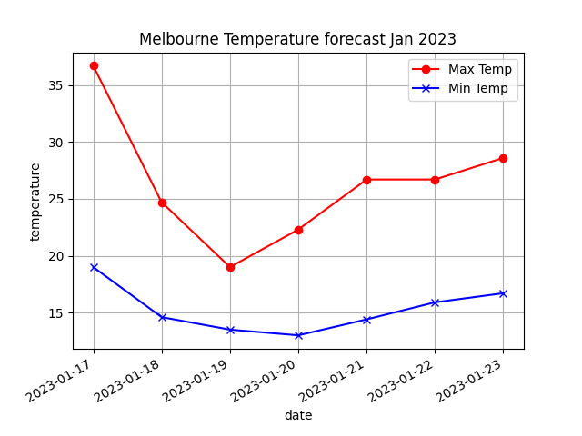

==========================
json API
==========================

| API stands for Application Programming Interface. 
| The API defines how two applications communicate with each other using requests and responses.

| Corey Schafer video See: https://www.youtube.com/watch?v=9N6a-VLBa2I&list=RDCMUCCezIgC97PvUuR4_gbFUs5g&start_radio=1&rv=9N6a-VLBa2I&t=1
| Socratica video See: https://www.youtube.com/watch?v=LosIGgon_KM&list=RDCMUCW6TXMZ5Pq6yL6_k5NZ2e0Q&index=13

| docs See: https://docs.python.org/3/library/urllib.request.html
| urllib tutorial See: https://realpython.com/urllib-request/

| Free weather API See: https://open-meteo.com/

----

Getting free weather data from the web
----------------------------------------

| The free API provides weather data. See: https://open-meteo.com/
| Use the form at: https://open-meteo.com/en/docs#api_form
| Enter Melbourne as the city and use the daily checkboxes to generate the url below.
| The url below is for Melbourne daily max and min temperatures for the next 7 days.
| The built-in python library, urllib, is used to get the web data from the url.
| THe syntax for urlopen and read is below.

.. code-block:: python
    
    from urllib.request import urlopen

    url = "https://api.open-meteo.com/v1/forecast?latitude=-37.81&longitude=144.96&daily=temperature_2m_max,temperature_2m_min&timezone=Australia%2FSydney"
    with urlopen(url) as response:
        source = response.read() 
    print(source)

| The data returned from the url above is for "2023-01-17" to "2023-01-23".
| The response is a byte string indicated by "b'".

.. code-block:: 

    b'{"latitude":-37.75,"longitude":145.0,"generationtime_ms":0.2799034118652344,"utc_offset_seconds":39600,"timezone":"Australia/Sydney","timezone_Abbriation":"AEDT","elevation":98.0,"daily_units":{"time":"iso8601","temperature_2m_max":"\xc2\xb0C","temperature_2m_min":"\xc2\xb0C"},"daily":{"time":["2023-01-17","2023-01-18","2023-01-19","2023-01-20","2023-01-21","2023-01-22","2023-01-23"],"temperature_2m_max":[36.6,26.4,19.0,22.9,26.4,28.0,27.2],"temperature_2m_min":[19.0,14.6,13.3,12.8,14.1,16.1,17.0]}}'

----

urlopen function
------------------

| The full syntax is at: https://docs.python.org/3/library/urllib.request.html#urllib.request.urlopen

| The most used syntax is:

.. py:function:: urlopen(url)

    :param url: a URL, which is a string

    | Returns a **http.client.HTTPResponse** object.

----

read function
------------------

| See: https://docs.python.org/3/library/http.client.html#http.client.HTTPResponse.read

| The syntax is:

.. py:function:: HTTPResponse.read([amt])

    :param amt: the number of bytes to read. Omit by default so that the whole body is returned.

    | Reads and returns the response body

----

Reading weather json
------------------------------------------

| The code below takes the source and loads it into a json object, data.
| Then the data is dumped to view the keys so that the dates and temperatures can be indexed.

.. code-block:: python
    
    import json
    from urllib.request import urlopen

    url = "https://api.open-meteo.com/v1/forecast?latitude=-37.81&longitude=144.96&daily=temperature_2m_max,temperature_2m_min&timezone=Australia%2FSydney"
    with urlopen(url) as response:
        source = response.read()
    data = json.loads(source)
    print(json.dumps(data, indent=4))

| Snippets of the json dump are below to help identify the keys for the weather data.

.. code-block::

    {
        "latitude": -37.75,
        "longitude": 145.0,
        ...
        },
        "daily": {
            "time": [
                "2023-01-17",
                ...
                "2023-01-23"
            ],
            "temperature_2m_max": [
                36.7,
                ...
                28.6
            ],
            "temperature_2m_min": [
                19.0,
                ...
                16.7
            ]
        }
    }

| The keys needed are:
| data["daily"]["time"]
| data["daily"]["temperature_2m_max"]
| data["daily"]["temperature_2m_min"]
| Each of these keys returns a list of 7 values, of which 2 are shown in the snippets above.

| The code below uses the keys identifies above to place the weather data lists in 3 variables: dates_list, max_list, min_list.
| The 3 lists hold their data in sequence. The first values in each list are for the same date.
| The zip function is used on the 3 lists so that they can be iterated over together.
| The weather data is printed out below.

.. code-block:: python
    
    import json
    from urllib.request import urlopen

    url = "https://api.open-meteo.com/v1/forecast?latitude=-37.81&longitude=144.96&daily=temperature_2m_max,temperature_2m_min&timezone=Australia%2FSydney"
    with urlopen(url) as response:
        source = response.read()
    data = json.loads(source)
    dates_list = data["daily"]["time"]
    max_list = data["daily"]["temperature_2m_max"]
    min_list = data["daily"]["temperature_2m_min"]

    for day, min, max in zip(dates_list, min_list, max_list):
        print(day, min, max)

.. code-block::
 
    2023-01-17 19.0 36.7
    2023-01-18 14.6 24.7
    2023-01-19 13.5 19.0
    2023-01-20 13.0 22.3
    2023-01-21 14.4 26.7
    2023-01-22 15.9 26.7
    2023-01-23 16.7 28.6

| To add headings to the printed data the following code is used.
| Padding has to be added to align the headings to the data.
| The string lenths for each header are in the paddings list.
| A list comprehension, ``padded_header = [h.ljust(p) for h, p in zip(header,paddings)]``, is used to build the list of padded strings.

.. code-block:: python
    
    header = ["day", "min", "max"]
    paddings = [11, 5, 5]
    padded_header = [h.ljust(p) for h, p in zip(header,paddings)]
    for head_str in padded_header:
        print(head_str, end='')
    print()

| The full code is below

.. code-block:: python
    
    import json
    from urllib.request import urlopen

    url = "https://api.open-meteo.com/v1/forecast?latitude=-37.81&longitude=144.96&daily=temperature_2m_max,temperature_2m_min&timezone=Australia%2FSydney"
    with urlopen(url) as response:
        source = response.read()
    data = json.loads(source)
    dates_list = data["daily"]["time"]
    max_list = data["daily"]["temperature_2m_max"]
    min_list = data["daily"]["temperature_2m_min"]

    header = ["day", "min", "max"]
    paddings = [11, 5, 5]
    padded_header = [h.ljust(p) for h, p in zip(header,paddings)]
    for head_str in padded_header:
        print(head_str, end='')
    print()

    for day, min, max in zip(dates_list, min_list, max_list):
        print(day, min, max)

.. code-block::

    day        min  max  
    2023-01-17 19.0 36.7
    2023-01-18 14.6 24.7
    2023-01-19 13.5 19.0
    2023-01-20 13.0 22.3
    2023-01-21 14.4 26.7
    2023-01-22 15.9 26.7
    2023-01-23 16.7 28.6

----

Plot weather data
---------------------

| As an extension, the weather data is plotted below.

.. code-block:: python

    import json
    from urllib.request import urlopen
    import matplotlib.pyplot as plt

    url = "https://api.open-meteo.com/v1/forecast?latitude=-37.81&longitude=144.96&daily=temperature_2m_max,temperature_2m_min&timezone=Australia%2FSydney"
    with urlopen(url) as response:
        source = response.read()
    data = json.loads(source)
    dates_list = data["daily"]["time"]
    max_list = data["daily"]["temperature_2m_max"]
    min_list = data["daily"]["temperature_2m_min"]

    xAxis = dates_list
    tmax = max_list
    tmin = min_list
    plt.grid(True)
    plt.xlabel('date')
    plt.ylabel('temperature')
    plt.title('Melbourne Temperature forecast Jan 2023')

    ## LINE GRAPH ##
    plt.plot(xAxis, tmax, color='red', marker='o', label = "Max Temp")
    plt.plot(xAxis, tmin, color='blue', marker='x', label = "Min Temp")

    # format dates so they are angled to fit
    plt.gcf().autofmt_xdate()
    plt.legend()
    plt.show()

