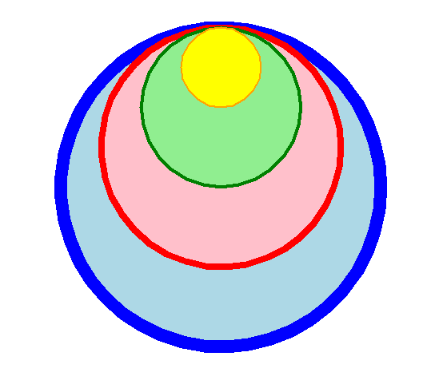

====================================================
Turtle circles
====================================================

| The code below draws circles.

----

Turtle Circles
------------------------------------------

| The turtle syntax for drawing circles in below:

.. py:function:: turtle.circle(radius, extent=None, steps=None)

    | radius - radius; a positive number draws anticlockwise, a negative number draws clockwise. 
    | extent - an angle; a number (or None for whole circle), which determines how many degrees of the circle is drawn; default None
    | steps - an integer (or None for a circle) which allows polygons to be drawn; default None

| The center is radius units left of the turtle at right angles from its heading if the radius is positive.
| The direction of the turtle is changed by the amount of extent.
| The pensize increases the circle line inwards and outwards from the radius distance. So a pensize of 41 draws the circle 20 pixels inwards and 20 pixels outwards from the exact radius position. This is important for predicting circle edges with large pensizes. 

----

Circles at a specified location
------------------------------------------

| Adding a starting position, the centre of the circle, will provide some convenience.
| The ``draw_centered_circle`` syntax is below:

.. py:function:: draw_centered_circle(t, centre=(0, 0), radius=10, penw=1, penc="black", fillc=None)

    | **t** - the turtle object to draw the circle
    | **centre** - start position; default (0, 0)
    | **radius** - the circle radius; default 10
    | **penw** - the pen width; default 1
    | **penc** - the pen color; a colorstring or a numeric color tuple (r, g, b,); default "black"
    | **fillc** - the fill color; a colorstring or a numeric color tuple (r, g, b,); default None

| The ``draw_centered_circle`` definition code is below.
| The code moves the turtle to the given centre, sets the angle to 0, moves forward the radius and sets the angle to 90, then draws the circle.
| If there is a fill color given, then ``begin_fill`` and ``end_fill`` need to be used either side of the drawing.

.. admonition:: Code Completion: draw_centered_circle definition

    .. tab-set::

        .. tab-item:: Q

            Complete the code for the ``draw_centered_circle`` definition by replacing the "XXX"s.
                        
            .. code-block:: python
    
                def draw_centered_circle(t, centre=(0, 0), radius=10, penw=1, penc="black", fillc=None):
                    t.pu()
                    t.goto(XXX)
                    t.seth(XXX)
                    t.fd(XXX)
                    t.seth(XXX)
                    t.pensize(XXX)
                    t.pencolor(XXX)
                    t.pd()
                    if XXX is not None:
                        t.fillcolor(XXX)
                        t.begin_fill()   
                    t.circle(XXX)  
                    if XXX is not None:
                        t.end_fill()

        .. tab-item:: Ans

            Completed code for the ``draw_centered_circle`` definition.
                        
            .. code-block:: python
    
                def draw_centered_circle(t, centre=(0, 0), radius=10, penw=1, penc="black", fillc=None):
                    t.pu()
                    t.goto(centre)
                    t.seth(0)
                    t.fd(radius)
                    t.seth(90)
                    t.pensize(penw)
                    t.pencolor(penc)
                    t.pd()
                    if fillc is not None:
                        t.fillcolor(fillc)
                        t.begin_fill()   
                    t.circle(radius)  
                    if fillc is not None:
                        t.end_fill()

----

Circles within circles
---------------------------
 

| Use draw_centered_circle to draw circles within circles.
| Use list indexing along with the lists given below.
| centres = [(0, 0),(0, 50),(0, 100),(0, 150)]
| radii = [200, 150, 100, 50]
| pensizes =  [16, 8, 4, 2]
| pencolors = ["blue", "red", "green", "orange"]
| fillcolors = ["light blue", "pink", "light green", "yellow"]

.. admonition:: Code Completion: rectangle_steps_coloured definition

    .. tab-set::

        .. tab-item:: Q

            Complete the code to draw circles within circles, by replacing the XXXs.
                        
            .. code-block:: python

                import turtle

                def draw_centered_circle(t, centre=(0, 0), radius=10, penw=1, penc="black", fillc=None):
                    t.pu()
                    t.goto(centre)
                    t.seth(0)
                    t.fd(radius)
                    t.seth(90)
                    t.pensize(penw)
                    t.pencolor(penc)
                    t.pd()
                    if fillc is not None:
                        t.fillcolor(fillc)
                        t.begin_fill()   
                    t.circle(radius)  
                    if fillc is not None:
                        t.end_fill()

                s = turtle.Screen()
                s.bgcolor("white")
                s.title("draw_centered_circle")
                s.setup(width=800, height=600, startx=0, starty=0)

                t = turtle.Turtle()
                t.speed(0)
                t.ht()

                centres = [(0, 0),(0, 50),(0, 100),(0, 150)]
                radii = [200, 150, 100, 50]
                pensizes =  [16, 8, 4, 2]
                pencolors = ["blue", "red", "green", "orange"]
                fillcolors = ["light blue", "pink", "light green", "yellow"]

                for i in range(XXX):
                    draw_centered_circle(t, centre=XXX, radius=XXX, penw=XXX, penc=XXX, fillc=XXX)

                s.exitonclick()

        .. tab-item:: Ans

            Completed code to draw circles within circles.
                        
            .. code-block:: python

                import turtle

                def draw_centered_circle(t, centre=(0, 0), radius=10, penw=1, penc="black", fillc=None):
                    t.pu()
                    t.goto(centre)
                    t.seth(0)
                    t.fd(radius)
                    t.seth(90)
                    t.pensize(penw)
                    t.pencolor(penc)
                    t.pd()
                    if fillc is not None:
                        t.fillcolor(fillc)
                        t.begin_fill()   
                    t.circle(radius)  
                    if fillc is not None:
                        t.end_fill()

                s = turtle.Screen()
                s.bgcolor("white")
                s.title("draw_centered_circle")
                s.setup(width=800, height=600, startx=0, starty=0)

                t = turtle.Turtle()
                t.speed(0)
                t.ht()

                centres = [(0, 0),(0, 50),(0, 100),(0, 150)]
                radii = [200, 150, 100, 50]
                pensizes =  [16, 8, 4, 2]
                pencolors = ["blue", "red", "green", "orange"]
                fillcolors = ["light blue", "pink", "light green", "yellow"]

                for i in range(len(radii)):
                    draw_centered_circle(t, centre=centres[i], radius=radii[i], penw=pensizes[i], penc=pencolors[i], fillc=fillcolors[i])

                s.exitonclick()

----

.. admonition:: Exercises

    1. Modify the lists above to draw the concentric circles show:
 
    .. image:: images/concentric_circles.png
        :scale: 75 %
        :align: center
        :alt: rectangle_steps_coloured

----

Rings of circles
--------------------

| The draw_ring_of_circles defintion draws a given number of circles in a circle shape.
| In the code below, the draw_ring_of_circles definition requires the importing of 2 maths functions via: ``from math import sin, radians``.
| List multiplication is used in the line below in which the list is replicted to have 24 colors:
| ``colorlist=["light blue", "pink", "light green", "yellow", "MediumPurple1", "bisque"]*4``

.. admonition:: Code Completion: rectangle_steps_coloured definition

    .. tab-set::

        .. tab-item:: Q

            Complete the code to draw a ring of circles as in the image by putitng in arguments to the draw_ring_of_circles calls, by replacing the XXXs.

            .. image:: images/rings_of_circles.png
                :scale: 75 %
                :align: center
                :alt: rectangle_steps_coloured

            .. code-block:: python

                import turtle
                from math import sin, radians

                def draw_centered_circle(t, centre=(0, 0), radius=10, penw=1, penc="black", fillc=None):
                    t.pu()
                    t.goto(centre)
                    t.seth(0)
                    t.fd(radius)
                    t.seth(90)
                    t.pensize(penw)
                    t.pencolor(penc)
                    t.pd()
                    if fillc is not None:
                        t.fillcolor(fillc)
                        t.begin_fill()   
                    t.circle(radius)  
                    if fillc is not None:
                        t.end_fill()

                def draw_ring_of_circles(t, centre, angle, size, sides, colors=None):
                    circum_r = (sin(radians(180/sides)) / (1 - sin(radians(180/sides)))) * size
                    for i in range(sides):
                        t.pu()
                        t.goto(centre)
                        t.seth(angle + i*360//sides)
                        t.fd(size + circum_r)
                        dot_centre = t.pos()
                        if colors is None:  
                            draw_centered_circle(t, centre=dot_centre, radius=circum_r, penw=1, penc="blue", fillc=None)
                        else:  
                            dot_color = colors[i]
                            draw_centered_circle(t, centre=dot_centre, radius=circum_r, penw=1, penc="blue", fillc=dot_color)

                s = turtle.Screen()
                s.bgcolor("white")
                s.title("draw_ring_of_circles")
                s.setup(width=1000, height=1000, startx=0, starty=0)
                s.tracer(0, 0)
                s.colormode(255)

                t = turtle.Turtle()
                t.speed(0)
                t.ht()

                colorlist=["light blue", "pink", "light green", "yellow", "MediumPurple1", "bisque"]*4
                draw_ring_of_circles(XXX)
                draw_ring_of_circles(XXX)

                s.update()
                s.exitonclick()

        .. tab-item:: Ans

            Completed code to draw a ring of circles.
                        
            .. code-block:: python

                import turtle
                from math import sin, radians

                def draw_centered_circle(t, centre=(0, 0), radius=10, penw=1, penc="black", fillc=None):
                    t.pu()
                    t.goto(centre)
                    t.seth(0)
                    t.fd(radius)
                    t.seth(90)
                    t.pensize(penw)
                    t.pencolor(penc)
                    t.pd()
                    if fillc is not None:
                        t.fillcolor(fillc)
                        t.begin_fill()   
                    t.circle(radius)  
                    if fillc is not None:
                        t.end_fill()

                def draw_ring_of_circles(t, centre, angle, size, sides, colors=None):
                    circum_r = (sin(radians(180/sides)) / (1 - sin(radians(180/sides)))) * size
                    for i in range(sides):
                        t.pu()
                        t.goto(centre)
                        t.seth(angle + i*360//sides)
                        t.fd(size + circum_r)
                        dot_centre = t.pos()
                        if colors is None:  
                            draw_centered_circle(t, centre=dot_centre, radius=circum_r, penw=1, penc="blue", fillc=None)
                        else:  
                            dot_color = colors[i]
                            draw_centered_circle(t, centre=dot_centre, radius=circum_r, penw=1, penc="blue", fillc=dot_color)

                s = turtle.Screen()
                s.bgcolor("white")
                s.title("draw_ring_of_circles")
                s.setup(width=1000, height=1000, startx=0, starty=0)
                s.tracer(0, 0)
                s.colormode(255)

                t = turtle.Turtle()
                t.speed(0)
                t.ht()

                colorlist=["light blue", "pink", "light green", "yellow", "MediumPurple1", "bisque"]*4
                draw_ring_of_circles(t, centre=(0, 0), angle=0, size=20, sides=6, colors=colorlist)
                draw_ring_of_circles(t, centre=(0, 0), angle=9, size=100, sides=24, colors=colorlist)

                s.update()
                s.exitonclick()

