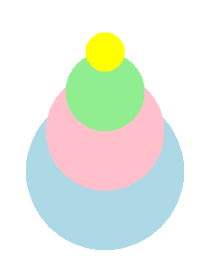

====================================================
Turtle circles and polygons
====================================================

| The code below draws dots, circles , parts of circles and regular polygons.

----

Turtle Dots
------------------------------------------

| The turtle syntax for drawing dots in below:

.. py:function:: turtle.dot(size=None, *color)

    | Draw a circular dot with diameter size, using color. 
    | If size is not given, the maximum of pensize+4 and 2*pensize is used.
    | **size** - the dot diameter, an integer >= 1 (if given)
    | **color** - a colorstring or a numeric color tuple (r,g, b,)

----

Draw_dot definition: dots at a specified location
--------------------------------------------------

| Adding a starting position, the centre of the dot, provides some convenience:

.. py:function:: draw_dot(t, centre=(0, 0), size=20, color="blue"):

    | **t** - the turtle object to draw the rectangle
    | **centre** - the centre of the dot; default (0, 0)
    | **size** - the diameter of the dot, an integer >= 1
    | **color** - a colorstring or a numeric color tuple (r,g, b,)

| The ``draw_dot`` definition code is below:

.. admonition:: Code Completion

    .. tab-set::

        .. tab-item:: Q

            | Complete the code for the draw_dot definition by replacing the "XXX"s.

            .. code-block:: python

                import turtle

                def draw_dot(t, centre=(0, 0), size=20, color="blue"):
                    t.XXX()
                    t.goto(XXX)
                    t.XXX()
                    t.dot(XXX, XXX)

        .. tab-item:: Ans

            | Completed code for the draw_dot definition.

            .. code-block:: python

                import turtle

                def draw_dot(t, centre=(0, 0), size=20, color="blue"):
                    t.pu()
                    t.goto(centre)
                    t.pd()
                    t.dot(size, color)

----

Using the Draw_dot definition
--------------------------------------------------

| Make use of the ``draw_dot`` definition by drawing a dot stack of 4 dots of decreasing size.

.. admonition:: Code Completion

    .. tab-set::

        .. tab-item:: Q

            | Complete the code to draw a series of stacked dots by replacing the "XXX"s.

            .. code-block:: python

                import turtle

                def draw_dot(t, centre=(0, 0), size=20, color="blue"):
                    t.pu()
                    t.goto(centre)
                    t.pd()
                    t.dot(size, color)

                s = turtle.Screen()
                s.bgcolor("white")
                s.title("Grid")
                s.setup(width=800, height=600, startx=0, starty=0)

                t = turtle.Turtle()
                t.speed(5)
                t.ht()

                centres = [(0, -100), (0, -50), (0, 0), (0, 50)]
                sizes = [200, 150, 100, 50]
                colors = ["light blue", "pink", "light green", "yellow"]
                
                for i in range(len(sizes)):
                    draw_dot(t, centre=XXX, size=XXX, color=XXX)

                s.exitonclick()

        .. tab-item:: Ans

            | Completed code to draw a series of stacked dots.

            .. code-block:: python

                import turtle

                def draw_dot(t, centre=(0, 0), size=20, color="blue"):
                    t.pu()
                    t.goto(centre)
                    t.pd()
                    t.dot(size, color)

                s = turtle.Screen()
                s.bgcolor("white")
                s.title("Grid")
                s.setup(width=800, height=600, startx=0, starty=0)

                t = turtle.Turtle()
                t.speed(5)
                t.ht()

                centres = [(0, -100), (0, -50), (0, 0), (0, 50)]
                sizes = [200, 150, 100, 50]
                colors = ["light blue", "pink", "light green", "yellow"]
                
                for i in range(len(sizes)):
                    draw_dot(t, centre=centres[i], size=sizes[i], color=colors[i])

                s.exitonclick()

----

Exploring draw_dot further
---------------------------

.. admonition:: Exercise

    1. Explore using lists to store multiple values for colors and positions and sizes. 
    Write a definition to iterate through the various values to draw stacks of dots of different sizes and colours.

    .. image:: images/dot_stacks.png
        :scale: 75 %
        :align: center
        :alt: dot_stacks

    .. dropdown::
            :icon: codescan
            :color: primary
            :class-container: sd-dropdown-container

            .. tab-set::

                .. tab-item:: Sample code

                    .. code-block:: python

                        import turtle

                        def draw_dot(t, centre=(0, 0), size=20, color="blue"):
                            t.pu()
                            t.goto(centre)
                            t.pd()
                            t.dot(size, color)

                        def draw_dot_stack(t, x, y, yadd, sizes, colors):
                            for i in range(len(sizes)):
                                centre_xy = (x, y+yadd*i)
                                draw_dot(t, centre=centre_xy, size=sizes[i], color=colors[i])

                        s = turtle.Screen()
                        s.bgcolor("white")
                        s.title("Grid")
                        s.setup(width=850, height=600, startx=0, starty=0)

                        t = turtle.Turtle()
                        t.speed(5)
                        t.ht()

                        colors = ["light blue", "pink", "light green", "yellow"]

                        sizes = [200, 150, 100, 50]
                        draw_dot_stack(t,-300, -80, 10, sizes, colors)

                        sizes = [200, 160, 120, 80]
                        draw_dot_stack(t,-100, -80, 25, sizes, colors)

                        sizes = [200, 170, 140, 110]
                        draw_dot_stack(t,100, -80, 40, sizes, colors)

                        sizes = [200, 180, 160, 140]
                        draw_dot_stack(t,300, -80, 55, sizes, colors)

                        s.exitonclick()

----

Turtle Circles
------------------------------------------

| The turtle syntax for drawing circles in below:

.. py:function:: turtle.circle(radius, extent=None, steps=None)

    | radius - radius, a number
    | extent - an angle, a number (or None for whole circle), which determines which part of the circle is drawn
    | steps - an integer (or None for a circle) which allows polygons to be drawn.

| The center is radius units left of the turtle at right angles from its heading if the radius is positive.
| The circle or arc is drawn counterclockwise if radius is positive, clockwise direction if negative.
| The direction of the turtle is changed by the amount of extent.
| The pensize increases the circle line inwards an outwards from the radius distance. So a pensize of 41 draws the circle 20 pixels inwards and 20 pixels outwards from the exact radius position. This is important for predicting circle edges with large pensizes. 

----

Circles at a specified location
------------------------------------------

| Adding a starting position, the centre of the circle, provides some convenience:

.. py:function:: draw_centered_circle(t, centre=(0, 0), size=20, color="blue", penw=1, penc="black", fillc=None)

    | **t** - the turtle object to draw the rectangle
    | **centre** - start position; default (0, 0)
    | **size** - the dot diameter, an integer >= 1 (if given)
    | **color** - a colorstring or a numeric color tuple (r,g, b,)

| The ``draw_dot`` definition code is below:

.. admonition:: Code Completion

    .. tab-set::

        .. tab-item:: Q

            | Complete the code for the draw_dot definition by replacing the "XXX"s.

            .. code-block:: python

                import turtle

                def draw_dot(t, centre=(0, 0), size=20, color="blue"):
                    t.XXX()
                    t.goto(centre)
                    t.XXX()
                    t.dot(XXX, XXX)

        .. tab-item:: Ans

            | Completed code for the draw_dot definition.

            .. code-block:: python

                import turtle

                def draw_dot(t, centre=(0, 0), size=20, color="blue"):
                    t.pu()
                    t.goto(centre)
                    t.pd()
                    t.dot(size, color)

----

| Make use of the ``draw_dot`` definition by drawing a series of dots of various sizes and colours at various locations.
| The sizes, colours and locations are provided as lists ready to use.

.. admonition:: Code Completion

    .. tab-set::

        .. tab-item:: Q

            | Complete the code to draw a series of stacked dots by replacing the "XXX"s.

            .. code-block:: python

                import turtle

                def draw_dot(t, centre=(0, 0), size=20, color="blue"):
                    t.pu()
                    t.goto(centre)
                    t.pd()
                    t.dot(size, color)

                s = turtle.Screen()
                s.bgcolor("white")
                s.title("Grid")
                s.setup(width=800, height=600, startx=0, starty=0)

                t = turtle.Turtle()
                t.speed(5)

                sizes = [200, 150, 100, 50]
                colors = ["light blue", "pink", "light green", "yellow"]
                centres = [(0, -100), (0, -50), (0, 0), (0, 30)]
                for i in range(len(sizes)):
                    draw_dot(t, centre=XXX, size=XXX, color=XXX)

                s.exitonclick()

        .. tab-item:: Ans

            | Completed code to draw a series of stacked dots.

            .. code-block:: python

                import turtle

                def draw_dot(t, centre=(0, 0), size=20, color="blue"):
                    t.pu()
                    t.goto(centre)
                    t.pd()
                    t.dot(size, color)

                s = turtle.Screen()
                s.bgcolor("white")
                s.title("Grid")
                s.setup(width=800, height=600, startx=0, starty=0)

                t = turtle.Turtle()
                t.speed(5)

                sizes = [200, 150, 100, 50]
                colors = ["light blue", "pink", "light green", "yellow"]
                centres = [(0, -100), (0, -50), (0, 0), (0, 30)]
                for i in range(len(sizes)):
                    draw_dot(t, centre=centres[i], size=sizes[i], color=colors[i])

                s.exitonclick()

