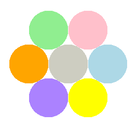
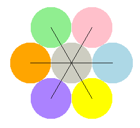

====================================================
Turtle dots
====================================================

| The code below draws dots (filled circles).

----

Turtle Dots
------------------------------------------

| The turtle syntax for drawing dots in below:

.. py:function:: turtle.dot(size=None, *color)

    | Draw a circular dot with diameter size, using color. 
    | **size** - the dot diameter, an integer >= 1 (if given)
    | If size is not given, the maximum of pensize+4 and 2*pensize is used.
    | **color** - a colorstring or a numeric color tuple (r,g, b,)

----

Draw_dot definition: dots at a specified location
--------------------------------------------------

| Adding a starting position, the centre of the dot, provides some convenience:

.. py:function:: draw_dot(t, centre=(0, 0), size=20, color="blue"):

    | **t** - the turtle object to draw the rectangle
    | **centre** - the centre of the dot; default (0, 0)
    | **size** - the diameter of the dot, an integer >= 1
    | **color** - a colorstring or a numeric color tuple (r,g, b,)

| The ``draw_dot`` definition code is below:

.. admonition:: Code Completion

    .. tab-set::

        .. tab-item:: Q

            | Complete the code for the draw_dot definition by replacing the "XXX"s.

            .. code-block:: python

                import turtle

                def draw_dot(t, centre=(0, 0), size=20, color="blue"):
                    t.XXX()
                    t.goto(XXX)
                    t.XXX()
                    t.dot(XXX, XXX)

        .. tab-item:: Ans

            | Completed code for the draw_dot definition.

            .. code-block:: python

                import turtle

                def draw_dot(t, centre=(0, 0), size=20, color="blue"):
                    t.pu()
                    t.goto(centre)
                    t.pd()
                    t.dot(size, color)

----

Using the Draw_dot definition
--------------------------------------------------

.. image:: images/dot_stack_1.png
    :scale: 75 %
    :align: center
    :alt: dot_stack_1

| Make use of the ``draw_dot`` definition by drawing a dot stack of 4 dots of decreasing size.
| The code below uses list of postions and sizes.
| For overlapping circles to have a common tangent on a side (that is, a line touches all the circles), if the change in the sizes (diameters), from one circle to the next, is the same, then the centres of the circles will be the same distance apart from one circle to the next.
| ``centres = [(0, -100), (0, -50), (0, 0), (0, 50)]``
| Notice how the y values of the centres increase by the same amount from one point to the next.
| ``sizes = [200, 150, 100, 50]``
| Notice also how the sizes (diameters) decrease by the same amount from one dot to the next.

| The code completion below draws the stacked dots in the image above. 

.. admonition:: Code Completion

    .. tab-set::

        .. tab-item:: Q

            | Complete the code to draw a series of stacked dots by replacing the "XXX"s.

            .. code-block:: python

                import turtle

                def draw_dot(t, centre=(0, 0), size=20, color="blue"):
                    t.pu()
                    t.goto(centre)
                    t.pd()
                    t.dot(size, color)

                s = turtle.Screen()
                s.bgcolor("white")
                s.title("Grid")
                s.setup(width=800, height=600, startx=0, starty=0)

                t = turtle.Turtle()
                t.speed(5)
                t.ht()

                centres = [(0, -100), (0, -50), (0, 0), (0, 50)]
                sizes = [200, 150, 100, 50]
                colors = ["light blue", "pink", "light green", "yellow"]
                
                for i in range(len(sizes)):
                    draw_dot(t, centre=XXX, size=XXX, color=XXX)

                s.exitonclick()

        .. tab-item:: Ans

            | Completed code to draw a series of stacked dots.

            .. code-block:: python

                import turtle

                def draw_dot(t, centre=(0, 0), size=20, color="blue"):
                    t.pu()
                    t.goto(centre)
                    t.pd()
                    t.dot(size, color)

                s = turtle.Screen()
                s.bgcolor("white")
                s.title("Grid")
                s.setup(width=800, height=600, startx=0, starty=0)

                t = turtle.Turtle()
                t.speed(5)
                t.ht()

                centres = [(0, -100), (0, -50), (0, 0), (0, 50)]
                sizes = [200, 150, 100, 50]
                colors = ["light blue", "pink", "light green", "yellow"]
                
                for i in range(len(sizes)):
                    draw_dot(t, centre=centres[i], size=sizes[i], color=colors[i])

                s.exitonclick()

.. admonition:: Exercise

    .. tab-set::

        .. tab-item:: Challenge

            | Try varying the change in the centres or sizes.
            | See if you can use variables to specify the start values of the lists and the size changes in the values so that you only need to change one number for all the numbers to adjust to that change.

----

Exploring dot stacks further
-----------------------------

.. admonition:: Task

    1. Explore drawing dot stacks using lists to store multiple values for colors and positions and sizes. 
    Write a definition to iterate through the various values to draw stacks of dots of different sizes and colours.

    .. image:: images/dot_stacks.png
        :scale: 75 %
        :align: center
        :alt: dot_stacks

    .. dropdown::
            :icon: codescan
            :color: primary
            :class-container: sd-dropdown-container

            .. tab-set::

                .. tab-item:: Sample code

                    .. code-block:: python

                        import turtle

                        def draw_dot(t, centre=(0, 0), size=20, color="blue"):
                            t.pu()
                            t.goto(centre)
                            t.pd()
                            t.dot(size, color)

                        def draw_dot_stack(t, x, y, yadd, size_0, size_dec, colors):
                            for i in range(len(colors)):
                                centre_xy = (x, y + yadd*i)
                                size = size_0 - size_dec*i
                                draw_dot(t, centre=centre_xy, size=size, color=colors[i])

                        s = turtle.Screen()
                        s.bgcolor("white")
                        s.title("Grid")
                        s.setup(width=850, height=600, startx=0, starty=0)

                        t = turtle.Turtle()
                        t.speed(5)
                        t.ht()

                        colors = ["light blue", "pink", "light green", "yellow"]

                        draw_dot_stack(t,x=-300, y=-80, yadd=10, size_0=200, size_dec=50, colors=colors)
                        draw_dot_stack(t,x=-100, y=-80, yadd=25, size_0=200, size_dec=40, colors=colors)
                        draw_dot_stack(t,x=100, y=-80, yadd=40, size_0=200, size_dec=30, colors=colors)
                        draw_dot_stack(t,x=300, y=-80, yadd=55, size_0=200, size_dec=20, colors=colors)

                        s.exitonclick()

----

Using the Draw_dot: hexagonal array
--------------------------------------------------

| Make use of the ``draw_dot`` definition by hexagon of circles using draw_dot.

| The code completion below draws a 6 circles around a central circle, wiht all circles the same size.
| The 6 circles have their centres in the shape of a hexagon. 
| Since 360/6 is 60 degrees, the turtle can locate the centres of each circle by starting for the central circles's centre each time and heading outwards at angles that change by 60 degrees each time.
| The image below shows the path taken by the turtle in doing the drawing.

.. py:function:: draw_dot_hexagon(t, x, y, angle, size, colors):

    | **t** - the turtle object to draw the rectangle
    | **centre** - the centre of the dot; default (0, 0)
    | **size** - the diameter of the dot, an integer >= 1
    | **color** - a colorstring or a numeric color tuple (r,g, b,)

.. admonition:: Code Completion

    .. tab-set::

        .. tab-item:: Q

            | Complete the code to draw a series of stacked dots by replacing the "XXX"s.

            .. code-block:: python

                def draw_dot_hexagon(t, x, y, angle, size, colors):
                    hex_centre = (x, y)
                    draw_dot(t, centre=hex_centre, size=size, color="ivory3")
                    for i in range(6):
                        t.pu()
                        t.goto(hex_centre)
                        t.seth(angle + 60 * i)
                        t.fd(size)
                        centre = t.pos()
                        draw_dot(t, centre=centre, size=size, color=colors[i])

.. admonition:: Code Completion

    .. tab-set::

        .. tab-item:: Q

            | Complete the code to draw a hexagon of circles by replacing the "XXX"s.

            .. code-block:: python

                import turtle

                def draw_dot(t, centre=(0, 0), size=20, color="blue"):
                    t.pu()
                    t.goto(centre)
                    t.pd()
                    t.dot(size, color)

                def draw_dot_hexagon(t, centre, angle, size, colors):
                    draw_dot(t, centre=centre, size=size, color="ivory3")
                    for i in range(6):
                        t.pu()
                        t.goto(centre)
                        t.seth(angle + 60 * i)
                        t.fd(size)
                        dot_centre = t.pos()
                        draw_dot(t, centre=dot_centre, size=size, color=colors[i])

                s = turtle.Screen()
                s.bgcolor("white")
                s.title("Grid")
                s.setup(width=850, height=600, startx=0, starty=0)
                s.tracer(0, 0)
                s.colormode(255)

                t = turtle.Turtle()
                t.speed(0)
                t.ht()

                colors = ["light blue", "pink", "light green", "orange", "MediumPurple1", "yellow"]
                draw_dot_hexagon(t, centre=(0, 0), angle=0, size=80, colors=colors)

                s.update()
                s.exitonclick()