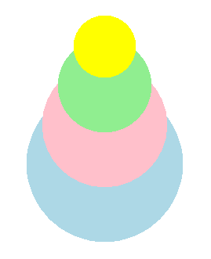
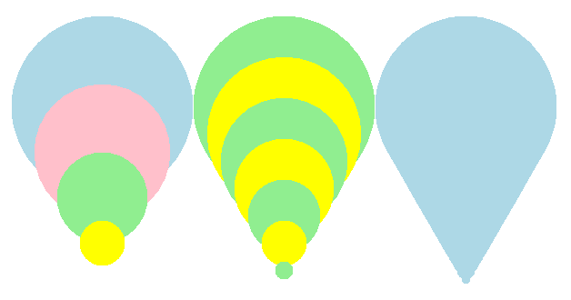
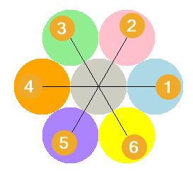

====================================================
Turtle dots
====================================================

| The code below draws dots (filled circles).

----

Turtle Dots
------------------------------------------

| The turtle syntax for drawing dots in below:

.. py:function:: turtle.dot(size=None, *color)

    | Draw a circular dot with diameter size, using color. 
    | **size** - the dot diameter, an integer >= 1 (if given); default None
    | If size is not given, the maximum of pensize+4 and 2*pensize is used.
    | **color** - a colorstring or a numeric color tuple (r, g, b,)

----

Draw_dot definition: dots at a specified location
--------------------------------------------------

| Adding a starting position, the centre of the dot, provides some convenience.
| The syntax for a ``draw_dot`` definition in below:

.. py:function:: draw_dot(t, centre=(0, 0), size=20, color="blue")

    | **t** - the turtle object to draw the dot
    | **centre** - the centre of the dot; default (0, 0)
    | **size** - the diameter of the dot, an integer >= 1; default 20
    | **color** - a colorstring or a numeric color tuple (r, g, b,); default "blue"

| The ``draw_dot`` definition code is below:

.. admonition:: Code Completion: draw_dot definition

    .. tab-set::

        .. tab-item:: Q

            | Complete the code for the draw_dot definition by replacing the "XXX"s.

            .. code-block:: python

                import turtle

                def draw_dot(t, centre=(0, 0), size=20, color="blue"):
                    t.XXX()
                    t.goto(XXX)
                    t.XXX()
                    t.dot(XXX, XXX)

        .. tab-item:: Ans

            | Completed code for the draw_dot definition.

            .. code-block:: python

                import turtle

                def draw_dot(t, centre=(0, 0), size=20, color="blue"):
                    t.pu()
                    t.goto(centre)
                    t.pd()
                    t.dot(size, color)

----

Using the Draw_dot definition
--------------------------------------------------

| Make use of the ``draw_dot`` definition by drawing a dot stack of 4 dots of decreasing size.
| The code below uses list of positions and sizes.
| For overlapping circles to have a common tangent on a side (that is, a line touches all the circles), set the change in the sizes (diameters), from one circle to the next, to the same value, and set the centres of the circles to be the same distance apart from one circle to the next.
| ``centres = [(0, -100), (0, -50), (0, 0), (0, 50)]``
| Notice how the y values of the centres increase by the same amount from one point to the next.
| ``sizes = [200, 160, 120, 80]``
| Notice also how the sizes (diameters) decrease by the same amount from one dot to the next.

| The code completion below draws the stacked dots in the image above. 

.. admonition:: Code Completion: stacked dots

    .. tab-set::

        .. tab-item:: Q

            | Complete the code to draw a series of stacked dots by replacing the "XXX"s.

            .. code-block:: python

                import turtle

                def draw_dot(t, centre=(0, 0), size=20, color="blue"):
                    t.pu()
                    t.goto(centre)
                    t.pd()
                    t.dot(size, color)

                s = turtle.Screen()
                s.bgcolor("white")
                s.title("draw_dot")
                s.setup(width=800, height=600, startx=0, starty=0)

                t = turtle.Turtle()
                t.speed(5)
                t.ht()

                centres = [(0, -100), (0, -50), (0, 0), (0, 50)]
                sizes = [200, 160, 120, 80]
                colors = ["light blue", "pink", "light green", "yellow"]
                
                for i in range(len(sizes)):
                    draw_dot(t, centre=XXX, size=XXX, color=XXX)

                s.exitonclick()

        .. tab-item:: Ans

            | Completed code to draw a series of stacked dots.

            .. code-block:: python

                import turtle

                def draw_dot(t, centre=(0, 0), size=20, color="blue"):
                    t.pu()
                    t.goto(centre)
                    t.pd()
                    t.dot(size, color)

                s = turtle.Screen()
                s.bgcolor("white")
                s.title("draw_dot")
                s.setup(width=800, height=600, startx=0, starty=0)

                t = turtle.Turtle()
                t.speed(5)
                t.ht()

                centres = [(0, -100), (0, -50), (0, 0), (0, 50)]
                sizes = [200, 160, 120, 80]
                colors = ["light blue", "pink", "light green", "yellow"]
                
                for i in range(len(sizes)):
                    draw_dot(t, centre=centres[i], size=sizes[i], color=colors[i])

                s.exitonclick()

.. admonition:: Exercise

    .. tab-set::

        .. tab-item:: Challenge

            | Try varying the change in the centres or sizes.
            | See if you can use variables to specify the start values of the lists and the size changes in the values so that you only need to change one number for all the numbers to adjust to that change.

----

draw_dot_stack definition
--------------------------------------------------

| From the code above, the iteration lines can be moved into a new defintion: ``draw_dot_stack``.
| The ``draw_dot_stack`` syntax :

.. py:function:: draw_dot_stack(t, centre, pos_step, angle, size, size_step, colors)

    | **t** - the turtle object to draw the dot stack
    | **centre** - the centre of the dot
    | **pos_step** - the length to move in the direction given by the angle, from the centre
    | **angle** - the angle to draw the stack    
    | **size** - the diameter of the dot    
    | **size_step** - the length to reduce the diameter by for successive dots
    | **colors** - a list of colorstring or numeric color tuples (r, g, b,)

| The ``draw_dot_stack`` definition code is below:

.. admonition:: Code Completion: draw_dot_stack definition

    .. tab-set::

        .. tab-item:: Q

            | Complete the code for the draw_dot_stack definition by replacing the "XXX"s.

            .. code-block:: python

                import turtle

                def draw_dot_stack(t, centre, pos_step, angle, size, size_step, colors):
                    # based on number of colours
                    for i in range(len(XXX)):
                        t.pu()
                        t.goto(XXX)
                        t.seth(XXX)
                        t.fd(i*XXX)
                        dot_centre = t.pos()
                        draw_dot(t, centre=dot_centre, size=size - i*XXX, color=colors[XXX])

        .. tab-item:: Ans

            | Completed code for the draw_dot definition.

            .. code-block:: python

                import turtle

                def draw_dot_stack(t, centre, pos_step, angle, size, size_step, colors):
                    # based on number of colours
                    for i in range(len(colors)):
                        t.pu()
                        t.goto(centre)
                        t.seth(angle)
                        t.fd(i*pos_step)
                        dot_centre = t.pos()
                        draw_dot(t, centre=dot_centre, size=size - i*size_step, color=colors[i])

----

Exploring dot stacks further
-----------------------------

.. admonition:: Task

    1. Use ``draw_dot_stack`` to draw the dot stacks above using the skeleton outline below.

    .. image:: images/dot_stacks.png
        :scale: 75 %
        :align: center
        :alt: dot_stacks

    .. dropdown::
            :icon: codescan
            :color: primary
            :class-container: sd-dropdown-container

            .. tab-set::

                .. tab-item:: Ans

                    .. code-block:: python

                        import turtle

                        # def draw_dot...

                        # def draw_dot_stack...

                        s = turtle.Screen()
                        #...

                        t = turtle.Turtle()
                        #...

                        # colors = ...

                        draw_dot_stack(t, centre=(-300, -80), pos_step=10, angle=45, size=200, size_step=50, colors=colors)
                        # draw_dot_stack...
                        # draw_dot_stack...
                        # draw_dot_stack...

                        s.exitonclick()

                .. tab-item:: Ans

                    .. code-block:: python

                        import turtle

                        def draw_dot(t, centre=(0, 0), size=20, color="blue"):
                            t.pu()
                            t.goto(centre)
                            t.pd()
                            t.dot(size, color)

                        def draw_dot_stack(t, centre, pos_step, angle, size, size_step, colors):
                            # based on number of colours
                            for i in range(len(colors)):
                                t.pu()
                                t.goto(centre)
                                t.seth(angle)
                                t.fd(i*pos_step)
                                dot_centre = t.pos()
                                draw_dot(t, centre=dot_centre, size=size - i*size_step, color=colors[i])

                        s = turtle.Screen()
                        s.bgcolor("white")
                        s.title("draw_dot_stack")
                        s.setup(width=850, height=600, startx=0, starty=0)

                        t = turtle.Turtle()
                        t.speed(0)
                        t.ht()

                        colors = ["light blue", "pink", "light green", "yellow"]

                        draw_dot_stack(t, centre=(-300, -80), pos_step=10, angle=45, size=200, size_step=50, colors=colors)
                        draw_dot_stack(t, centre=(-100, -80), pos_step=25, angle=60, size=200, size_step=40, colors=colors)
                        draw_dot_stack(t, centre=(100, -80), pos_step=40, angle=75, size=200, size_step=30, colors=colors)
                        draw_dot_stack(t, centre=(300, -80), pos_step=55, angle=90, size=200, size_step=20, colors=colors)

                        s.exitonclick()

----

Icecream cones from dot stacks
--------------------------------------------------

| Make use of the ``draw_dot_stack`` definition to approximate a cone shape by drawing a series of smaller and smaller circles.

draw_dot_stack_cone definition
--------------------------------------------------

| The draw_dot_stack_cone syntax :

.. py:function:: draw_dot_stack_cone(t, centre, pos_step, angle, size, size_step, colors)

    | **t** - the turtle object to draw the dot stack cone
    | **centre** - the centre of the dot
    | **pos_step** - the length to move in the direction given by angle, from centre
    | **angle** - the angle to draw the stack    
    | **size** - the diameter of the dot    
    | **size_step** - the length to reduce the diameter by for successive dots
    | **colors** - a list of colorstring or numeric color tuples (r, g, b,)

| The ``draw_dot_stack_cone`` definition code is below.
| This modifies the ``draw_dot_stack`` definition.
| It loops through the dot size from its starting size down towards 0.
| As a result, a counter will be used for the other variables that need to be changed with each loop.
| To loop through the colors list, when more loops occur than the length of the colors list, the modulus operator can be used to get the remainder, which is then used to index the colour in the colors list.
| ``counter % len(colors)`` gives a value between 0 and the last index position in the colors list.
| See: https://www.w3schools.com/python/gloss_python_arithmetic_operators.asp
| If only one colour is passed as an argument, then ``len(colors)`` will treat is as a string and not as a list. 
| ``isinstance(colors,list)`` is used to cover this situation, and either use that single colour if there is just one, or index the next colour in the list.
| See: https://www.w3schools.com/python/ref_func_isinstance.asp

.. admonition:: Code Completion: draw_dot_stack_cone definition

    .. tab-set::

        .. tab-item:: Q

            | Complete the code for the draw_dot_stack_cone definition by replacing the "XXX"s.

            .. code-block:: python

                import turtle

 
                def draw_dot_stack_cone(t, centre, pos_step, angle, size, size_step, colors):
                    # based on size and size_step
                    # use  counter % len(colors)  to be able to loop though colors more than once.
                    # use isinstance(colors,list) to check for just one colour or a list of colours
                    counter = 0
                    for i in range(size, 0, -XXX):
                        t.pu()
                        t.goto(XXX)
                        t.seth(XXX)
                        t.fd(counter*XXX)
                        dot_centre = t.pos()
                        if isinstance(colors,list):
                            dot_color = colors[counter % len(colors)] 
                        else:
                            dot_color = colors  
                        draw_dot(t, centre=dot_centre, size=size - counter*XXX, color=dot_color)
                        counter += 1

        .. tab-item:: Ans

            | Completed code for the draw_dot_stack_cone definition.

            .. code-block:: python

                import turtle

                def draw_dot_stack_cone(t, centre, pos_step, angle, size, size_step, colors):
                    # based on size and size_step
                    # use  counter % len(colors)  to be able to loop though colors more than once.
                    # use isinstance(colors,list) to check for just one colour or a list of colours
                    counter = 0
                    for i in range(size, 0, -size_step):
                        t.pu()
                        t.goto(centre)
                        t.seth(angle)
                        t.fd(counter*pos_step)
                        dot_centre = t.pos()
                        if isinstance(colors,list):
                            dot_color = colors[counter % len(colors)] 
                        else:
                            dot_color = colors  
                        draw_dot(t, centre=dot_centre, size=size - counter*size_step, color=dot_color)
                        counter += 1

----

draw_dot_stack_cone usage
--------------------------------------------------

| Draw cone shapes with the draw_dot_stack_cone definition, with different numbers of dots in each.

.. admonition:: Task

    1. | Write code to draw a series of 3 cones which approximate a cone shape as in the image below, using the skeleton outline below.

    .. image:: images/cones_by_dot_stacks.png
        :scale: 50 %
        :align: center
        :alt: dot_stack_1

    .. dropdown::
            :icon: codescan
            :color: primary
            :class-container: sd-dropdown-container

            .. tab-set::

                .. tab-item:: Q

                    .. code-block:: python

                        import turtle

                        # def draw_dot...

                        # def draw_dot_stack_cone...

                        s = turtle.Screen()
                        #...

                        t = turtle.Turtle()
                        #...

                        colors = ["light blue", "pink", "light green", "yellow", "MediumPurple1", "bisque"]

                        draw_dot_stack_cone(t, centre=(-200, 100), pos_step=50, angle=270, size=200, size_step =50, colors=colors)
                        #...

                        s.update()
                        s.exitonclick()

                .. tab-item:: Ans

                    | Completed code to draw a series of 3 cones which approximate a cone shape.

                    .. code-block:: python

                        import turtle

                        def draw_dot(t, centre=(0, 0), size=20, color="blue"):
                            t.pu()
                            t.goto(centre)
                            t.pd()
                            t.dot(size, color)

                        def draw_dot_stack_cone(t, centre, pos_step, angle, size, size_step, colors):
                            # based on size and size_step
                            # use  counter % len(colors)  to be able to loop though colors more than once.
                            # use isinstance(colors,list) to check for just one colour or a list of colours
                            counter = 0
                            for i in range(size, 0, -size_step):
                                t.pu()
                                t.goto(centre)
                                t.seth(angle)
                                t.fd(counter*pos_step)
                                dot_centre = t.pos()
                                if isinstance(colors,list):
                                    dot_color = colors[counter % len(colors)] 
                                else:
                                    dot_color = colors  
                                draw_dot(t, centre=dot_centre, size=size - counter*size_step, color=dot_color)
                                counter += 1

                        s = turtle.Screen()
                        s.bgcolor("white")
                        s.title("draw_dot_stack_cone")
                        s.setup(width=800, height=600, startx=0, starty=0)
                        s.tracer(0, 0)
                        s.colormode(255)

                        t = turtle.Turtle()
                        t.speed(0)
                        t.ht()

                        colors = ["light blue", "pink", "light green", "yellow", "MediumPurple1", "bisque"]

                        draw_dot_stack_cone(t, centre=(-200, 100), pos_step=50, angle=270, size=200, size_step =50, colors=colors)
                        draw_dot_stack_cone(t, centre=(0, 100), pos_step=30, angle=270, size=200, size_step=30, colors=colors[2:4])
                        draw_dot_stack_cone(t, centre=(200, 100), pos_step=10,  angle=270, size=200, size_step=10, colors=colors[0])

                        s.update()
                        s.exitonclick()

----

Hexagonal array: draw_dot_centre_hexagon definition
--------------------------------------------------

| Write a ``draw_dot_centre_hexagon`` definition to draw a hexagon of circles around a central dot.

.. py:function:: draw_dot_centre_hexagon(t, centre, angle, size, centre_color, colors)

    | **t** - the turtle object to draw the rectangle
    | **centre** - the centre of the dot hexagon
    | **angle** - the direction of the first dot
    | **size** - the diameter of the dot, an integer >= 1
    | **centre_color** - the colour of the central dot; a colorstring or a numeric color tuple (r, g, b,)
    | **colors** - the colours of the surrounding dots; a list of 6 colorstring or a numeric color tuples (r, g, b,)

| The code completion below completes the ``draw_dot_centre_hexagon`` definition to draw 6 circles around a central circle, with all circles the same size.
| The 6 circles have their centres in the shape of a hexagon. 
| Since 360/6 is 60 degrees, the turtle can locate the centres of each circle by starting from the central circles's centre each time and heading outwards at angles that change by 60 degrees each time.
| This avoids using trig to calculate the centre of the circles, since ``dot_centre = t.pos()`` can be used instead.
| An alternative approach would be to go from centre to centre by turning 60 degrees.
| The image below shows the path taken by the turtle in doing the drawing.

.. admonition:: Code Completion: draw_dot_centre_hexagon definition

    .. tab-set::

        .. tab-item:: Q

            | Complete the draw_dot_centre_hexagon definition used to draw 6 circles around a central circle, with all circles the same size.
            | Replacing the "XXX"s.

            .. code-block:: python

                def draw_dot_centre_hexagon(t, centre, angle, size, centre_color, colors):
                    draw_dot(t, centre=centre, size=size, color=XXX)
                    for i in range(6):
                        t.pu()
                        t.goto(XXX)
                        t.seth(angle + XXX * i)
                        t.fd(XXX)
                        dot_centre = t.pos()
                        draw_dot(t, centre=XXX, size=XXX, color=colors[XXX])

        .. tab-item:: Ans

            | Completed draw_dot_centre_hexagon definition.

            .. code-block:: python

                def draw_dot_centre_hexagon(t, centre, angle, size, centre_color, colors):
                    draw_dot(t, centre=centre, size=size, color=centre_color)
                    for i in range(6):
                        t.pu()
                        t.goto(centre)
                        t.seth(angle + 60 * i)
                        t.fd(size)
                        dot_centre = t.pos()
                        draw_dot(t, centre=dot_centre, size=size, color=colors[i])

.. admonition:: Task

    1. | Write code to draw 6 dots around a central dot, with all dots the same size.

    .. dropdown::
            :icon: codescan
            :color: primary
            :class-container: sd-dropdown-container

            .. tab-set::

                .. tab-item:: Q

                    | Complete the code to draw 6 dots around a central dots using the skeleton outline below.

                    .. code-block:: python

                        import turtle

                        #def draw_dot...

                        #def draw_dot_centre_hexagon...

                        s = turtle.Screen()
                        #...

                        t = turtle.Turtle()
                        #...

                        XXX = ["light blue", "pink", "light green", "orange", "MediumPurple1", "yellow"]
                        XXX(t, centre=(0, 0), angle=0, size=80, colors=colors)

                        s.update()
                        s.exitonclick()

                .. tab-item:: Ans

                    | Completed code to draw 6 dots around a central dots, with all dots the same size.

                    .. code-block:: python

                        import turtle

                        def draw_dot(t, centre=(0, 0), size=20, color="blue"):
                            t.pu()
                            t.goto(centre)
                            t.pd()
                            t.dot(size, color)

                        def draw_dot_centre_hexagon(t, centre, angle, size, colors):
                            draw_dot(t, centre=centre, size=size, color="ivory3")
                            for i in range(6):
                                t.pu()
                                t.goto(centre)
                                t.seth(angle + 60 * i)
                                t.fd(size)
                                dot_centre = t.pos()
                                draw_dot(t, centre=dot_centre, size=size, color=colors[i])

                        s = turtle.Screen()
                        s.bgcolor("white")
                        s.title("draw_dot_centre_hexagon")
                        s.setup(width=800, height=600, startx=0, starty=0)
                        s.tracer(0, 0)
                        s.colormode(255)

                        t = turtle.Turtle()
                        t.speed(0)
                        t.ht()

                        colors = ["light blue", "pink", "light green", "orange", "MediumPurple1", "yellow"]
                        draw_dot_centre_hexagon(t, centre=(0, 0), angle=0, size=80, colors=colors)

                        s.update()
                        s.exitonclick()

----

.. admonition:: Exercise

    .. tab-set::

        .. tab-item:: Challenge

            | Write code to construct the image below.

            .. image:: images/hexagonal_dot_cones.png
                :scale: 75 %
                :align: center
                :alt: hexagonal_dot_cones

