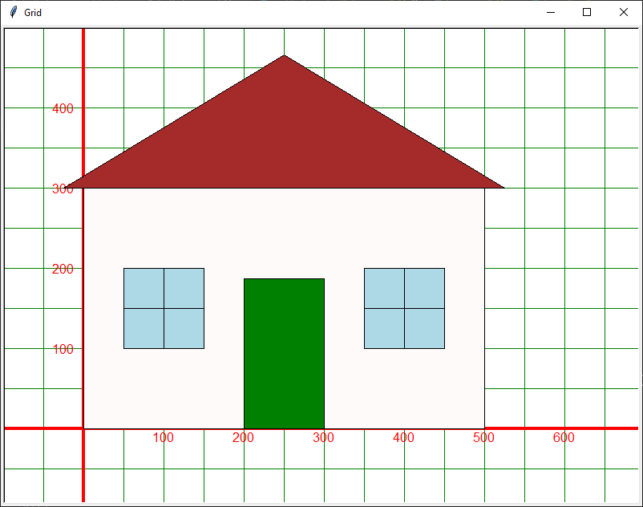
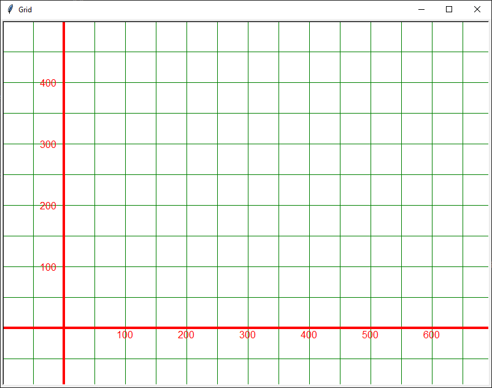

====================================================
Turtle houses
====================================================

| Redesign the house to make it more symmetrical.
| Below is a symmetrical house, resized to 500 wide for convenience.
| The door is in the centre of the front.
| The windows are either side of the door at equal distances from the wall and door.
| Think of the hosue as have 10 equal divisions across the front, with eeach space being 1 division and each door and window each being 2 divisions.
| Write new definitions for the ``house_door`` and ``house_window4``.
| Keep and rename the old ``house_door`` and ``house_window4`` to ``house_door_v1`` and ``house_window4_v1``.

----

Own design
---------------

| An empty grid is below.
| Design your own house and write definitions to place the parts.

