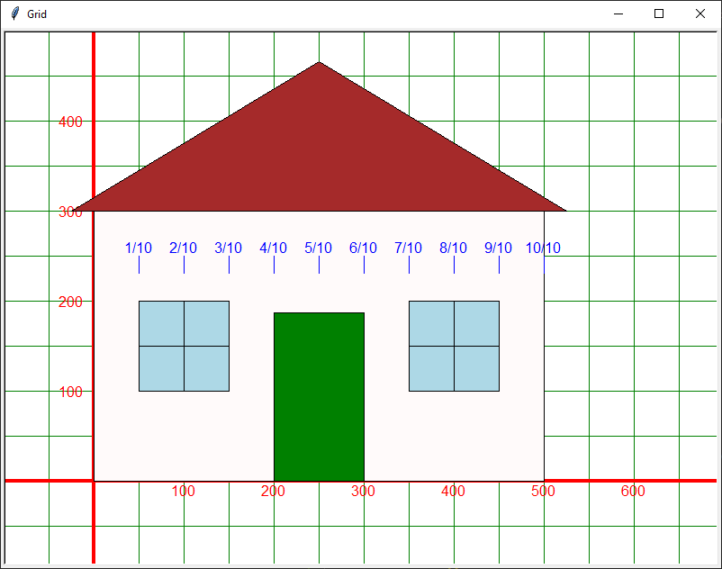

====================================================
Turtle houses designs
====================================================

Symmetrical house
--------------------------

| Redesign the house to make it more symmetrical.
| Below is a symmetrical house, resized to 500 wide for convenience.
| The door is in the centre of the front.
| The windows are either side of the door at equal distances from the wall and door.
| Think of the house as having 10 equal divisions across the front, with each space being 1 division and each door and window each being 2 divisions.

----

Module revision
--------------------

.. admonition:: Exercises

    1. Write new definitions for the ``house_door`` and ``house_window4`` to produce the image below. Add these to the house module and use them to make your own row of houses.
    
        .. image:: images/houses_v2.png
            :scale: 75 %
            :align: center
            :alt: houses_v2.png

----

Other compound objects
--------------------------

| Add dots, cirles, polygons, pie slices and stars to the shapes module in preparation for making other compound objects.

| An empty grid is below.
| Design your own compound objects and write definitions to place the parts relative to a start position so that the total object can be scaled.

| Some ideas can be gained from the links below.
| Remember to write definitions to place each part so that the final object can be scaled and repositioned.
| Don't just use sequencing as in the examples below. Create code that uses definitions to place the shapes from the ``shape`` module.
| e.g A Christmas tree. See: https://copyassignment.com/draw-a-christmas-tree-using-python-turtle/
| e.g A snowman made of circles. See: https://copyassignment.com/draw-snowman-using-turtle/
| e.g. A boat mad of triangles and rectangles: See: https://www.youtube.com/watch?v=S21p1EwNgA8&list=PLS9qLR8VoFA56NWSswK2daQSovI9QCpQE&index=48

