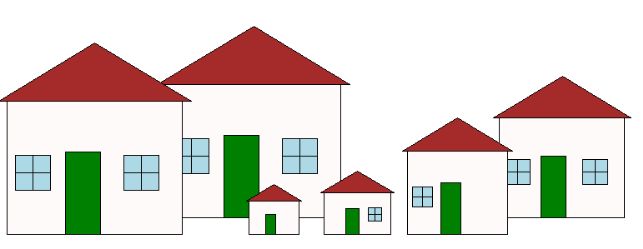

====================================================
Turtle houses module
====================================================

| The houses are built from squares, rectangles and triangles.
| To reduce the code in the main file, separate modules are used which group the code together.
| Definitions for the base shapes, squares, rectangles and triangles, are placed in a module, ``shapes.py``.
| Definitions for house shapes will be placed in a module, ``houses.py``.

| Download the python file :download:`shapes.py module <files/shapes.py>`
| Create the module, ``houses.py``, by following the steps below to build a basic house shape by combining together various shapes from the shapes module.

----

Importing the shapes module
----------------------------------

| See: https: // www.w3schools.com/python/ref_keyword_as.asp
| The code below shows importing the shapes module as an alias via ``import shapes as sh``.
| This makes it shorter to refer to functions in the shapes module.
| Instead of needing ``shapes.rectangle``, only ``sh.rectangle`` is needed.

.. code-block:: python

    import turtle
    import shapes as sh

----

Windowed houses
------------------

| The diagram below shows the layout of a house with windows.
| Positions and sizes of each shape are related to the position and sizes of the house.
| Measurements are calculated using multiplication and division so that the house can be scaled up or down and still keep the same proportions.

.. image:: images/house_measurements.png
    :scale: 75 %
    :align: center
    :alt: simple_houses1

----

House definition
------------------

| Write a definition that produces a house of given length, height and position with 0 to 2 windows.

.. py:function:: windowed_house(t, length=60, height=40, start_pos=(0, 0), w_sides=None))

    | draw a house with 0-2 windows
    | **t** (class turtle.Turtle): turtle instance.
    | **length** (int, optional): length of house. Defaults to 60.
    | **height** (int, optional): height of house. Defaults to 40.
    | **start_pos** (tuple, optional): bottom left of house. Defaults to (0, 0).
    | **w_sides** (str, optional): L for windows on left side of house; R for right; LR for both. Defaults to None.

| Use the functions from the ``shapes.py`` module to build the windowed_house function.
| The code below is starter code for the windowed_house definition.
| The doc string has already been added.
| Comments are in place to indicate where each part of the hosue will be added.

.. code-block:: python

    import turtle
    import shapes as sh

    def windowed_house(t, length=60, height=40, start_pos=(0, 0), w_sides=None):
        """draw a house with 0-2 windows

        Args:
            t (class turtle.Turtle): turtle instance.
            length (int, optional): length of house. Defaults to 60.
            height (int, optional): height of house. Defaults to 40.
            start_pos (tuple, optional): bottom left of house. Defaults to (0, 0).
            w_sides (str, optional): L for left side of house; R for right and LR for both. Defaults to None.
        """
        # front of house
        
        # door

        # roof

        # windows

----

Front of house
------------------

| The front of the house will be a rectangle.
| The length, width, start_pos of the rectangle are those of the house.
| For simplicity, the pensize, pencolor and fillcolor have been set below.
| ``sh.rectangle(t, length=length, width=height, start_pos=start_pos, penw=1, penc="black", fillc="snow")``

.. code-block:: python

    import turtle
    import shapes as sh

    def windowed_house(t, length=60, height=40, start_pos=(0, 0), w_sides=None):
        """draw a house with 0-2 windows

        Args:
            t (class turtle.Turtle): turtle instance.
            length (int, optional): length of house. Defaults to 60.
            height (int, optional): height of house. Defaults to 40.
            start_pos (tuple, optional): bottom left of house. Defaults to (0, 0).
            w_sides (str, optional): L for left side of house; R for right and LR for both. Defaults to None.
        """
        # front of house
        sh.rectangle(t, length=length, width=height, start_pos=start_pos, 
                        penw=1, penc="black", fillc="snow")

| Test the code sofar using ``windowed_house(t, length=600, height=300, start_pos=(-300, -200), w_sides="LR")``
| This will build a house of 600 by 300 at (-300, -200).
| Only the houses main rectangle will be drawn so far.

.. code-block:: python

    import turtle
    import shapes as sh

    s = turtle.Screen()
    s.bgcolor("white")
    s.title("Windowed Houses")
    s.setup(width=800, height=600, startx=200, starty=100)

    t = turtle.Turtle()

    def windowed_house(t, length=60, height=40, start_pos=(0, 0), w_sides=None):
        """draw a house with 0-2 windows

        Args:
            t (class turtle.Turtle): turtle instance.
            length (int, optional): length of house. Defaults to 60.
            height (int, optional): height of house. Defaults to 40.
            start_pos (tuple, optional): bottom left of house. Defaults to (0, 0).
            w_sides (str, optional): L for left side of house; R for right and LR for both. Defaults to None.
        """
        # front of house
        sh.rectangle(t, length=length, width=height, start_pos=start_pos, 
                        penw=1, penc="black", fillc="snow")

    windowed_house(t, length=600, height=300, start_pos=(-300, -200), w_sides="LR")

    s.exitonclick()

----

.. admonition:: Code Completion

    .. tab-set::

        .. tab-item:: Q

            | Complete the code to build a series of houses.
            | Starter code is provided with ``XXX`` where the code has to be completed.

            .. code-block:: python

                import turtle
                import shapes as sh

                s = turtle.Screen()
                s.bgcolor("white")
                s.title("Windowed House")
                s.setup(width=800, height=600, startx=200, starty=100)
                s.tracer(0, 0)

                t = turtle.Turtle()
                t.speed(0)

                t.ht()
                s.update()
                s.exitonclick()

        .. tab-item:: Ans

            Completed code to build a series of houses.

            .. code-block:: python

                import turtle
                import shapes as sh

                s = turtle.Screen()
                s.bgcolor("white")
                s.title("Grid")
                s.setup(width=800, height=600, startx=200, starty=100)
                s.tracer(0, 0)

                t = turtle.Turtle()
                t.speed(0)

                def house_door(t, length, height, start_pos):
                    """draw door 1/3 along length of house, 1/5 of length of house, 1/1.6 of height of house
                    """
                    d_pos = (start_pos[0] + length//3, start_pos[1])
                    d_height = height//1.6
                    d_length = length//5
                    sh.rectangle(t, length=d_length, width=d_height, start_pos=d_pos, penw=1, penc="black", fillc="green")

                def house_roof(t, length, height, start_pos):
                    """draw roof with overhang of 5 pixels over left side and right side of house
                    """
                    r_pos = (start_pos[0] - 5, start_pos[1] + height)
                    r_height = length//3
                    r_length = length + 10
                    sh.isosceles(t, base=r_length, height=r_height, start_pos=r_pos, penw=1, penc="black", fillc="brown")

                def simple_house(t, length=60, height=40, start_pos=(0, 0)):
                    # main house
                    sh.rectangle(t, length=length, width=height, start_pos=start_pos, penw=1, penc="black", fillc="snow")
                    # door
                    house_door(t, length, height, start_pos)
                    # roof
                    house_roof(t, length, height, start_pos)

                simple_house(t, length=210, height=160, start_pos=(-200, 20))
                simple_house(t, length=150, height=120, start_pos=(200, 20))
                simple_house(t, length=60, height=40, start_pos=(-100, 0))
                simple_house(t, length=80, height=50, start_pos=(-10, 0))
                simple_house(t, length=120, height=100, start_pos=(90, 0))
                simple_house(t, length=210, height=160, start_pos=(-390, 0))

                t.ht()
                s.update()
                s.exitonclick()

----

windows
---------------------

| Write a definition, ``window(t, length=10, start_pos=(0, 0))``, that produces a 4 pane square window given the window length and start position.
| Combine 4 squares to make the 4 pane square window.
| Write a helper function, ``window_pos(start_pos, x_add, y_add)``, to get the bottom left coordinates of each square.
| The module syntax is ``square(t, length=50, start_pos=(0, 0), start_h=0, penw=1, penc="black", fillc=None)``.
| Some default arguments, ``start_h=0, penw=1, penc="black"``, can be left out for convenience in the code below.

.. image:: images/window.png
    :scale: 100 %
    :align: center
    :alt: window

.. py:function:: window(t, length=10, start_pos=(0, 0))

    | **t** - the turtle object to draw the rectangle
    | **length** - the length of the window; default 10
    | **start_pos** - start position in bottom left of the window; default (0, 0)

| Starter code is provided with ``XXX`` where the code has to be completed.

.. code-block:: python

    import turtle
    import houses as h

    s = turtle.Screen()
    s.bgcolor("white")
    s.title("Grid")
    s.setup(width=800, height=600, startx=200, starty=100)
    s.tracer(0, 0)

    t = turtle.Turtle()
    t.speed(0)
        

    def window_pos(start_pos, x_add, y_add):
        return (start_pos[0] + XXX, start_pos[1] + XXX)

    def window(t, length=10, start_pos=(0, 0)):
        h.square(t, length=length/2, start_pos=start_pos, fillc="light blue")
        h.square(t, length=length/2, start_pos=window_pos(XXX), fillc="light blue")
        h.square(t, length=length/2, start_pos=window_pos(XXX), fillc="light blue")
        h.square(t, length=length/2, start_pos=window_pos(XXX), fillc="light blue")

    t.ht()
    s.update()
    s.exitonclick()

----

Houses with windows
---------------------

