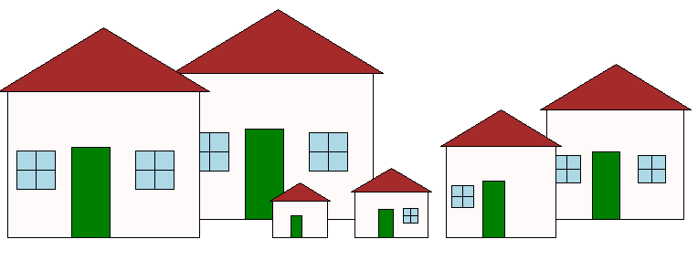

====================================================
Turtle houses module
====================================================

| Make a house module that provides definitions to make prefabricated houses with one line of code.

| The houses are built from squares, rectangles and triangles.
| To reduce the code in the main file, separate modules are used which group the code together.
| Definitions for the base shapes, squares, rectangles and triangles, are placed in a module, ``shapes.py``.
| Definitions for house shapes will be placed in a module, ``houses.py``.

| Download the python file :download:`shapes.py module <files/shapes.py>`
| Create the module, ``houses.py``, by following the steps below to build a basic house shape by combining together various shapes from the shapes module.

----

Importing the shapes module
----------------------------------

| See: https://www.w3schools.com/python/ref_keyword_as.asp
| The code below shows importing the shapes module as an alias via ``import shapes as sh``.
| This makes it shorter to refer to functions in the shapes module.
| Instead of needing ``shapes.rectangle``, only ``sh.rectangle`` is needed.

.. code-block:: python

    import turtle
    import shapes as sh

----

Houses
------------------

| The diagram below shows the layout of a house with windows.
| Positions and sizes of each shape are related to the position and sizes of the house.
| Measurements are calculated using multiplication and division so that the house can be scaled up or down and still keep the same proportions.

.. image:: images/house_measurements.png
    :scale: 75 %
    :align: center
    :alt: simple_houses1

----

House definition
------------------

| Write a definition that produces a house of given length, height and position with 0 to 2 windows.

.. py:function:: house(t, length=60, height=40, start_pos=(0, 0), w_sides=None))

    | draw a house with 0-2 windows
    | **t** (class turtle.Turtle): turtle instance.
    | **length** (int, optional): length of house. Defaults to 60.
    | **height** (int, optional): height of house. Defaults to 40.
    | **start_pos** (tuple, optional): bottom left of house. Defaults to (0, 0).
    | **w_sides** (str, optional): L for windows on left side of house; R for right; LR for both. Defaults to None.

| Use the functions from the ``shapes.py`` module to build the house function.
| The code below is starter code for the house definition.
| The doc string has already been added.
| Comments are in place to indicate where each part of the house will be added.

.. code-block:: python

    import turtle
    import shapes as sh

    def house(t, length=60, height=40, start_pos=(0, 0), w_sides=None):
        """draw a house with 0-2 windows

        Args:
            t (class turtle.Turtle): turtle instance.
            length (int, optional): length of house. Defaults to 60.
            height (int, optional): height of house. Defaults to 40.
            start_pos (tuple, optional): bottom left of house. Defaults to (0, 0).
            w_sides (str, optional): window sides - L for left side of house; R for right and LR for both. Defaults to None.
        """
        # front of house
        
        # door

        # roof

        # windows

----

Front of house
------------------

| The front of the house will be a rectangle.
| The length, width, start_pos of the rectangle are those of the house.
| For simplicity, the pensize has been set to 1, pencolor to black and fillcolor to snow.
| Use: ``sh.rectangle(t, length=length, width=height, start_pos=start_pos, penw=1, penc="black", fillc="snow")``

.. admonition:: Code Completion: front of house

    .. tab-set::

        .. tab-item:: Q

            | Add the front of the house to the ``house`` definition.

            .. code-block:: python

                import turtle
                import shapes as sh

                def house(t, length=60, height=40, start_pos=(0, 0), w_sides=None):
                    """draw a house with 0-2 windows

                    Args:
                        t (class turtle.Turtle): turtle instance.
                        length (int, optional): length of house. Defaults to 60.
                        height (int, optional): height of house. Defaults to 40.
                        start_pos (tuple, optional): bottom left of house. Defaults to (0, 0).
                        w_sides (str, optional): L for left side of house; R for right and LR for both. Defaults to None.
                    """
                    # front of house
                    '''add code here to draw the rectangle'''
                    
                    # door

                    # roof

                    # windows

        .. tab-item:: Ans

            | Added the front of the house to the ``house`` definition.

            .. code-block:: python

                import turtle
                import shapes as sh

                def house(t, length=60, height=40, start_pos=(0, 0), w_sides=None):
                    """draw a house with 0-2 windows

                    Args:
                        t (class turtle.Turtle): turtle instance.
                        length (int, optional): length of house. Defaults to 60.
                        height (int, optional): height of house. Defaults to 40.
                        start_pos (tuple, optional): bottom left of house. Defaults to (0, 0).
                        w_sides (str, optional): L for left side of house; R for right and LR for both. Defaults to None.
                    """
                    # front of house
                    sh.rectangle(t, length=length, width=height, start_pos=start_pos, 
                                    penw=1, penc="black", fillc="snow")
                    
                    # door

                    # roof

                    # windows

| Test the code so far using:
| ``house(t, length=600, height=300, start_pos=(-300, -200), w_sides="LR")``
| This will build a house of 600 by 300 at (-300, -200).
| Only the houses main rectangle will be drawn so far.

.. code-block:: python

    import turtle
    import shapes as sh

    s = turtle.Screen()
    s.bgcolor("white")
    s.title("Houses")
    s.setup(width=800, height=600, startx=200, starty=100)

    t = turtle.Turtle()
    t.speed(9)

    def house(t, length=60, height=40, start_pos=(0, 0), w_sides=None):
        """draw a house with 0-2 windows

        Args:
            t (class turtle.Turtle): turtle instance.
            length (int, optional): length of house. Defaults to 60.
            height (int, optional): height of house. Defaults to 40.
            start_pos (tuple, optional): bottom left of house. Defaults to (0, 0).
            w_sides (str, optional): L for left side of house; R for right and LR for both. Defaults to None.
        """
        # front of house
        sh.rectangle(t, length=length, width=height, start_pos=start_pos, 
                        penw=1, penc="black", fillc="snow")
         
        # door

        # roof

        # windows

    house(t, length=600, height=300, start_pos=(-300, -200), w_sides="LR")

    s.exitonclick()

----

Door of house
------------------

| The door of the house will be a rectangle.

.. admonition:: Code Completion: front of house

    .. tab-set::

        .. tab-item:: Q

            | Complete the ``house_door`` definition.

            .. code-block:: python

                def house_door(t, length, height, start_pos):
                    """draw door 1/3 along length of house, 1/5 of length of house, 1/1.6 of height of house
                    
                    Args:
                        t (class turtle.Turtle): turtle instance.
                        length (int, optional): length of house.
                        height (int, optional): height of house.
                        start_pos (tuple, optional): bottom left of house.
                    """
                    d_pos = (start_pos[0] + length//XXX, start_pos[1])
                    d_height = height//XXX
                    d_length = length//XXX
                    sh.rectangle(t, length=d_length, width=d_height, start_pos=d_pos, penw=1, penc="black", fillc="green")

        .. tab-item:: Ans

            | Completed ``house_door`` definition.

            .. code-block:: python

                def house_door(t, length, height, start_pos):
                    """draw door 1/3 along length of house, 1/5 of length of house, 1/1.6 of height of house
                    
                    Args:
                        t (class turtle.Turtle): turtle instance.
                        length (int, optional): length of house.
                        height (int, optional): height of house.
                        start_pos (tuple, optional): bottom left of house.
                    """
                    d_pos = (start_pos[0] + length//3, start_pos[1])
                    d_height = height//1.6
                    d_length = length//5
                    sh.rectangle(t, length=d_length, width=d_height, start_pos=d_pos, penw=1, penc="black", fillc="green")

| Test the code so far using:
| ``house(t, length=600, height=300, start_pos=(-300, -200), w_sides="LR")``
| This will build a house of 600 by 300 at (-300, -200).
| Only the houses main rectangle and door will be drawn.

.. code-block:: python

    import turtle
    import shapes as sh

    s = turtle.Screen()
    s.bgcolor("white")
    s.title("Houses")
    s.setup(width=800, height=600, startx=200, starty=100)

    t = turtle.Turtle()
    t.speed(9)

    def house_door(t, length, height, start_pos):
        """draw door 1/3 along length of house, 1/5 of length of house, 1/1.6 of height of house

        Args:
            t (class turtle.Turtle): turtle instance.
            length (int, optional): length of house.
            height (int, optional): height of house.
            start_pos (tuple, optional): bottom left of house.
        """
        d_pos = (start_pos[0] + length//3, start_pos[1])
        d_height = height//1.6
        d_length = length//5
        sh.rectangle(t, length=d_length, width=d_height, start_pos=d_pos, penw=1, penc="black", fillc="green")

    def house(t, length=60, height=40, start_pos=(0, 0), w_sides=None):
        """draw a house with 0-2 windows

        Args:
            t (class turtle.Turtle): turtle instance.
            length (int, optional): length of house. Defaults to 60.
            height (int, optional): height of house. Defaults to 40.
            start_pos (tuple, optional): bottom left of house. Defaults to (0, 0).
            w_sides (str, optional): L for left side of house; R for right and LR for both. Defaults to None.
        """
        # front of house
        sh.rectangle(t, length=length, width=height, start_pos=start_pos,
                        penw=1, penc="black", fillc="snow")
        # door
        house_door(t, length, height, start_pos)

        # roof

        # windows

    house(t, length=600, height=300, start_pos=(-300, -200), w_sides="LR")

    s.exitonclick()

----

Roof of house
------------------

| The roof of the house will be an isosceles triangle.

.. code-block:: python

    def house_roof(t, length, height, start_pos):
        """draw roof with overhang of 1/20 length of house over left side and right side of house

        Args:
            t (class turtle.Turtle): turtle instance.
            length (int, optional): length of house.
            height (int, optional): height of house.
            start_pos (tuple, optional): bottom left of house.
        """
        r_height = length//3
        r_length = length * 1.1
        r_overhang = length//20
        r_pos = (start_pos[0] - r_overhang, start_pos[1] + height)
        sh.isosceles(t, base=r_length, height=r_height, start_pos=r_pos, penw=1, penc="black", fillc="brown")

----

windows
---------------------

| Combine 4 squares to make a 4 pane square window.

.. image:: images/window.png
    :scale: 50 %
    :align: center
    :alt: window

----

Houses with windows
---------------------

