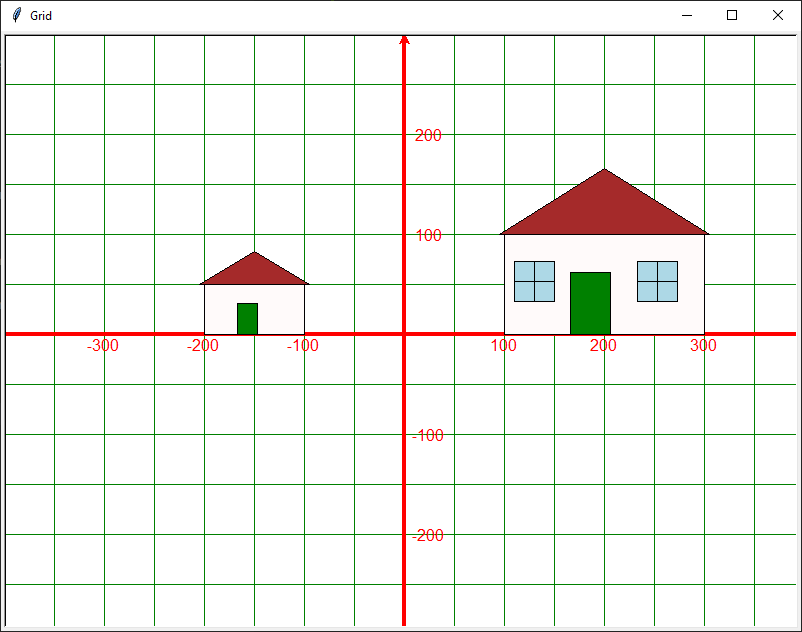
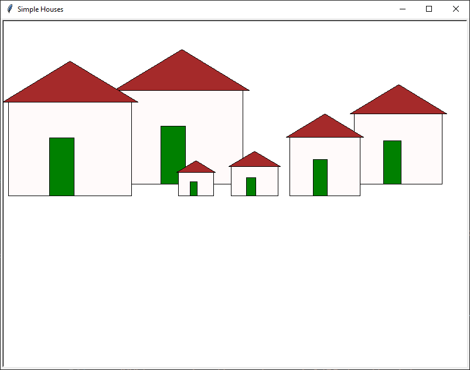
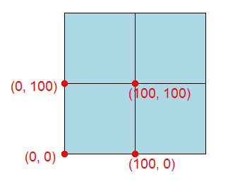

====================================================
Turtle houses module
====================================================

| The houses are built from squares, rectangles and triangles.
| To reduce the code in the main file, separate modules are used which group the code together.
| Definitions for the base shapes are placed in a module, ``shapes.py``.
| Definitions for house shapes will be placed in a module, ``houses.py``.

| Download the python file :download:`shapes.py module <files/shapes.py>`
| Create the module, ``houses.py``, by following the steps below to build a basic house shape by combining together various shapes from the shapes module.

----

Importing the shapes module
----------------------------------

| See: https://www.w3schools.com/python/ref_keyword_as.asp
| The code below shows importing the shapes module as an alias via ``import shapes as sh``.
| This makes it shorter to refer to functions in the shapes module.
| Instead of needing ``shapes.rectangle``, only ``sh.rectangle`` is needed.

.. code-block:: python

    import turtle
    import shapes as sh

----

Simple houses
------------------

| Write a definition that produces a house of given length, height and position.
| Use the functions from the ``shapes.py`` module.
| Use the function to make several houses as shown below.

.. py:function:: simple_house(t, length=60, height=40, start_pos=(0, 0))

    | **t** - the turtle object to draw the rectangle
    | **length** - the length of the house; default 60
    | **height** - the height of the house (not including the roof); default 40
    | **start_pos** - start position in bottom left of house; default (0, 0)

| Starter code is provided with ``?`` where the code has to be completed.

.. code-block:: python

    import turtle
    import houses as h

    s = turtle.Screen()
    s.bgcolor("white")
    s.title("Grid")
    s.setup(width=800, height=600, startx=200, starty=100)
    s.tracer(0, 0)

    t = turtle.Turtle()
    t.speed(0)

    def door_pos(start_pos, length):
        return (start_pos[0] + ?, start_pos[1])

    def roof_pos(start_pos, length, height):
        return (start_pos[0] -?, start_pos[1] + ?)

    def simple_house(t, length=60, height=40, start_pos=(0, 0)):
        # main house
        h.rectangle(t, length=length, width=height, start_pos=start_pos, fillc="snow")
        # door
        h.rectangle(t, length=?, width=?, start_pos=door_pos(?), fillc="green")
        # roof
        h.isosceles(t, base=?, height=?, start_pos=roof_pos(?), fillc="brown")

    simple_house(t, length=210, height=160, start_pos=(-200, 20))
    simple_house(t, length=150, height=120, start_pos=(200, 20))
    simple_house(t, length=60, height=40, start_pos=(-100, 0))
    simple_house(t, length=80, height=50, start_pos=(-10, 0))
    simple_house(t, length=120, height=100, start_pos=(90, 0))
    simple_house(t, length=210, height=160, start_pos=(-390, 0))

    t.ht()
    s.update()
    s.exitonclick()

----

windows
---------------------

| Write a definition, ``window(t, length=10, start_pos=(0, 0))``, that produces a 4 pane square window given the window length and start position.
| Combine 4 squares to make the 4 pane square window.
| Write a helper function, ``window_pos(start_pos, x_add, y_add)``, to get the bottom left coordinates of each square.
| The module syntax is ``square(t, length=50, start_pos=(0, 0), start_h=0, penw=1, penc="black", fillc=None)``.
| Some default arguments, ``start_h=0, penw=1, penc="black"``, can be left out for convenience in the code below.

.. py:function:: window(t, length=10, start_pos=(0, 0))

    | **t** - the turtle object to draw the rectangle
    | **length** - the length of the window; default 10
    | **start_pos** - start position in bottom left of the window; default (0, 0)

| Starter code is provided with ``?`` where the code has to be completed.

.. code-block:: python

    import turtle
    import houses as h

    s = turtle.Screen()
    s.bgcolor("white")
    s.title("Grid")
    s.setup(width=800, height=600, startx=200, starty=100)
    s.tracer(0, 0)

    t = turtle.Turtle()
    t.speed(0)
        
    def window_pos(start_pos, x_add, y_add):
        return (start_pos[0] + ?, start_pos[1] + ?)

    def window(t, length=10, start_pos=(0, 0)):
        h.square(t, length=length/2, start_pos=start_pos, fillc="light blue")
        h.square(t, length=length/2, start_pos=window_pos(?), fillc="light blue")
        h.square(t, length=length/2, start_pos=window_pos(?), fillc="light blue")
        h.square(t, length=length/2, start_pos=window_pos(?), fillc="light blue")

    t.ht()
    s.update()
    s.exitonclick()

----

Houses with windows
---------------------

