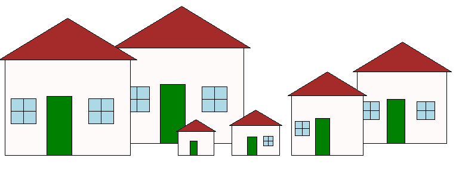
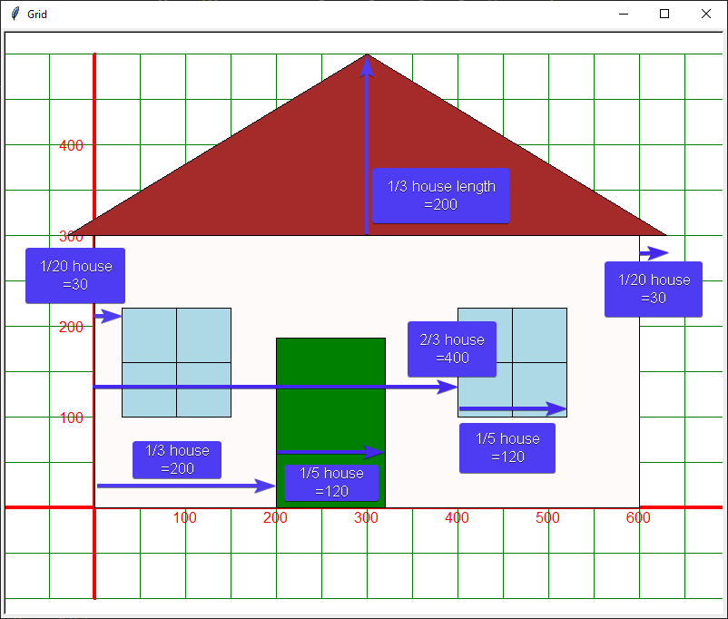
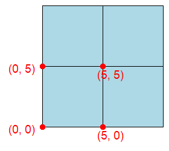

====================================================
Turtle houses module
====================================================

| Make a house module that provides definitions to make prefabricated houses with one line of code.

| The houses are built from squares, rectangles and triangles.
| To reduce the code in the main file, separate modules are used which group the code together.
| Definitions for the base shapes, squares, rectangles and triangles, are placed in a module, ``shapes.py``.
| Definitions for house shapes will be placed in a module, ``houses.py``.

| Download the python file :download:`shapes.py module <files/shapes.py>`
| Create the module, ``houses.py``, by following the steps below to build a basic house shape by combining together various shapes from the shapes module.

----

Importing the shapes module
----------------------------------

| See: https://www.w3schools.com/python/ref_keyword_as.asp
| The code below shows importing the shapes module as an alias via ``import shapes as sh``.
| This makes it shorter to refer to functions in the shapes module.
| Instead of needing ``shapes.rectangle``, only ``sh.rectangle`` is needed.

.. code-block:: python

    import turtle
    import shapes as sh

----

Houses
------------------

| The diagram below shows the layout of a house with windows.
| Positions and sizes of each shape are related to the position and sizes of the house.
| Measurements are calculated using multiplication and division so that the house can be scaled up or down and still keep the same proportions.

----

House definition
------------------

| Write a definition that produces a house of given length, height and position with 0 to 2 windows.

.. py:function:: house(t, length=60, height=40, start_pos=(0, 0), w_sides=None))

    | draw a house with 0-2 windows
    | **t** (class turtle.Turtle): turtle instance.
    | **length** (int, optional): length of house. Defaults to 60.
    | **height** (int, optional): height of house. Defaults to 40.
    | **start_pos** (tuple, optional): bottom left of house. Defaults to (0, 0).
    | **w_sides** (str, optional): L for windows on left side of house; R for right; LR for both. Defaults to None.

| Use the functions from the ``shapes.py`` module to build the house function.
| The code below is starter code for the house definition.
| The doc string has already been added.
| Comments are in place to indicate where each part of the house will be added.

.. code-block:: python

    import turtle
    import shapes as sh

    def house(t, length=60, height=40, start_pos=(0, 0), w_sides=None):
        """draw a house with 0-2 windows

        Args:
            t (class turtle.Turtle): turtle instance.
            length (int, optional): length of house. Defaults to 60.
            height (int, optional): height of house. Defaults to 40.
            start_pos (tuple, optional): bottom left of house. Defaults to (0, 0).
            w_sides (str, optional): window sides - L for left side of house; R for right and LR for both. Defaults to None.
        """
        # front of house
        
        # door

        # roof

        # windows

----

Front of house
------------------

| The front of the house will be a rectangle.
| The length, width, start_pos of the rectangle are those of the house.
| For simplicity, the pensize has been set to 1, pencolor to black and fillcolor to snow.
| Use: ``sh.rectangle(t, length=length, width=height, start_pos=start_pos, penw=1, penc="black", fillc="snow")``

.. admonition:: Code Completion: front of house

    .. tab-set::

        .. tab-item:: Q

            | Add the front of the house to the ``house`` definition.

            .. code-block:: python

                import turtle
                import shapes as sh

                def house(t, length=60, height=40, start_pos=(0, 0), w_sides=None):
                    """draw a house with 0-2 windows

                    Args:
                        t (class turtle.Turtle): turtle instance.
                        length (int, optional): length of house. Defaults to 60.
                        height (int, optional): height of house. Defaults to 40.
                        start_pos (tuple, optional): bottom left of house. Defaults to (0, 0).
                        w_sides (str, optional): L for left side of house; R for right and LR for both. Defaults to None.
                    """
                    # front of house
                    '''add code here to draw the rectangle'''
                    
                    # door

                    # roof

                    # windows

        .. tab-item:: Ans

            | Added the front of the house to the ``house`` definition.

            .. code-block:: python

                import turtle
                import shapes as sh

                def house(t, length=60, height=40, start_pos=(0, 0), w_sides=None):
                    """draw a house with 0-2 windows

                    Args:
                        t (class turtle.Turtle): turtle instance.
                        length (int, optional): length of house. Defaults to 60.
                        height (int, optional): height of house. Defaults to 40.
                        start_pos (tuple, optional): bottom left of house. Defaults to (0, 0).
                        w_sides (str, optional): L for left side of house; R for right and LR for both. Defaults to None.
                    """
                    # front of house
                    sh.rectangle(t, length=length, width=height, start_pos=start_pos, 
                                    penw=1, penc="black", fillc="snow")
                    
                    # door

                    # roof

                    # windows

| Test the code so far using:
| ``house(t, length=600, height=300, start_pos=(-300, -200), w_sides="LR")``
| This will build a house of 600 by 300 at (-300, -200).
| Only the houses main rectangle will be drawn so far.

.. admonition:: Tasks

    1. Test the code so far.
        
    .. dropdown::
        :icon: codescan
        :color: primary
        :class-container: sd-dropdown-container

        .. tab-set::

            .. tab-item:: Code test

                .. code-block:: python

                    import turtle
                    import shapes as sh

                    s = turtle.Screen()
                    s.bgcolor("white")
                    s.title("Houses")
                    s.setup(width=800, height=600, startx=200, starty=100)

                    t = turtle.Turtle()
                    t.speed(9)

                    def house(t, length=60, height=40, start_pos=(0, 0), w_sides=None):
                        """draw a house with 0-2 windows

                        Args:
                            t (class turtle.Turtle): turtle instance.
                            length (int, optional): length of house. Defaults to 60.
                            height (int, optional): height of house. Defaults to 40.
                            start_pos (tuple, optional): bottom left of house. Defaults to (0, 0).
                            w_sides (str, optional): L for left side of house; R for right and LR for both. Defaults to None.
                        """
                        # front of house
                        sh.rectangle(t, length=length, width=height, start_pos=start_pos, 
                                        penw=1, penc="black", fillc="snow")
                        
                        # door

                        # roof

                        # windows

                    house(t, length=600, height=300, start_pos=(-300, -200), w_sides="LR")

                    s.exitonclick()

----

Door of house
------------------

| The door of the house will be a rectangle.

.. admonition:: Code Completion: door of house

    .. tab-set::

        .. tab-item:: Q

            | Complete the ``house_door`` definition.

            .. code-block:: python

                def house_door(t, length, height, start_pos):
                    """draw door 1/3 along length of house, 1/5 of length of house, 1/1.6 of height of house
                    
                    Args:
                        t (class turtle.Turtle): turtle instance.
                        length (int, optional): length of house.
                        height (int, optional): height of house.
                        start_pos (tuple, optional): bottom left of house.
                    """
                    d_pos = (start_pos[0] + length//XXX, start_pos[1])
                    d_height = height//XXX
                    d_length = length//XXX
                    sh.XXX(t, length=d_length, width=d_height, start_pos=d_pos, penw=1, penc="black", fillc="green")

        .. tab-item:: Ans

            | Completed ``house_door`` definition.

            .. code-block:: python

                def house_door(t, length, height, start_pos):
                    """draw door 1/3 along length of house, 1/5 of length of house, 1/1.6 of height of house
                    
                    Args:
                        t (class turtle.Turtle): turtle instance.
                        length (int, optional): length of house.
                        height (int, optional): height of house.
                        start_pos (tuple, optional): bottom left of house.
                    """
                    d_pos = (start_pos[0] + length//3, start_pos[1])
                    d_height = height//1.6
                    d_length = length//5
                    sh.rectangle(t, length=d_length, width=d_height, start_pos=d_pos, penw=1, penc="black", fillc="green")

| Test the code so far using:
| ``house(t, length=600, height=300, start_pos=(-300, -200), w_sides="LR")``
| This will build a house of 600 by 300 at (-300, -200).
| Only the houses main rectangle and door will be drawn.

.. admonition:: Tasks

    1. Test the code so far
        
    .. dropdown::
        :icon: codescan
        :color: primary
        :class-container: sd-dropdown-container

        .. tab-set::

            .. tab-item:: Code test

                .. code-block:: python

                    import turtle
                    import shapes as sh

                    s = turtle.Screen()
                    s.bgcolor("white")
                    s.title("Houses")
                    s.setup(width=800, height=600, startx=200, starty=100)

                    t = turtle.Turtle()
                    t.speed(9)

                    def house_door(t, length, height, start_pos):
                        """draw door 1/3 along length of house, 1/5 of length of house, 1/1.6 of height of house

                        Args:
                            t (class turtle.Turtle): turtle instance.
                            length (int, optional): length of house.
                            height (int, optional): height of house.
                            start_pos (tuple, optional): bottom left of house.
                        """
                        d_pos = (start_pos[0] + length//3, start_pos[1])
                        d_height = height//1.6
                        d_length = length//5
                        sh.rectangle(t, length=d_length, width=d_height, start_pos=d_pos, penw=1, penc="black", fillc="green")

                    def house(t, length=60, height=40, start_pos=(0, 0), w_sides=None):
                        """draw a house with 0-2 windows

                        Args:
                            t (class turtle.Turtle): turtle instance.
                            length (int, optional): length of house. Defaults to 60.
                            height (int, optional): height of house. Defaults to 40.
                            start_pos (tuple, optional): bottom left of house. Defaults to (0, 0).
                            w_sides (str, optional): L for left side of house; R for right and LR for both. Defaults to None.
                        """
                        # front of house
                        sh.rectangle(t, length=length, width=height, start_pos=start_pos,
                                        penw=1, penc="black", fillc="snow")
                        # door
                        house_door(t, length, height, start_pos)

                        # roof

                        # windows

                    house(t, length=600, height=300, start_pos=(-300, -200), w_sides="LR")

                    s.exitonclick()

----

Roof of house
------------------

| The roof of the house will be an isosceles triangle.

.. admonition:: Code Completion: roof of house

    .. tab-set::

        .. tab-item:: Q

            | Complete the ``house_roof`` definition.

            .. code-block:: python

                def house_roof(t, length, height, start_pos):
                    """draw roof height 1/3 of house length
                    with overhang of 1/20 length of house over left side and right side of house

                    Args:
                        t (class turtle.Turtle): turtle instance.
                        length (int, optional): length of house.
                        height (int, optional): height of house.
                        start_pos (tuple, optional): bottom left of house.
                    """
                    r_height = length//XXX
                    r_length = length * XXX
                    r_overhang = length//XXX
                    r_pos = (start_pos[0] - r_overhang, start_pos[1] + height)
                    sh.XXX(t, base=r_length, height=r_height, start_pos=r_pos, penw=1, penc="black", fillc="brown")

        .. tab-item:: Ans

            | Complete the ``house_roof`` definition.

            .. code-block:: python

                def house_roof(t, length, height, start_pos):
                    """draw roof with overhang of 1/20 length of house over left side and right side of house

                    Args:
                        t (class turtle.Turtle): turtle instance.
                        length (int, optional): length of house.
                        height (int, optional): height of house.
                        start_pos (tuple, optional): bottom left of house.
                    """
                    r_height = length//3
                    r_length = length * 1.1
                    r_overhang = length//20
                    r_pos = (start_pos[0] - r_overhang, start_pos[1] + height)
                    sh.isosceles(t, base=r_length, height=r_height, start_pos=r_pos, penw=1, penc="black", fillc="brown")

| Test the code so far using:
| ``house(t, length=600, height=300, start_pos=(-300, -200), w_sides="LR")``
| This will build a house of 600 by 300 at (-300, -200).
| Only the houses main rectangle and door and roof will be drawn.

.. admonition:: Tasks

    1. Test the code so far
        
    .. dropdown::
        :icon: codescan
        :color: primary
        :class-container: sd-dropdown-container

        .. tab-set::

            .. tab-item:: Code test

                .. code-block:: python

                    import turtle
                    import shapes as sh

                    s = turtle.Screen()
                    s.bgcolor("white")
                    s.title("Houses")
                    s.setup(width=800, height=600, startx=200, starty=100)

                    t = turtle.Turtle()
                    t.speed(9)

                    def house_door(t, length, height, start_pos):
                        """draw door 1/3 along length of house, 1/5 of length of house, 1/1.6 of height of house

                        Args:
                            t (class turtle.Turtle): turtle instance.
                            length (int, optional): length of house.
                            height (int, optional): height of house.
                            start_pos (tuple, optional): bottom left of house.
                        """
                        d_pos = (start_pos[0] + length//3, start_pos[1])
                        d_height = height//1.6
                        d_length = length//5
                        sh.rectangle(t, length=d_length, width=d_height, start_pos=d_pos, penw=1, penc="black", fillc="green")

                    def house_roof(t, length, height, start_pos):
                        """draw roof with overhang of 1/20 length of house over left side and right side of house

                        Args:
                            t (class turtle.Turtle): turtle instance.
                            length (int, optional): length of house.
                            height (int, optional): height of house.
                            start_pos (tuple, optional): bottom left of house.
                        """
                        r_height = length//3
                        r_length = length * 1.1
                        r_overhang = length//20
                        r_pos = (start_pos[0] - r_overhang, start_pos[1] + height)
                        sh.isosceles(t, base=r_length, height=r_height, start_pos=r_pos, penw=1, penc="black", fillc="brown")

                    def house(t, length=60, height=40, start_pos=(0, 0), w_sides=None):
                        """draw a house with 0-2 windows

                        Args:
                            t (class turtle.Turtle): turtle instance.
                            length (int, optional): length of house. Defaults to 60.
                            height (int, optional): height of house. Defaults to 40.
                            start_pos (tuple, optional): bottom left of house. Defaults to (0, 0).
                            w_sides (str, optional): L for left side of house; R for right and LR for both. Defaults to None.
                        """
                        # front of house
                        sh.rectangle(t, length=length, width=height, start_pos=start_pos,
                                        penw=1, penc="black", fillc="snow")
                        # door
                        house_door(t, length, height, start_pos)

                        # roof
                        house_roof(t, length, height, start_pos)
                        
                        # windows

                    house(t, length=600, height=300, start_pos=(-300, -200), w_sides="LR")

                    s.exitonclick()

----

windows
---------------------

| Combine 4 squares to make a 4 pane square window.

.. admonition:: Code Completion: roof of house

    .. tab-set::

        .. tab-item:: Q

            | Complete the ``house_window4`` definition.

            .. code-block:: python

                def house_window4(t, length, height, start_pos, w_side, fillc="light blue"):
                    """draw a 4 pane square window.
                        each window pane is half the total length of the window.
                        right hand window; 1/5 of house length; 2/3 of house length from left of house up 1/3 of height of house
                        left hand window; 1/5 of house length; 1/20 of house length from left of house up 1/3 of height of house

                    Args:
                        t (class turtle.Turtle): turtle instance.
                        length (int, optional): length of house.
                        height (int, optional): height of house.
                        start_pos (tuple, optional): bottom left of house.
                        w_side (str): L for left side of house; R for right and LR for both.
                        fillc (str, optional): window pane colour. Defaults to "light blue".
                    """
                    w_length = length//XXX
                    if "L" in w_side:
                        w_pos = (start_pos[0] + length//XXX, start_pos[1] + height//XXX)
                    elif "R" in w_side:
                        w_pos = (start_pos[0] + 2*length//XXX, start_pos[1] + height//XXX)
                    else:
                        w_pos = (start_pos[0] + length//XXX, start_pos[1] + height//XXX)

                    sh.square(t, length=w_length, start_pos=w_pos, fillc="light blue")
                    sh.square(t, length=w_length, start_pos=(w_pos[0] + w_length, w_pos[1]), fillc="light blue")
                    sh.square(t, length=w_length, start_pos=(w_pos[0], w_pos[1] + w_length), fillc="light blue")
                    sh.square(t, length=w_length, start_pos=(w_pos[0] + w_length, w_pos[1] + w_length), fillc="light blue")

        .. tab-item:: Q

            | Completed ``house_window4`` definition.

            .. code-block:: python

                def house_window4(t, length, height, start_pos, w_side, fillc="light blue"):
                    """draw a 4 pane square window.
                        each window pane is half the total length of the window.
                        right hand window; 1/5 of house length; 2/3 of house length from left of house up 1/3 of height of house
                        left hand window; 1/5 of house length; 1/20 of house length from left of house up 1/3 of height of house

                    Args:
                        t (class turtle.Turtle): turtle instance.
                        length (int, optional): length of house.
                        height (int, optional): height of house.
                        start_pos (tuple, optional): bottom left of house.
                        w_side (str): L for left side of house; R for right and LR for both.
                        fillc (str, optional): window pane colour. Defaults to "light blue".
                    """
                    w_length = length//10
                    if "L" in w_side:
                        w_pos = (start_pos[0] + length//20, start_pos[1] + height//3)
                    elif "R" in w_side:
                        w_pos = (start_pos[0] + 2*length//3, start_pos[1] + height//3)
                    else:
                        w_pos = (start_pos[0] + length//20, start_pos[1] + height//3)

                    sh.square(t, length=w_length, start_pos=w_pos, fillc="light blue")
                    sh.square(t, length=w_length, start_pos=(w_pos[0] + w_length, w_pos[1]), fillc="light blue")
                    sh.square(t, length=w_length, start_pos=(w_pos[0], w_pos[1] + w_length), fillc="light blue")
                    sh.square(t, length=w_length, start_pos=(w_pos[0] + w_length, w_pos[1] + w_length), fillc="light blue")

----

Houses with windows
---------------------

| Test the completed code using:
| ``house(t, length=600, height=300, start_pos=(-300, -200), w_sides="LR")``
| This will build a house of 600 by 300 at (-300, -200).
| Only the houses main rectangle and door and roof will be drawn.

.. admonition:: Tasks

    1. Test the completed code
        
    .. dropdown::
        :icon: codescan
        :color: primary
        :class-container: sd-dropdown-container

        .. tab-set::

            .. tab-item:: Code test

                .. code-block:: python

                    import turtle
                    import shapes as sh

                    s = turtle.Screen()
                    s.bgcolor("white")
                    s.title("Houses")
                    s.setup(width=800, height=600, startx=200, starty=100)

                    t = turtle.Turtle()
                    t.speed(9)

                    def house_door(t, length, height, start_pos):
                        """draw door 1/3 along length of house, 1/5 of length of house, 1/1.6 of height of house

                        Args:
                            t (class turtle.Turtle): turtle instance.
                            length (int, optional): length of house.
                            height (int, optional): height of house.
                            start_pos (tuple, optional): bottom left of house.
                        """
                        d_pos = (start_pos[0] + length//3, start_pos[1])
                        d_height = height//1.6
                        d_length = length//5
                        sh.rectangle(t, length=d_length, width=d_height, start_pos=d_pos, penw=1, penc="black", fillc="green")

                    def house_roof(t, length, height, start_pos):
                        """draw roof with overhang of 1/20 length of house over left side and right side of house

                        Args:
                            t (class turtle.Turtle): turtle instance.
                            length (int, optional): length of house.
                            height (int, optional): height of house.
                            start_pos (tuple, optional): bottom left of house.
                        """
                        r_height = length//3
                        r_length = length * 1.1
                        r_overhang = length//20
                        r_pos = (start_pos[0] - r_overhang, start_pos[1] + height)
                        sh.isosceles(t, base=r_length, height=r_height, start_pos=r_pos, penw=1, penc="black", fillc="brown")

                    def house_window4(t, length, height, start_pos, w_side, fillc="light blue"):
                        """draw a 4 pane square window.
                            each window pane is half the total length of the window.
                            right hand window; 1/5 of house length; 2/3 of house length from left of house up 1/3 of height of house
                            left hand window; 1/5 of house length; 1/20 of house length from left of house up 1/3 of height of house

                        Args:
                            t (class turtle.Turtle): turtle instance.
                            length (int, optional): length of house.
                            height (int, optional): height of house.
                            start_pos (tuple, optional): bottom left of house.
                            w_sides (str): L for left side of house; R for right and LR for both.
                            fillc (str, optional): window pane colour. Defaults to "light blue".
                        """
                        w_length = length//10
                        if "L" in w_side:
                            w_pos = (start_pos[0] + length//20, start_pos[1] + height//3)
                        elif "R" in w_side:
                            w_pos = (start_pos[0] + 2*length//3, start_pos[1] + height//3)
                        else:
                            w_pos = (start_pos[0] + length//20, start_pos[1] + height//3)

                        sh.square(t, length=w_length, start_pos=w_pos, fillc="light blue")
                        sh.square(t, length=w_length, start_pos=(w_pos[0] + w_length, w_pos[1]), fillc="light blue")
                        sh.square(t, length=w_length, start_pos=(w_pos[0], w_pos[1] + w_length), fillc="light blue")
                        sh.square(t, length=w_length, start_pos=(w_pos[0] + w_length, w_pos[1] + w_length), fillc="light blue")

                    def house(t, length=60, height=40, start_pos=(0, 0), w_sides=None):
                        """draw a house with 0-2 windows

                        Args:
                            t (class turtle.Turtle): turtle instance.
                            length (int, optional): length of house. Defaults to 60.
                            height (int, optional): height of house. Defaults to 40.
                            start_pos (tuple, optional): bottom left of house. Defaults to (0, 0).
                            w_sides (str, optional): L for left side of house; R for right and LR for both. Defaults to None.
                        """
                        # front of house
                        sh.rectangle(t, length=length, width=height, start_pos=start_pos,
                                        penw=1, penc="black", fillc="snow")
                        # door
                        house_door(t, length, height, start_pos)

                        # roof
                        house_roof(t, length, height, start_pos)

                        # windows
                        if w_sides is not None:
                            if "R" in w_sides:
                                # right hand window
                                house_window4(t, length, height, start_pos, "R")
                            if "L" in w_sides:
                                # left hand window
                                house_window4(t, length, height, start_pos, "L")

                    house(t, length=600, height=300, start_pos=(-300, -200), w_sides="LR")

                    s.exitonclick()

----

Multiple houses
---------------------

    
| Use the completed house definition to make a row of houses of different sizes.

.. admonition:: Exercises

    1. Test the house module using the code below.
    2. Make your own row of houses of different sizes.
        
    .. code-block:: python

        import turtle
        import houses as h

        s = turtle.Screen()
        s.bgcolor("white")
        s.title("Houses")
        s.setup(width=800, height=600, startx=200, starty=100)
        s.tracer(0, 0)

        t = turtle.Turtle()
        t.speed(0)

        h.house(t, length=210, height=160, start_pos=(-200, 20), w_sides="LR")
        h.house(t, length=150, height=120, start_pos=(200, 20), w_sides="LR")
        h.house(t, length=60, height=40, start_pos=(-100, 0), w_sides=None)
        h.house(t, length=80, height=50, start_pos=(-10, 0), w_sides="R")
        h.house(t, length=120, height=100, start_pos=(90, 0), w_sides="L")
        h.house(t, length=210, height=160, start_pos=(-390, 0), w_sides="LR")

        t.ht()
        s.update()
        s.exitonclick()
