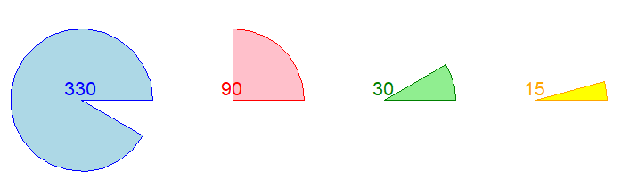

====================================================
Turtle pie slices
====================================================

| The code below draws pie slices.
| Pie slcies are made up of 2 circle radii and an arc of a circle.

----

Turtle Circles as pie slices
------------------------------------------

| Use the turtle syntax for drawing circles to draw pie slices by specifying a given extent number:

.. py:function:: turtle.circle(radius, extent=None, steps=None)

    | radius - radius; a positive number draws anticlockwise, a negative number draws clockwise. 
    | extent - an angle; a number (or None for whole circle), which determines how many degrees of the circle is drawn; default None
    | steps - an integer (or None for a circle) which allows polygons to be drawn; default None

| To draw a cake with a thin slice removed, use ``extent=330``.
| To draw a quarter slice, use ``extent=90``.
| To draw a thin slice, use ``extent=30``.
| To draw a very thin slice, use ``extent=15``.

        
----

Pie slices at a specified location
------------------------------------------

| Adding a starting position, the centre of the circle for the pie slice, will provide some convenience.
| The ``draw_centered_pie_slice`` syntax is below:

.. py:function:: draw_centered_pie_slice(t, centre=(0, 0), angle=0, radius=10, extent=360, penw=1, penc="black", fillc=None)

    | **t** - the turtle object to draw the regular polygon
    | **centre** - start position; default (0, 0)
    | **angle** - the angle to satrt the arc from; default 0
    | **radius** - the circle radius; default 10
    | **extent** - the arc angle in degrees; default 360 for a full circle
    | **penw** - the pen width; default 1
    | **penc** - the pen color; a colorstring or a numeric color tuple (r, g, b,); default "black"
    | **fillc** - the fill color; a colorstring or a numeric color tuple (r, g, b,); default None

| The ``draw_centered_pie_slice`` definition code is below.
| The code moves the turtle to the given centre, sets the angle to 0, moves forward the radius and sets the angle to 90, then draws the  regular polygon.
| If there is a fill color given, then ``begin_fill`` and ``end_fill`` need to be used either side of the drawing.

.. admonition:: Code Completion: draw_centered_pie_slice definition

    .. tab-set::

        .. tab-item:: Q

            Complete the code for the ``draw_centered_pie_slice`` definition by replacing the "XXX"s.
                        
            .. code-block:: python

                def draw_centered_pie_slice(t, centre=(0, 0), angle=0, radius=10, extent=360, 
                                            penw=1, penc="black", fillc=None):
                    t.pu()
                    t.goto(centre)
                    t.seth(XXX)
                    t.pensize(penw)
                    t.pencolor(penc)
                    t.pd()
                    
                    if fillc is not None:
                        t.fillcolor(fillc)
                        t.begin_fill()
                    t.fd(XXX)
                    t.seth(XXX + 90)   
                    t.circle(radius, extent=XXX)
                    t.goto(XXX)
                    if fillc is not None:
                        t.end_fill()

        .. tab-item:: Ans

            Completed code for the ``draw_centered_pie_slice`` definition.
                        
            .. code-block:: python
    
                def draw_centered_pie_slice(t, centre=(0, 0), angle=0, radius=10, extent=360, 
                                            penw=1, penc="black", fillc=None):
                    t.pu()
                    t.goto(centre)
                    t.seth(angle)
                    t.pensize(penw)
                    t.pencolor(penc)
                    t.pd()
                    
                    if fillc is not None:
                        t.fillcolor(fillc)
                        t.begin_fill()
                    t.fd(radius)
                    t.seth(angle + 90)   
                    t.circle(radius, extent=extent)
                    t.goto(centre)
                    if fillc is not None:
                        t.end_fill()

----

Simple pie slices
------------------------

.. admonition:: Tasks

    1. Use the definition provided above to draw simple pie slices shown in the image.

    .. image:: images/pie_slice.png
        :scale: 75 %
        :align: center
        :alt: pie_slice
        
    .. dropdown::
        :icon: codescan
        :color: primary
        :class-container: sd-dropdown-container

        .. tab-set::

            .. tab-item:: Q1

                Use the definition provided above to draw simple pie slices shown in the image.

                .. code-block:: python

                    import turtle

                    def draw_centered_pie_slice(t, centre=(0, 0), angle=0, radius=10, extent=330, penw=1, penc="black", fillc=None):
                        t.pu()
                        t.goto(centre)
                        t.seth(angle)
                        t.pensize(penw)
                        t.pencolor(penc)
                        t.pd()
                        
                        if fillc is not None:
                            t.fillcolor(fillc)
                            t.begin_fill()
                        t.fd(radius)
                        t.seth(angle + 90)   
                        t.circle(radius, extent=extent)
                        t.goto(centre)
                        if fillc is not None:
                            t.end_fill()
                    

                    s = turtle.Screen()
                    s.bgcolor("white")
                    s.title("draw_centered_pie_slice")
                    s.setup(width=800, height=600, startx=0, starty=0)

                    t = turtle.Turtle()
                    t.speed(0)
                    t.ht()

                    centres = [(0, 0),(30, 0)]
                    radii = [80, 80]
                    angles = [15, -15]
                    extents = [330, 30]
                    pensizes =  [1, 1]
                    pencolors = ["blue", "red"]
                    fillcolors = ["light blue", "pink"]

                    for i in range(len(radii)):
                        draw_centered_pie_slice(t, centre=centres[i], angle=angles[i], radius=radii[i], extent=extents[i], penw=1, penc=pencolors[i], fillc=fillcolors[i])

                    s.exitonclick()