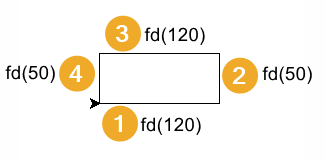
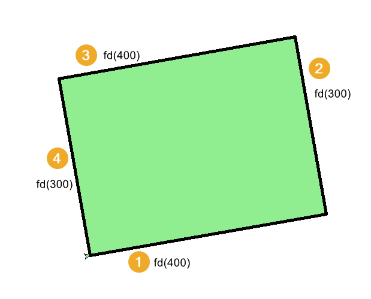

====================================================
Turtle rectangle progressions
====================================================

| The code progressions below draw a rectangle.
| With each version, an improvement in code structure is made.
| Firstly, only **sequencing** is used, with no iteration.
| Secondly, **iteration**, using a for-loop, reduces code duplication.
| Thirdly, a **definition** block with parameters allows for code reuse via the use of arguments.

----

Sequencing: steps to draw a rectangle
------------------------------------------

    
| The code below uses sequencing only.
| The code below draws a rectangle of side length 120 and width 50 at coordinates (20, 30).
| The start direction, eastwards, is set by: ``t.seth(0)``
| The start position, at (20, 30), is set by: ``t.goto(20, 30)``. 
| ``t.pu()`` and ``t.pd()`` are used either side of it to avoid line drawing when repositioning the turtle.
| A line is drawn forwards by: ``t.fd(120)``.
| The turtle then turns to the left by: ``t.lt(90)``.
| A line is drawn forwards by: ``t.fd(50)``.
| The turtle then turns to the left by: ``t.lt(90)``.
| Then the last 2 sides are drawn by doing the same 4 steps again.

.. admonition:: Code Completion: rectangle steps

    .. tab-set::

        .. tab-item:: Q

            Complete the code to draw a rectangle of side length 120 and width 50 at (20, 30), by replacing the XXXs.

            .. code-block:: python

                import turtle

                s = turtle.Screen()
                s.bgcolor("white")
                s.title("rectangle")
                s.setup(width=800, height=600, startx=0, starty=0)

                t = turtle.Turtle()
                t.speed(5)

                t.pu()
                XXX(20, 30)
                t.pd()
                t.seth(0)

                XXX(120)
                XXX(90)
                XXX(50)
                XXX(90)
                XXX(120)
                XXX(90)
                XXX(50)
                XXX(90)

                s.exitonclick()

        .. tab-item:: Ans

            Completed code to draw a rectangle of side length 120 and width 50 at (20, 30).

            .. code-block:: python

                import turtle

                s = turtle.Screen()
                s.bgcolor("white")
                s.title("rectangle")
                s.setup(width=800, height=600, startx=0, starty=0)

                t = turtle.Turtle()
                t.speed(5)

                t.pu()
                t.goto(20, 30)
                t.pd()
                t.seth(0)

                t.fd(120)
                t.lt(90)
                t.fd(50)
                t.lt(90)
                t.fd(120)
                t.lt(90)
                t.fd(50)
                t.lt(90)

                s.exitonclick()

----

.. admonition:: Tasks

    1. From the code above, list the 8 lines that do the actual drawing.
    2. From the 8 lines, list the simplest amount of code that is repeated to form a rectangle.

    .. dropdown::
        :icon: codescan
        :color: primary
        :class-container: sd-dropdown-container

        .. tab-set::

            .. tab-item:: Q1

                From the code above, list the lines that do the actual drawing. 

                .. code-block:: python

                    t.fd(120)
                    t.lt(90)
                    t.fd(50)
                    t.lt(90)
                    t.fd(120)
                    t.lt(90)
                    t.fd(50)
                    t.lt(90)

            .. tab-item:: Q2

                From the 8 lines, list the simplest amount of code that is repeated to form a rectangle.

                .. code-block:: python

                    t.fd(120)
                    t.lt(90)
                    t.fd(50)
                    t.lt(90)

----

Iteration: using a for-loop to draw a rectangle 
------------------------------------------------

| The code below uses iteration to reduce code duplication that was present when only sequencing was used.
| The code below draws a rectangle of side length 120 and width 50 at coordinates (20, 30).
| Firstly, 2 sides are drawn, then this is repeated.
| The iterator used is "_". This is the standard choice in python when the iterator is not referenced in the for-loop block.

.. admonition:: Code Completion: rectangle for loops

    .. tab-set::

        .. tab-item:: Q

            Complete the code to draw a rectangle of side length 120 and width 50 at (20, 30), by replacing the XXXs.

            .. code-block:: python

                import turtle

                s = turtle.Screen()
                s.bgcolor("white")
                s.title("rectangle")
                s.setup(width=800, height=600, startx=0, starty=0)

                t = turtle.Turtle()
                t.speed(5)

                t.pu()
                XXX(20, 30)
                t.pd()
                t.seth(0)

                for _ in range(XXX):
                    XXX(120)
                    XXX(90)
                    XXX(50)
                    XXX(90)
                    
                s.exitonclick()

        .. tab-item:: Ans

            Completed code to draw a rectangle of side length 120 and width 50 at (20, 30).

            .. code-block:: python

                import turtle

                s = turtle.Screen()
                s.bgcolor("white")
                s.title("rectangle")
                s.setup(width=800, height=600, startx=0, starty=0)

                t = turtle.Turtle()
                t.speed(5)

                t.pu()
                t.goto(20, 30)
                t.pd()
                t.seth(0)

                for _ in range(2):
                    t.fd(120)
                    t.lt(90)
                    t.fd(50)
                    t.lt(90)
                    
                s.exitonclick()

----

.. admonition:: Tasks

    1. Modify the code above to draw a rectangle of 80 by 150.

    .. dropdown::
        :icon: codescan
        :color: primary
        :class-container: sd-dropdown-container

        .. tab-set::

            .. tab-item:: Q1

                Modify the code above to draw a rectangle of 80 by 150.

                .. code-block:: python

                    import turtle

                    s = turtle.Screen()
                    s.bgcolor("white")
                    s.title("rectangle")
                    s.setup(width=800, height=600, startx=0, starty=0)

                    t = turtle.Turtle()
                    t.speed(5)

                    t.pu()
                    t.goto(20, 30)
                    t.pd()
                    t.seth(0)

                    for _ in range(2):
                        t.fd(80)
                        t.lt(90)
                        t.fd(150)
                        t.lt(90)
                        
                    s.exitonclick()

----

Definitions: using a def block to draw a rectangle
----------------------------------------------------

| The code below uses a definition block to draw a rectangle.
| The function has parameters to specify the side length and the starting position of the bottom left vertex.
| The function also requires the turtle to be passed as an argument so it can be referred to.
| Before the for-loop, the turtle is repositioned without drawing the movement; **penup** and **pendown** are needed for that.

.. py:function:: rectangle(t, length=40, width=30, start_pos=(0, 0), start_h=0)

    | **t** - the turtle object to draw the rectangle
    | **length** - side length; default 40
    | **width** - side width; default 30
    | **start_pos** - start position; default (0, 0)
    | **start_h** - start heading; default 0 degrees
    
| In the code below, ``rectangle(t)`` draws a default rectangle.
| ``rectangle(t, length=120, width=50, start_pos=(20, 30))`` draws a rectangle of 120 by 50 at (20, 30).
| ``rectangle(t, length=400, width=300, start_pos=(-300, -100), start_h=10)`` draws a rectangle of 400 by 300 at (-300, -100) with an angle of 10 degrees.

.. admonition:: Code Completion: rectangle definition

    .. tab-set::

        .. tab-item:: Q

            Complete the code to draw a rectangle of side length 120 and width 50 at (20, 30), by replacing the XXXs.
    
            .. code-block:: python

                import turtle

                s = turtle.Screen()
                s.bgcolor("white")
                s.title("rectangle")
                s.setup(width=800, height=600, startx=0, starty=0)

                t = turtle.Turtle()
                t.speed(5)

                def rectangle(t, XXX=40, XXX=30, XXX=(0, 0), XXX=0):
                    t.pu()
                    t.goto(XXX)
                    t.pd()
                    t.seth(XXX)

                    for _ in range(2):
                        t.fd(XXX)
                        t.lt(90)
                        t.fd(XXX)
                        t.lt(90)

                rectangle(t)
                rectangle(t, length=120, width=50, start_pos=(20, 30))
                rectangle(t, length=400, width=300, start_pos=(-300, -100), start_h=10)

                s.exitonclick()

        .. tab-item:: Ans

            Completed code to draw a rectangle of side length 120 and width 50 at (20, 30).
    
            .. code-block:: python

                import turtle

                s = turtle.Screen()
                s.bgcolor("white")
                s.title("rectangle")
                s.setup(width=800, height=600, startx=0, starty=0)

                t = turtle.Turtle()
                t.speed(5)

                def rectangle(t, length=40, width=30, start_pos=(0, 0), start_h=0):
                    t.pu()
                    t.goto(start_pos)
                    t.pd()
                    t.seth(start_h)

                    for _ in range(2):
                        t.fd(length)
                        t.lt(90)
                        t.fd(width)
                        t.lt(90)

                rectangle(t)
                rectangle(t, length=120, width=50, start_pos=(20, 30))
                rectangle(t, length=400, width=300, start_pos=(-300, -100), start_h=10)

                s.exitonclick()

----

.. admonition:: Tasks

    1. Modify the code above to draw a rectangle of 80 by 150 at (-80, -150).

    .. dropdown::
        :icon: codescan
        :color: primary
        :class-container: sd-dropdown-container

        .. tab-set::

            .. tab-item:: Q1

                Modify the code above to draw a rectangle of 80 by 150 at (-80, -150).

                .. code-block:: python

                    import turtle

                    s = turtle.Screen()
                    s.bgcolor("white")
                    s.title("rectangle")
                    s.setup(width=800, height=600, startx=0, starty=0)

                    t = turtle.Turtle()
                    t.speed(5)

                    def rectangle(t, length=40, width=30, start_pos=(0, 0), start_h=0):
                        t.pu()
                        t.goto(start_pos)
                        t.pd()
                        t.seth(start_h)

                        for _ in range(2):
                            t.fd(length)
                            t.lt(90)
                            t.fd(width)
                            t.lt(90)

                    rectangle(t, length=80, width=150, start_pos=(-80, -150), start_h=0)

                    s.exitonclick()

----

Adding pen colour and fill colour parameters
-----------------------------------------------

| The syntax below adds parameters for pen and fill colours.

.. py:function:: rectangle(t, length=40, width=30, start_pos=(0, 0), start_h=0, penw=1, penc="black", fillc=None)

    | **t** - the turtle object to draw the rectangle
    | **length** - side length; default 40
    | **width** - side width; default 30
    | **start_pos** - start position; default (0, 0)
    | **start_h** - start heading; default 0 degrees
    | **penw** - pensize; default 1
    | **penc** - pencolor; ; default "black"
    | **fillc** - fillcolor; default None

 

| In the code below, ``rectangle(t, length=400, width=300, start_pos=(-100, -150), start_h=10, penw=5, penc="black", fillc="light green")`` draws a rectangle of 400 by 300 at (x=-100, y=-150) with a black pencolor, a green fillcolor, using a pensize of 5.
| The code needs to check the **fillc** argument since setting a fillcolor to **None** will throw an error.

.. admonition:: Code Completion: rectangle_steps_coloured definition

    .. tab-set::

        .. tab-item:: Q

            Complete the code to draw a rectangle of side length 120 and width 50 at (20, 30), by replacing the XXXs.
                        
            .. code-block:: python

                import turtle

                s = turtle.Screen()
                s.bgcolor("white")
                s.title("rectangle")
                s.setup(width=800, height=600, startx=0, starty=0)

                t = turtle.Turtle()
                t.speed(0)

                def rectangle(t, length=40, width=30, start_pos=(0, 0), start_h=0, 
                                XXX=1, XXX="black", XXX=None):
                    t.pu()
                    t.goto(start_pos)
                    t.pd()
                    t.seth(start_h)

                    t.pensize(XXX)
                    t.pencolor(XXX)

                    if XXX is not None:
                        t.fillcolor(XXX)
                        t.begin_fill()

                    for _ in range(2):
                        t.fd(length)
                        t.lt(90)
                        t.fd(width)
                        t.lt(90)

                    if XXX is not None:
                        t.end_fill()

                rectangle(t, length=400, width=300, start_pos=(-100, -150), start_h=10, 
                            penw=5, penc="black", fillc="light green")

                s.exitonclick()

        .. tab-item:: Ans

            Completed code to draw a rectangle of side length 120 and width 50 at (20, 30).
                        
            .. code-block:: python

                import turtle

                s = turtle.Screen()
                s.bgcolor("white")
                s.title("rectangle")
                s.setup(width=800, height=600, startx=0, starty=0)

                t = turtle.Turtle()
                t.speed(0)

                def rectangle(t, length=40, width=30, start_pos=(0, 0), start_h=0, 
                                penw=1, penc="black", fillc=None):
                    t.pu()
                    t.goto(start_pos)
                    t.pd()
                    t.seth(start_h)

                    t.pensize(penw)
                    t.pencolor(penc)

                    if fillc is not None:
                        t.fillcolor(fillc)
                        t.begin_fill()

                    for _ in range(2):
                        t.fd(length)
                        t.lt(90)
                        t.fd(width)
                        t.lt(90)

                    if fillc is not None:
                        t.end_fill()

                rectangle(t, length=400, width=300, start_pos=(-100, -150), start_h=10, 
                            penw=5, penc="black", fillc="light green")

                s.exitonclick()

----

.. admonition:: Tasks

    1. Use the definition provided above to draw a rectangle of side lengths 150 and 250 at (x=-150, y=-250) with a purple pencolor, a bisque fillcolor, with a pensize of 10.

    .. dropdown::
        :icon: codescan
        :color: primary
        :class-container: sd-dropdown-container

        .. tab-set::

            .. tab-item:: Q1

                Use the definition provided above to draw a rectangle of side lengths 150 and 250 at (x=-150, y=-250) with a purple pencolor, a bisque fillcolor, with a pensize of 10. 

                .. code-block:: python

                    import turtle

                    s = turtle.Screen()
                    s.bgcolor("white")
                    s.title("rectangle")
                    s.setup(width=800, height=600, startx=0, starty=0)

                    t = turtle.Turtle()
                    t.speed(0)

                    def rectangle(t, length=40, width=30, start_pos=(0, 0), start_h=0, 
                                    penw=1, penc="black", fillc=None):
                        t.pu()
                        t.goto(start_pos)
                        t.pd()
                        t.seth(start_h)
                        
                        t.pensize(penw)
                        t.pencolor(penc)

                        if fillc is not None:
                            t.fillcolor(fillc)
                            t.begin_fill()

                        for _ in range(2):
                            t.fd(length)
                            t.lt(90)
                            t.fd(width)
                            t.lt(90)

                        if fillc is not None:
                            t.end_fill()

                    rectangle(t, length=150, width=250, start_pos=(-150, -250), start_h=0, 
                                penw=10, penc="purple", fillc="bisque")

----

Practice Questions
--------------------

.. admonition:: Exercises

    1. Using sequencing only, draw a rectangle of side lengths 500 and 400 at (-250, -250).
    2. Using a repeat loop (without a function), draw a rectangle of side lengths 50 and 40 at (-25, -25).
    3. Use the definition provided above to draw a rectangle of side lengths 400 and 300 at (x=-300, y=-200) with a black pencolor, a snow fillcolor, with a pensize of 6.
