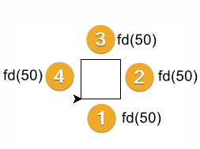
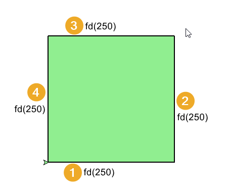

====================================================
Turtle square progressions
====================================================

| The code progressions below draw a square.
| With each version, an improvement in code structure is made.
| Firstly, only **sequencing** is used, with no iteration.
| Secondly, **iteration**, using a for-loop, reduces code duplication.
| Thirdly, a **definition** block with parameters allows for code reuse via the use of arguments.

----

Sequencing: steps to draw a square
------------------------------------------

| The code below uses sequencing only.
| The code below draws a square of side length 50 at coordinates (20, 30).
| The start direction, eastwards, is set by: ``t.seth(0)``
| The start position, at (20, 30), is set by: ``t.goto(20, 30)``. 
| Penup, ``t.pu()``, and pendown, ``t.pd()``, are used either side of ``t.goto(20, 30)`` to avoid line drawing when repositioning the turtle.
| A line is drawn forwards, in the direction the turtle is heading, by: ``t.fd(50)``.
| The turtle then turns to the left by: ``t.lt(90)``.
| The ``t.fd(50)`` and ``t.lt(90)`` are then repeated 3 more times for the other three sides.

.. code-block:: python

    import turtle

    s = turtle.Screen()
    s.bgcolor("white")
    s.title("Grsquareid")
    s.setup(width=800, height=600, startx=0, starty=0)

    t = turtle.Turtle()
    t.speed(5)

    t.pu()
    t.goto(20, 30)
    t.pd()
    t.seth(0)

    t.fd(50)
    t.lt(90)
    t.fd(50)
    t.lt(90)
    t.fd(50)
    t.lt(90)
    t.fd(50)
    t.lt(90)

    s.exitonclick()

----

.. admonition:: Tasks

    1. From the code above, list the 8 lines that do the actual drawing.
    2. From the 8 lines, list the simplest amount of code that is repeated.
    3. Using sequencing only, draw a square of side length 500 at (-250, -250).

    .. dropdown::
        :icon: codescan
        :color: primary
        :class-container: sd-dropdown-container

        .. tab-set::

            .. tab-item:: Q1

                From the code above, list the lines that do the actual drawing. 

                .. code-block:: python

                    t.fd(50)
                    t.lt(90)
                    t.fd(50)
                    t.lt(90)
                    t.fd(50)
                    t.lt(90)
                    t.fd(50)
                    t.lt(90)
                    
            .. tab-item:: Q2

                From the 8 lines, list the simplest amount of code that is repeated.

                .. code-block:: python

                    t.fd(50)
                    t.lt(90)

            .. tab-item:: Q3

                Using sequencing only, draw a square of side length 500 at (-250, -250).

                .. code-block:: python

                    import turtle

                    s = turtle.Screen()
                    s.bgcolor("white")
                    s.title("square")
                    s.setup(width=800, height=600, startx=0, starty=0)

                    t = turtle.Turtle()
                    t.speed(5)

                    t.pu()
                    t.goto(-250, -250)
                    t.pd()
                    t.seth(0)

                    t.fd(500)
                    t.lt(90)
                    t.fd(500)
                    t.lt(90)
                    t.fd(500)
                    t.lt(90)
                    t.fd(500)
                    t.lt(90)

                    s.exitonclick()

----

Iteration: using a for-loop to draw a square 
----------------------------------------------

| The code below uses iteration to reduce code duplication that was present when only sequencing was used.
| The code below draws a square of side length 50 at coordinates (20, 30).
| The ``t.fd(50)`` and ``t.lt(90)`` are placed in a for-loop with 4 repeats for the 4 sides.
| The iterator used is "_". This is the standard choice in python when the iterator is not referenced in the for-loop block.

.. code-block:: python

    import turtle

    s = turtle.Screen()
    s.bgcolor("white")
    s.title("square")
    s.setup(width=800, height=600, startx=0, starty=0)

    t = turtle.Turtle()
    t.speed(5)

    t.pu()
    t.goto(20, 30)
    t.pd()
    t.seth(0)

    for _ in range(4):
        t.fd(50)
        t.lt(90)

    s.exitonclick()

----

.. admonition:: Tasks

    1. Identify the lines of code that replaced the 8 steps: 
    t.fd(50); t.lt(90); t.fd(50); t.lt(90); t.fd(50); t.lt(90); t.fd(50); t.lt(90)

    .. dropdown::
        :icon: codescan
        :color: primary
        :class-container: sd-dropdown-container

        .. tab-set::

            .. tab-item:: Q1

                Identify the lines of code that replaced the 8 steps. 

                .. code-block:: python

                    for _ in range(4):
                        t.fd(50)
                        t.lt(90)
                    
----

Definitions: using a def block to draw a square
----------------------------------------------------

| The code below uses a definition block to draw a square.
| The function has parameters to specify the side length and the starting position of the bottom left vertex.
| The function also requires the turtle to be passed as an argument so it can be referred to.
| Before the for-loop, the turtle is repositioned without drawing the movement; **penup** and **pendown** are needed for that.
| The initial heading defaults to 0, which is acrosss to the right.

.. py:function:: square(t, length=50, start_pos=(0, 0), start_h=0)

    | **t** - the turtle object to draw the square
    | **length** - side length; default 50
    | **start_pos** - start position; default (0, 0)
    | **start_h** - start heading; default 0
    
| In the code below, ``square(t)`` draws a default square.
| The square function's parameters that have default values don't need to be passed as arguments when the the function is called.
| ``square(t, length=50, start_pos=(20, 30))`` draws a square of length 50 at (x=20, y=30).
| ``square(t, length=250, start_pos=(-300, -200), start_h=20)`` draws a square of length 250 at (x=-300, y=-200) angled 20 degrees.
    
.. code-block:: python

    import turtle

    s = turtle.Screen()
    s.bgcolor("white")
    s.title("square")
    s.setup(width=800, height=600, startx=0, starty=0)

    t = turtle.Turtle()
    t.speed(5)

    def square(t, length=50, start_pos=(0, 0), start_h=0):
        t.pu()
        t.goto(start_pos)
        t.pd()
        t.seth(start_h)
        for _ in range(4):
            t.fd(length)
            t.lt(90)

    square(t)
    square(t, length=50, start_pos=(20, 30))
    square(t, length=250, start_pos=(-300, -200), start_h=20)

    s.exitonclick()

----

.. admonition:: Tasks

    1. Modify ``square(t, length=50, start_pos=(0, 0), start_h=0)`` to draw a square of length 200 at (-300, -100).
    2. Modify ``square(t, length=50, start_pos=(0, 0), start_h=0)`` to draw a square of length 30 at (70, 100) with heading 30 degrees.

    .. dropdown::
        :icon: codescan
        :color: primary
        :class-container: sd-dropdown-container

        .. tab-set::

            .. tab-item:: Q1

                Modify ``square(t, length=50, start_pos=(0, 0))`` to draw a square of length 200 at (-300, -100).

                .. code-block:: python

                    square(t, length=200, start_pos=(-300, -100))

            .. tab-item:: Q2

                Modify ``square(t, length=50, start_pos=(0, 0), start_h=0)`` to draw a square of length 30 at (70, 100) with heading 30 degrees.

                .. code-block:: python

                    square(t, length=30, start_pos=(70, 100), start_h=30)

----

Adding pen colour and fill colour parameters
-----------------------------------------------

| The syntax below adds parameters for pen and fill colours and pen size.

.. py:function:: square(t, length=50, start_pos=(0, 0), start_h=0, penw=1, penc="black", fillc=None)

    | **t** - the turtle object to draw the square
    | **length** - side length; default 50
    | **start_pos** - start position; default (0, 0)
    | **start_h** - start heading; default 0
    | **penw** - pensize; default 1
    | **penc** - pencolor; default "black"
    | **fillc** - fillcolor; default None

   
| In the code below, ``square(t, length=250, start_pos=(-100, -150), start_h=0, penw=2, penc="black", fillc="light green")`` draws a square of length 250 at (x=-100, y=-150) with a black pencolor, a light green fillcolor, with a pensize of 2.
| The code needs to check the **fillc** argument since setting a fillcolor to **None** will throw an error.

.. code-block:: python

    import turtle

    s = turtle.Screen()
    s.bgcolor("white")
    s.title("square")
    s.setup(width=800, height=600, startx=0, starty=0)

    t = turtle.Turtle()
    t.speed(0)

    def square(t, length=50, start_pos=(0, 0), start_h=0, penw=1, penc="black", fillc=None):
        t.pu()
        t.goto(start_pos)
        t.pd()
        t.seth(start_h)

        t.pensize(penw)
        t.pencolor(penc)

        if fillc is not None:
            t.fillcolor(fillc)
            t.begin_fill()

        for _ in range(4):
            t.fd(length)
            t.lt(90)
            
        if fillc is not None:
            t.end_fill()

    square(t, length=250, start_pos=(-100, -150), start_h=0, penw=2, penc="black", fillc="light green")

    s.exitonclick()

    
----

.. admonition:: Tasks

    1. Modify ``square(t, length=50, start_pos=(0, 0), start_h=0, penw=1, penc="black", fillc=None)`` to draw a square of length 200 at (-300, -100) with red outline of thickness 5.
    2. Modify ``square(t, length=50, start_pos=(0, 0), start_h=0, penw=1, penc="black", fillc=None)`` to draw a square of length 30 at (70, 100) with green outline of thickness 3 and a yellow fill.

    .. dropdown::
        :icon: codescan
        :color: primary
        :class-container: sd-dropdown-container

        .. tab-set::

            .. tab-item:: Q1

                Modify ``square(t, length=50, start_pos=(0, 0), start_h=0, penw=1, penc="black", fillc=None)`` to draw a square of length 200 at (-300, -100) with red outline of thickness 5.

                .. code-block:: python

                    square(t, length=200, start_pos=(-300, -100), start_h=0, penw=5, penc="red", fillc=None)

            .. tab-item:: Q2

                Modify ``square(t, length=50, start_pos=(0, 0), start_h=0, penw=1, penc="black", fillc=None)`` to draw a square of length 30 at (70, 100) with green outline of thickness 3 and a yellow fill.

                .. code-block:: python

                    square(t, length=30, start_pos=(70, 100), start_h=0, penw=3, penc="green", fillc="yellow")

----

Practice Questions
--------------------

.. admonition:: Exercises

    1. Using sequencing only, draw a square of side length 500 at (-250, -250).
    2. Using a repeat loop (without a function), draw a square of side length 50 at (-25, -25).
    3. Use the definition provided above to draw a square of length 400 at (x=-200, y=-200) with a purple pencolor, a bisque fillcolor, and a pensize of 10.
