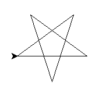
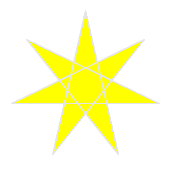

====================================================
Turtle star progressions
====================================================

| The code progressions below draw a star.
| With each version, an improvement in code structure is made.
| Firstly, only **sequencing** is used, with no iteration.
| Secondly, **iteration**, using a for-loop, reduces code duplication.
| Thirdly, a **definition** block with parameters allows for code reuse via the use of arguments.

| For star polygrams, made of a polygon and isosceles triangles see: https://www.desmos.com/calculator/hpglbai0jg

----

Sequencing: steps to draw a star
------------------------------------------

    
| The code below uses sequencing only.
| The code below draws a star with diagonals of 120, at coordinates (20, 30).
| The start direction, eastwards, is set by: ``t.seth(0)``
| The start position, at (20, 30), is set by: ``t.goto(20, 30)``. 
| ``t.pu()`` and ``t.pd()`` are used either side of it to avoid line drawing when repositioning the turtle.
| A line is drawn forwards by: ``t.fd(120)``.
| The turtle then turns to the left by: ``t.lt(144)``.
| Then these 2 steps are repeated until the start is fully drawn.

.. admonition:: Code Completion: star steps

    .. tab-set::

        .. tab-item:: Q

            Complete the code to draw a 5 pointed star with diagonals of 120 at (20, 30), by replacing the XXXs.

            .. code-block:: python

                import turtle

                s = turtle.Screen()
                s.bgcolor("white")
                s.title("star")
                s.setup(width=800, height=600, startx=0, starty=0)

                t = turtle.Turtle()
                t.speed(5)

                t.pu()
                XXX(20, 30)
                t.pd()
                t.seth(0)

                t.fd(120)
                t.lt(144)
                t.fd(XXX)
                t.lt(XXX)
                t.fd(XXX)
                t.lt(XXX)
                t.fd(XXX)
                t.lt(XXX)
                t.fd(XXX)
                t.lt(XXX)

                s.exitonclick()

        .. tab-item:: Ans

            Completed code to draw a 5 pointed star with diagonals of 120 at (20, 30).

            .. code-block:: python

                import turtle

                s = turtle.Screen()
                s.bgcolor("white")
                s.title("star")
                s.setup(width=800, height=600, startx=0, starty=0)

                t = turtle.Turtle()
                t.speed(5)

                t.pu()
                t.goto(20, 30)
                t.pd()
                t.seth(0)

                t.fd(120)
                t.lt(144)
                t.fd(120)
                t.lt(144)
                t.fd(120)
                t.lt(144)
                t.fd(120)
                t.lt(144)
                t.fd(120)
                t.lt(144)

                s.exitonclick()

----

.. admonition:: Tasks

    1. From the code above, list the 10 lines that do the actual drawing.
    2. From the 10 lines, list the simplest amount of code that is repeated.

    .. dropdown::
        :icon: codescan
        :color: primary
        :class-container: sd-dropdown-container

        .. tab-set::

            .. tab-item:: Q1

                From the code above, list the lines that do the actual drawing. 

                .. code-block:: python

                    t.fd(120)
                    t.lt(144)
                    t.fd(120)
                    t.lt(144)
                    t.fd(120)
                    t.lt(144)
                    t.fd(120)
                    t.lt(144)
                    t.fd(120)
                    t.lt(144)

            .. tab-item:: Q2

                From the 10 lines, list the simplest amount of code that is repeated.

                .. code-block:: python

                    t.fd(120)
                    t.lt(144)

----

Iteration: using a for-loop to draw a star 
------------------------------------------------

| The code below uses iteration to reduce code duplication that was present when only sequencing was used.
| The code below draws a star of diagonal 120 at coordinates (20, 30).
| Firstly, 2 lines are drawn, then this is repeated.
| The iterator used is "_". This is the standard choice in python when the iterator is not referenced in the for-loop block.

.. admonition:: Code Completion: star for loops

    .. tab-set::

        .. tab-item:: Q

            Complete the code to draw a star with diagonals of 120 at (20, 30), by replacing the XXXs.

            .. code-block:: python

                import turtle

                s = turtle.Screen()
                s.bgcolor("white")
                s.title("star")
                s.setup(width=800, height=600, startx=0, starty=0)

                t = turtle.Turtle()
                t.speed(5)

                t.pu()
                XXX(20, 30)
                t.pd()
                t.seth(0)

                for _ in range(XXX):
                    t.fd(XXX)
                    t.lt(XXX)
                                    
                s.exitonclick()

        .. tab-item:: Ans

            Completed code to draw a 5 pointed star with diagonals of 120 at (20, 30).

            .. code-block:: python

                import turtle

                s = turtle.Screen()
                s.bgcolor("white")
                s.title("star")
                s.setup(width=800, height=600, startx=0, starty=0)

                t = turtle.Turtle()
                t.speed(5)

                t.pu()
                t.goto(20, 30)
                t.pd()
                t.seth(0)

                for _ in range(5):
                    t.fd(120)
                    t.lt(144)
                    
                s.exitonclick()

----

.. admonition:: Tasks

    1. Modify the code above to draw a 9 pointed star with diagonals of 120 at (20, 30), by turning 160 degrees at the points of the stars.

    .. dropdown::
        :icon: codescan
        :color: primary
        :class-container: sd-dropdown-container

        .. tab-set::

            .. tab-item:: Q1

                Modify the code above to draw a 9 pointed star with diagonals of 120 at (20, 30), by turning 160 degrees at the points of the stars.

                .. code-block:: python

                    import turtle

                    s = turtle.Screen()
                    s.bgcolor("white")
                    s.title("star")
                    s.setup(width=800, height=600, startx=0, starty=0)

                    t = turtle.Turtle()
                    t.speed(5)

                    t.pu()
                    t.goto(20, 30)
                    t.pd()
                    t.seth(0)

                    for _ in range(9):
                        t.fd(120)
                        t.lt(160)

                        s.exitonclick()

----

Definitions: using a def block to draw a star
----------------------------------------------------

| The code below uses a definition block to draw a star.
| The function has parameters to specify the diagonal length and the starting position.
| The function also requires the turtle to be passed as an argument so it can be referred to.
| Before the for-loop, the turtle is repositioned without drawing the movement; **penup** and **pendown** are needed for that.

.. py:function:: star(t, length=50, points=5, start_pos=(0, 0), start_h=0)

    | **t** - the turtle object to draw the star
    | **length** - diagonal length; default 50
    | **points** - number of points in the star, odd integer >=5; default 5
    | **start_pos** - start position; default (0, 0)
    | **start_h** - start heading; default 0 degrees

| The formula to calculate the turning angle of the turtle is (360 * ((points-1)/2))/points.
| e.g for 5 points the angle is (360 * (5-1)/2)/5 which is 720/5 which is 144.

| The code to draw a star with an odd number of points from 5 upwards is below. 

.. admonition:: Code Completion: star definition

    .. tab-set::

        .. tab-item:: Q

            Complete the ``star`` definition by replacing the "XXX"s.
    
            .. code-block:: python

                def star(t, length=50, points=5, start_pos=(0, 0), start_h=0):
                    ang = (360 * ((points-1)/2))/points
                    t.pu()
                    t.goto(start_pos)
                    t.pd()
                    t.seth(start_h)
                    for _ in range(points):
                        t.fd(length)
                        t.lt(ang)

        .. tab-item:: Ans

            Completed ``star`` definition.
    
            .. code-block:: python

                def star(t, length=50, points=5, start_pos=(0, 0), start_h=0):
                    ang = (360 * ((points-1)/2))/points
                    t.pu()
                    t.goto(start_pos)
                    t.pd()
                    t.seth(start_h)
                    for _ in range(points):
                        t.fd(length)
                        t.lt(ang)

----

.. admonition:: Tasks

    1. Use the code above to draw a star with 7 points and diagonal length of 300, at (-100, 0).

    .. dropdown::
        :icon: codescan
        :color: primary
        :class-container: sd-dropdown-container

        .. tab-set::

            .. tab-item:: Q1

                Use the code above to draw a star with 7 points and diagonal length of 300, at (0, 0).

                .. code-block:: python

                    import turtle

                    def star(t, length=50, points=5, start_pos=(0, 0), start_h=0):
                        ang = (360 * ((points-1)/2))/points
                        t.pu()
                        t.goto(start_pos)
                        t.pd()
                        t.seth(start_h)
                        for _ in range(points):
                            t.fd(length)
                            t.lt(ang)

                    s = turtle.Screen()
                    s.bgcolor("white")
                    s.title("star")
                    s.setup(width=800, height=600, startx=0, starty=0)

                    t = turtle.Turtle()
                    t.speed(9)

                    star(t, length=300, start_pos=(-100, 0), start_h=0, points=7)

                    t.ht()
                    s.exitonclick()

----

Adding pen colour and fill colour parameters
-----------------------------------------------

| The syntax below adds parameters for pen and fill colours.

.. py:function:: star(t, length=50, points=5, start_pos=(0, 0), start_h=0, penw=1, penc="black", fillc=None)

    | **t** - the turtle object to draw the star
    | **length** - diagonal length; default 50
    | **points** - number of points in the star, odd integer >=5; default 5
    | **start_pos** - start position; default (0, 0)
    | **start_h** - start heading; default 0 degrees
    | **penw** - pensize; default 1
    | **penc** - pencolor; ; default "black"
    | **fillc** - fillcolor; default None

 

| In the code below, ``star(t, length=300, points=7, start_pos=(-100, 0), start_h=0, penw=3, penc="grey90", fillc="yellow")`` draws a 9 pointed star at (x=-100, y=0) with a grey90 pencolor, a yellow fillcolor, using a pensize of 3.
| The code needs to check the **fillc** argument since setting a fillcolor to **None** will throw an error.

.. admonition:: Code Completion: star definition

    .. tab-set::

        .. tab-item:: Q

            Complete the code to draw a 9 pointed star at (x=-100, y=0) with a grey90 pencolor, a yellow fillcolor, using a pensize of 3, by replacing the XXXs.
                        
            .. code-block:: python

                import turtle

                def star(t, length=50, points=5, start_pos=(0, 0), start_h=0, penw=1, penc="black", fillc=None):
                    ang = (360 * ((points-1)/2))/points
                    t.pu()
                    t.goto(start_pos)
                    t.pd()
                    t.seth(start_h)

                    t.pensize(penw)
                    t.pencolor(penc)

                    if fillc is not None:
                        t.fillcolor(fillc)
                        t.begin_fill()

                    for _ in range(points):
                        t.fd(length)
                        t.lt(ang)
                        
                    if fillc is not None:
                        t.end_fill()

                s = turtle.Screen()
                s.bgcolor("white")
                s.title("star")
                s.setup(width=800, height=600, startx=0, starty=0)

                t = turtle.Turtle()
                t.speed(9)

                star(t, length=XXX, points=XXX, start_pos=(XXX), start_h=0, penw=XXX, penc="XXX", fillc="XXX")

                t.ht()
                s.exitonclick()

        .. tab-item:: Ans

            Completed code to draw a 9 pointed star at (x=-100, y=0) with a grey90 pencolor, a yellow fillcolor, using a pensize of 3.
                        
            .. code-block:: python

                import turtle

                def star(t, length=50, points=5, start_pos=(0, 0), start_h=0, penw=1, penc="black", fillc=None):
                    ang = (360 * ((points-1)/2))/points
                    t.pu()
                    t.goto(start_pos)
                    t.pd()
                    t.seth(start_h)

                    t.pensize(penw)
                    t.pencolor(penc)

                    if fillc is not None:
                        t.fillcolor(fillc)
                        t.begin_fill()

                    for _ in range(points):
                        t.fd(length)
                        t.lt(ang)
                        
                    if fillc is not None:
                        t.end_fill()

                s = turtle.Screen()
                s.bgcolor("white")
                s.title("star")
                s.setup(width=800, height=600, startx=0, starty=0)

                t = turtle.Turtle()
                t.speed(9)

                star(t, length=300, points=7, start_pos=(-100, 0), start_h=0, penw=3, penc="grey90", fillc="yellow")

                t.ht()
                s.exitonclick()

----

Practice Questions
--------------------

.. admonition:: Exercises

    1. Draw a 5 pointed star with an orange fill colour.
    2. Draw a 7 pointed star with a red pen and gold2 fill colour.
    3. Draw a random number, between 10 and 20, of 5 pointed stars, of random size, between 10 and 100, at random positions.

    
