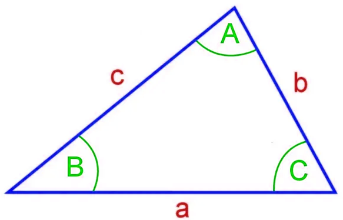

====================================================
Turtle triangle progressions
====================================================

| The code progressions below draw a triangle.
| With each version, an improvement in code structure is made.
| Firstly, only sequencing is used.
| Iteration can be used for an equilateral triangle.
| Then a definition block with parameters allows for code reuse via the use of arguments.

----

Sequencing: steps to draw a triangle
------------------------------------------

| A triangle of sides a, b, c, has opposite angles of A, B, C. 

    
| The code below uses sequencing only.
| The code below draws a triangle of given Side, Angle, Side.
| The code uses variables for side a, angle C, side b.
| The code completes the triangle bt storing the start position and returning to it.

.. code-block:: python

    import turtle

    s = turtle.Screen()
    s.bgcolor("white")
    s.title("Grid")
    s.setup(width=800, height=600, startx=0, starty=0)

    t = turtle.Turtle()
    t.speed(5)

    t.seth(0)
    t.pu()
    t.goto(20, 30)
    t.pd()

    a = 100
    C = 60
    b = 100

    start_pos = t.pos()
    t.fd(a)
    t.lt(180 - C)
    t.fd(b)
    t.lt(90)
    t.goto(start_pos)

    s.exitonclick()

----

Iteration: equilateral triangles 
------------------------------------------------

| The code below uses iteration to draw an equilateral triangle with angles of 60 degrees at (20,30).
| FOr an internal angle of 60 degrees when drawing anticlockwise, and angle of 120 degrees is need for the left turn.

.. code-block:: python

    import turtle

    s = turtle.Screen()
    s.bgcolor("white")
    s.title("Grid")
    s.setup(width=800, height=600, startx=0, starty=0)

    t = turtle.Turtle()
    t.speed(5)

    t.seth(0)
    t.pu()
    t.goto(20, 30)
    t.pd()

    start_pos = t.pos()
    for _ in range(3):
        t.fd(100)
        t.lt(120)

    s.exitonclick()

----

Definitions: using a def block to draw a triangle
----------------------------------------------------

| The code below uses a definition block to draw a triangle.
| The function has parameters to specify the side length and the staring position of the bottom left vertex.
| The function also requires the turtle to be passed as an argument so it can be referred to.
| Before the for-loop, the turtle is repositioned without drawing the movement; **penup** and **pendown** are needed for that.
| The initial heading has been left out of the triangle function, but it can be set prior to using the triangle function.

.. py:function:: triangle(t, length=50, x=0, y=0)

    | t - the turtle object to draw the triangle
    | length - side length, default 50
    | x - starting x position, default 0
    | y - starting y position, default 0
    
| In the code below, ``triangle(t)`` draws a default triangle.
| ``triangle(t, l=50, x=20, y=30)`` draws a triangle of length 50 at (x=20, y=30).
| ``triangle(t, l=250, x=-300, y=-200)`` draws a triangle of length 250 at (x=-300, y=-200).
    
.. code-block:: python

    import turtle

    s = turtle.Screen()
    s.bgcolor("white")
    s.title("Grid")
    s.setup(width=800, height=600, startx=0, starty=0)

    t = turtle.Turtle()
    t.speed(5)

    def triangle(t, length=50, x=0, y=0):
        t.pu()
        t.goto(x, y)
        t.pd()
        for _ in range(4):
            t.fd(l)
            t.lt(90)

    t.seth(0)
    triangle(t)
    triangle(t, length=50, x=20, y=30)
    triangle(t, length=250, x=-300, y=-200)

    s.exitonclick()

----

Adding pen colour and fill colour parameters
-----------------------------------------------

| The code adds parameters for pen and fill colours.

.. py:function:: triangle(t, length=50, x=0, y=0, penc="blue", fillc=None, penw=1)

    | t - the turtle object to draw the triangle
    | length - side length, default 50
    | x - starting x position, default 0
    | y - starting y position, default 0
    | penc - pencolor, default is blue
    | fillc - fillcolor, default is None
    | penw - pensize, default 1
   
| In the code below, ``triangle(t, l=250, x=-100, y=-150, penc="blue", fillc="green", penw=2) ``draws a triangle of length 250 at (x=-100, y=-150) with a blue pencolor, a green fillcolor, with a pensize of 2.
| The code needs to check the **fillc** argument since setting a fillcolor to **None** will throw an error.

.. code-block:: python

    import turtle

    s = turtle.Screen()
    s.bgcolor("white")
    s.title("Grid")
    s.setup(width=800, height=600, startx=0, starty=0)

    t = turtle.Turtle()
    t.speed(0)

    def triangle(t, l=50, x=0, y=0, penc="blue", fillc="red", penw=1):
        t.pu()
        t.goto(x, y)
        t.pd()
        t.pensize(penw)
        t.pencolor(penc)
        if fillc is not None:
            t.fillcolor(fillc)
            t.begin_fill()
        for _ in range(4):
            t.fd(length)
            t.lt(90)
        if fillc is not None:
            t.end_fill()

    triangle(t, length=250, x=-100, y=-150, penc="blue", fillc="snow", penw=2)

    s.exitonclick()

----

Practice Questions
--------------------

.. admonition:: Tasks

    1. Using sequencing only, draw a triangle of side length 500 at (-250, -250).
    2. Using a repeat loop (without a function), draw a triangle of side length 50 at (-25, -25).
    3. Use the definition provided above to draw a triangle of length 400 at (x=-200, y=-200) with a purple pencolor, a bisque fillcolor, with a pensize of 10.
