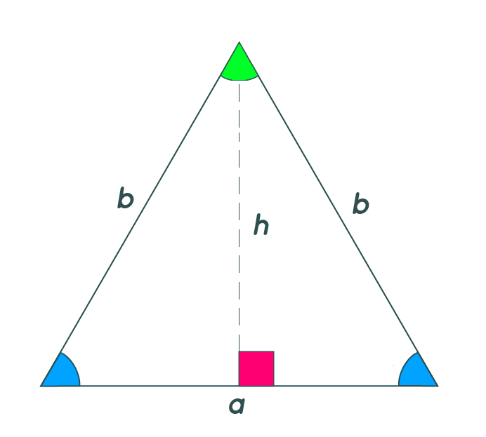
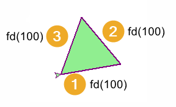

====================================================
Turtle triangle progressions
====================================================

| The basic code to draw different triangles is given below.

| With each version, attempt to write a definition for the triangle.
| The values to be passed as arguments have been assigned to variables for easy identification.
| Then a definition block with parameters allows for code reuse via the use of arguments.

----

Scalene triangle
------------------------------------------

| A triangle of sides a, b, c, has opposite angles of A, B, C. 

    
| The code below draws a triangle of given Side, Angle, Side.
| The code uses variables for side a, angle C, side b.
| The code also makes use of the heading and start position.
| The code draws a triangle of base 100, angle 60 and side 150 with a heading of 15 degrees, positioned at (20, 30).

.. admonition:: Code Completion: scalene_steps definition

    .. tab-set::

        .. tab-item:: Q

            Write a definition to replace the lines between the comments (begin triangle and end triangle) in the code below.
                                         
            .. code-block:: python

                import turtle

                s = turtle.Screen()
                s.bgcolor("white")
                s.title("triangle")
                s.setup(width=800, height=600, startx=0, starty=0)

                t = turtle.Turtle()
                t.speed(5)

                # --begin triangle
                side_a = 100
                angle_C = 60
                side_b = 150
                start_pos = (20, 30)
                start_h = 15

                t.pu()
                t.goto(start_pos)
                t.pd()
                t.seth(start_h)

                t.fd(side_a)
                t.lt(180 - angle_C)
                t.fd(side_b)
                t.goto(start_pos)
                # --end triangle

                s.exitonclick()

        .. tab-item:: Ans

            A definition for a scalene triangle.
                                         
            .. code-block:: python

                import turtle

                s = turtle.Screen()
                s.bgcolor("white")
                s.title("triangle")
                s.setup(width=800, height=600, startx=0, starty=0)

                t = turtle.Turtle()
                t.speed(5)

                def scalene(t, side_a, angle_C, side_b, start_pos=(0, 0), start_h=0):
                    t.pu()
                    t.goto(start_pos)
                    t.pd()
                    t.seth(start_h)

                    t.fd(side_a)
                    t.lt(180 - angle_C)
                    t.fd(side_b)
                    t.goto(start_pos)

                scalene(t, side_a=100, angle_C=60, side_b=150, start_pos=(20, 30), start_h=15)

                s.exitonclick()

----

Isosceles triangle
------------------------------------------

  
| A triangle of sides a, b, b can be drawn, given the base and the height. 

| The code below uses the x and y positions and only works when the base is drawn horizontally with the intitial heading set to 0.
| The code draws an isosceles triangle of base 100 and height 50 at (20, 30).

.. admonition:: Code Completion: isosceles definition

    .. tab-set::

        .. tab-item:: Q

            Write a definition to replace the lines between the comments (begin triangle and end triangle) in the code above.
                                                        
            .. code-block:: python

                import turtle

                s = turtle.Screen()
                s.bgcolor("white")
                s.title("triangle")
                s.setup(width=800, height=600, startx=0, starty=0)

                t = turtle.Turtle()
                t.speed(5)

                # --begin triangle
                base = 100
                height = 50
                start_pos = (20, 30)

                t.pu()
                t.goto(start_pos)
                t.pd()
                t.seth(0)

                start_x = start_pos[0]
                start_y = start_pos[1]
                t.fd(base)
                t.goto(start_x + base/2, start_y + height)
                t.goto(start_x, start_y)
                # --end triangle

                s.exitonclick()

        .. tab-item:: Ans

            A definition for an Isosceles triangle.

            .. code-block:: python

                import turtle

                s = turtle.Screen()
                s.bgcolor("white")
                s.title("triangle")
                s.setup(width=800, height=600, startx=0, starty=0)

                t = turtle.Turtle()
                t.speed(5)

                # --begin triangle
                def isosceles(t, base, height, start_pos):
                    t.pu()
                    t.goto(start_pos)
                    t.pd()
                    t.seth(0)

                    start_x = start_pos[0]
                    start_y = start_pos[1]
                    t.fd(base)
                    t.goto(start_x + base / 2, start_y + height)
                    t.goto(start_x, start_y)

                isosceles(t, base=100, height=50, start_pos=(20, 30))
                # --end triangle

                s.exitonclick()

----

Isosceles triangle at any angle
------------------------------------------

  
| An isosceles triangle can be drawn at a given angle, given the base and the height. 
| The formuals above can be used to calculate the angle B, which the turtle needs to turn and the side length, b.
| The code for each formula is:
|     ``b = math.sqrt(height**2 + (base**2) / 4)``
|     ``angle_B = math.degrees(math.atan(2 * height / base))``

.. admonition:: Code Completion: isosceles definition

    .. tab-set::

        .. tab-item:: Q

            Write a definition to replace the lines between the comments (begin triangle and end triangle) in the code above.
              
            .. code-block:: python

                import turtle
                import math

                s = turtle.Screen()
                s.bgcolor("white")
                s.title("triangle")
                s.setup(width=800, height=600, startx=0, starty=0)

                t = turtle.Turtle()
                t.speed(5)

                # --begin triangle
                base = 100
                height = 50
                start_pos = (20, 30)
                start_h = 15

                t.pu()
                t.goto(start_pos)
                t.pd()
                t.seth(start_h)

                b = math.sqrt(height**2 + (base**2) / 4)
                angle_B = math.degrees(math.atan(2 * height / base))

                t.fd(base)
                t.lt(180 - angle_B)
                t.fd(b)
                t.goto(start_pos)
                # --end triangle

                s.exitonclick()

        .. tab-item:: Ans

            A definition for an Isosceles triangle.

            .. code-block:: python

                import turtle
                import math

                s = turtle.Screen()
                s.bgcolor("white")
                s.title("triangle")
                s.setup(width=800, height=600, startx=0, starty=0)

                t = turtle.Turtle()
                t.speed(5)

                # --begin triangle
                def isosceles(t, base, height, start_pos=(0, 0), start_h=0):
                    t.pu()
                    t.goto(start_pos)
                    t.pd()
                    t.seth(start_h)

                    b = math.sqrt(height**2 + (base**2) / 4)
                    angle_B = math.degrees(math.atan(2 * height / base))

                    t.fd(base)
                    t.lt(180 - angle_B)
                    t.fd(b)
                    t.goto(start_pos)

                isosceles(t, base=100, height=50, start_pos=(20, 30), start_h=15)
                # --end triangle

                s.exitonclick()
                                            

----

Equilateral triangles 
------------------------------------------------

| The code below uses iteration to draw an equilateral triangle with angles of 60 degrees at (20,30), with the base at 30 degrees from the horizontal (start_h = 10).
| For an internal angle of 60 degrees when drawing anticlockwise, and angle of 120 degrees is need for the left turn.

.. admonition:: Code Completion: equilateral definition

    .. tab-set::

        .. tab-item:: Q

            Write a definition to replace the lines between the comments (begin triangle and end triangle) in the code above.
                            
            .. code-block:: python

                import turtle

                s = turtle.Screen()
                s.bgcolor("white")
                s.title("triangle")
                s.setup(width=800, height=600, startx=0, starty=0)

                t = turtle.Turtle()
                t.speed(5)

                # --begin triangle
                side = 100
                start_pos = (20, 30)
                start_h = 10

                t.pu()
                t.goto(start_pos)
                t.pd()
                t.seth(start_h)

                start_pos = t.pos()
                for _ in range(3):
                    t.fd(side)
                    t.lt(120)
                # --end triangle

                s.exitonclick()

        .. tab-item:: Ans

            A definition for an equilateral triangle.

            .. code-block:: python

                import turtle

                s = turtle.Screen()
                s.bgcolor("white")
                s.title("triangle")
                s.setup(width=800, height=600, startx=0, starty=0)

                t = turtle.Turtle()
                t.speed(5)

                # --begin triangle
                def equilateral(t, side, start_pos=(0, 0), start_h=0):
                    t.pu()
                    t.goto(start_pos)
                    t.pd()
                    t.seth(start_h)

                    start_pos = t.pos()
                    for _ in range(3):
                        t.fd(side)
                        t.lt(120)

                equilateral(t, side=100, start_pos=(20, 30), start_h=10)
                # --end triangle

                s.exitonclick()

----

Adding pen colour and fill colour parameters
---------------------------------------------

.. admonition:: Tasks

    1. Modify the triangle definitions to include parameters for pencolor, fillcolor, pensize. Set default values for each parameter for pencolor, fillcolor, pensize so that they can be omitted as arguments when the funcitons are called, without breaking the code.
    
    .. dropdown::
        :icon: codescan
        :color: primary
        :class-container: sd-dropdown-container

        .. tab-set::

            .. tab-item:: Scalene

                .. code-block:: python

                    import turtle

                    s = turtle.Screen()
                    s.bgcolor("white")
                    s.title("triangle")
                    s.setup(width = 800, height = 600, startx = 0, starty = 0)
                    t = turtle.Turtle()
                    t.speed(5)

                    # --begin triangle
                    def scalene(t, side_a, angle_C, side_b, start_pos=(0, 0), start_h=0, 
                                penw=1, penc="black", fillc=None): 
                        t.pu()
                        t.goto(start_pos)
                        t.pd()
                        t.seth(start_h)

                        t.pensize(penw)
                        t.pencolor(penc)

                        if fillc is not None:
                            t.fillcolor(fillc)
                            t.begin_fill()

                        t.fd(side_a)
                        t.lt(180 - angle_C)
                        t.fd(side_b)
                        t.goto(start_pos)

                        if fillc is not None:
                            t.end_fill()

                    scalene(t, side_a=100, angle_C=60, side_b=150, start_pos=(20, 30), start_h=15,
                            penw=3, penc="black", fillc="light green")
                    # --end triangle  
                                                
                    s.exitonclick()

            .. tab-item:: Isosceles

                .. code-block:: python

                    import turtle
                    import math

                    s = turtle.Screen()
                    s.bgcolor("white")
                    s.title("triangle")
                    s.setup(width=800, height=600, startx=0, starty=0)

                    t = turtle.Turtle()
                    t.speed(5)

                    # --begin triangle
                    def isosceles(t, base, height, start_pos=(0, 0), start_h=0,
                                    penw=1, penc="black", fillc=None):
                        t.pu()
                        t.goto(start_pos)
                        t.pd()
                        t.seth(start_h)

                        t.pensize(penw)
                        t.pencolor(penc)

                        b = math.sqrt(height**2 + (base**2) / 4)
                        angle_B = math.degrees(math.atan(2 * height / base))

                        if fillc is not None:
                            t.fillcolor(fillc)
                            t.begin_fill()
                        
                        t.fd(base)
                        t.lt(180 - angle_B)
                        t.fd(b)
                        t.goto(start_pos)

                        if fillc is not None:
                            t.end_fill()

                    isosceles(t, base=100, height=50, start_pos=(20, 30), start_h=15, 
                                penw=2, penc="black", fillc="pink")
                    # --end triangle

                    s.exitonclick()

            .. tab-item:: Equilateral

                .. code-block:: python

                    import turtle

                    s = turtle.Screen()
                    s.bgcolor("white")
                    s.title("triangle")
                    s.setup(width=800, height=600, startx=0, starty=0)

                    t = turtle.Turtle()
                    t.speed(5)

                    # --begin triangle
                    def equilateral(t, side, start_pos=(0, 0), start_h=0, 
                                    penw=1, penc="black", fillc=None):
                        t.pu()
                        t.goto(start_pos)
                        t.pd()
                        t.seth(start_h)

                        t.pensize(penw)
                        t.pencolor(penc)

                        if fillc is not None:
                            t.fillcolor(fillc)
                            t.begin_fill()
                    
                        start_pos = t.pos()
                        for _ in range(3):
                            t.fd(side)
                            t.lt(120)

                        if fillc is not None:
                            t.end_fill()

                    equilateral(t, side=100, start_pos=(20, 30), start_h=10, 
                                penw=2, penc="purple", fillc="light green")
                    # --end triangle

                    s.exitonclick()

